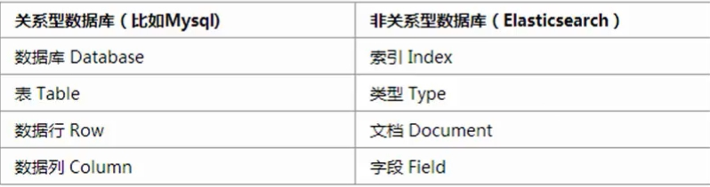
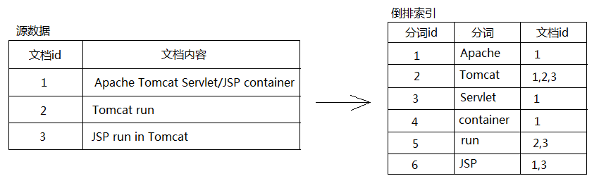

# 认识elasticsearch

## 搜索引擎

搜索引擎依托于多种技术，如网络爬虫技术、检索排序技术、网页处理技术、大数据处理技术、自然语言处理技术等，
为信息检索用户提供快速、高相关性的信息服务。搜索引擎技术的核心模块一般包括爬虫、索引、检索和排序等，
同时可添加其他一系列辅助模块，以为用户创造更好的网络使用环境。

搜索引擎是指根据一定的策略、运用特定的计算机程序从互联网上采集信息，在对信息进行组织和处理后，为用户提供检索服务，将检索的相关信息展示给用户的系统。搜索引擎是工作于互联网上的一门检索技术，它旨在提高人们获取搜集信息的速度，为人们提供更好的网络使用环境。从功能和原理上搜索引擎大致被分为全文搜索引擎、元搜索引擎、垂直搜索引擎和目录搜索引擎等四大类


### 分类


#### 全文搜索引擎

一般网络用户适用于全文搜索引擎。这种搜索方式方便、简捷，并容易获得所有相关信息。但搜索到的信息过于庞杂，因此用户需要逐一浏览并甄别出所需信息。尤其在用户没有明确检索意图情况下，这种搜索方式非常有效


#### 元搜索引擎

元搜索引擎适用于广泛、准确地收集信息。不同的全文搜索引擎由于其性能和信息反馈能力差异，导致其各有利弊。元搜索引擎的出现恰恰解决了这个问题，有利于各基本搜索引擎间的优势互补。而且本搜索方式有利于对基本搜索方式进行全局控制，引导全文搜索引擎的持续改善


#### 垂直搜索引擎

垂直搜索引擎适用于有明确搜索意图情况下进行检索。例如，用户购买机票、火车票、汽车票时，或想要浏览网络视频资源时，都可以直接选用行业内专用搜索引擎，以准确、迅速获得相关信息。


#### 目录搜索引擎

目录搜索引擎是网站内部常用的检索方式。本搜索方式旨在对网站内信息整合处理并分目录呈现给用户，但其缺点在于用户需预先了解本网站的内容，并熟悉其主要模块构成。总而观之，目录搜索方式的适应范围非常有限，且需要较高的人工成本来支持维护


### 特点

1. 信息抓取迅速。【爬虫】[数据怎么获取]
2. 深入开展信息挖掘。【数据挖掘】[数据怎么处理]
3. 检索内容的多样化和广泛性。【搜索技术】[数据怎么查询]


### 应用场景

**1、社会化搜索**
社交网络平台和应用占据了互联网的主流，社交网络平台强调用户之间的联系和交互，这对传统的搜索技术提出了新的挑战。
传统搜索技术强调搜索结果和用户需求的相关性，社会化搜索除了相关性外，还额外增加了一个维度，即搜索结果的可信赖性。对某个搜索结果，传统的结果可能成千上万，但如果处于用户社交网络内其他用户发布的信息、点评或验证过的信息则更容易信赖，这是与用户的心里密切相关的。社会化搜索为用户提供更准确、更值得信任的搜索结果。


**2、实时搜索**
对搜索引擎的实时性要求日益增高，这也是搜索引擎未来的一个发展方向。
实时搜索最突出的特点是时效性强，越来越多的突发事件首次发布在微博上，实时搜索核心强调的就是“快”，用户发布的信息第一时间能被搜索引擎搜索到。不过在国内，实时搜索由于各方面的原因无法普及使用，比如Google的实时搜索是被重置的，百度也没有明显的实时搜索入口。 


**3、移动搜索**
随着智能手机的快速发展，基于手机的移动设备搜索日益流行，但移动设备有很大的局限性，比如屏幕太小，可显示的区域不多，计算资源能力有限，打开网页速度很慢，手机输入繁琐等问题都需要解决。  
目前，随着智能手机的快速普及，移动搜索一定会更加快速的发展，所以移动搜索的市场占有率会逐步上升，而对于没有移动版的网站来说，百度也提供了“百度移动开放平台”来弥补这个缺失。  


**4、个性化搜索**
个性化搜索主要面临两个问题：如何建立用户的个人兴趣模型?在搜索引擎里如何使用这种个人兴趣模型?  
个性化搜索的核心是根据用户的网络行为，建立一套准确的个人兴趣模型。而建立这样一套模型，就要全民收集与用户相关的信息，包括用户搜索历史、点击记录、浏览过的网页、用户E-mail信息、收藏夹信息、用户发布过的信息、博客、微博等内容。比较常见的是从这些信息中提取出关键词及其权重。为不同用户提供个性化的搜索结果，是搜索引擎总的发展趋势，但现有技术有很多问题，比如个人隐私的泄露，而且用户的兴趣会不断变化，太依赖历史信息，可能无法反映用户的兴趣变化。  


**5、地理位置感知搜索**
目前，很多手机已经有GPS的应用了，这是基于地理位置感知的搜索，而且可以通过陀螺仪等设备感知用户的朝向，基于这种信息，可以为用户提供准确的地理位置服务以及相关搜索服务。目前，此类应用已经大行其道，比如手机地图APP。  


**6、跨语言搜索**
如何将中文的用户查询翻译为英文查询，目前主流的方法有3种：机器翻译、双语词典查询和双语语料挖掘。对于一个全球性的搜索引擎来说，具备跨语言搜索功能是必然的发展趋势，而其基本的技术路线一般会采用查询翻译加上网页的机器翻译这两种技术手段。  


**7、多媒体搜索**
目前，搜索引擎的查询还是基于文字的，即使是图片和视频搜索也是基于文本方式。那么未来的多媒体搜索技术则会弥补查询这一缺失。多媒体形式除了文字，主要包括图片、音频、视频。多媒体搜索比纯文本搜索要复杂许多，一般多媒体搜索包含4个主要步骤：多媒体特征提取、多媒体数据流分割、多媒体数据分类和多媒体数据搜索引擎。  


**8、情境搜索**
情境搜索是融合了多项技术的产品，上面介绍的社会化搜索、个性化搜索、地点感知搜索等都是支持情境搜索的，目前Google在大力提倡这一概念。所谓情境搜索，就是能够感知人与人所处的环境，针对“此时此地此人”来建立模型，试图理解用户查询的目的，根本目标还是要理解人的信息需求。比如某个用户在苹果专卖店附近发出“苹果”这个搜索请求，基于地点感知及用户的个性化模型，搜索引擎就有可能认为这个查询是针对苹果公司的产品，而非对水果的需求。 


## 常见全文搜索引擎框架


### Lucene

Lucene的开发语言是Java，也是Java家族中最为出名的一个开源搜索引擎，在Java世界中已经是标准的全文检索程序，它提供了完整的查询引擎和索引引擎，没有中文分词引擎，需要自己去实现，因此用Lucene去做一个搜素引擎需要自己去架构，另外它不支持实时搜索。但是solr和elasticsearch都是基于Lucene封装。

**优点**
  成熟的解决方案，有很多的成功案例。apache 顶级项目，正在持续快速的进步。庞大而活跃的开发社区，大量的开发人员。它只是一个类库，有足够的定制和优化空间：经过简单定制，就可以满足绝大部分常见的需求；经过优化，可以支持 10亿+ 量级的搜索。

 **缺点**
  需要额外的开发工作。所有的扩展，分布式，可靠性等都需要自己实现；非实时，从建索引到可以搜索中间有一个时间延迟，而当前的“近实时”(Lucene Near Real Time search)搜索方案的可扩展性有待进一步完善.


### Apache Solr

Solr是一个高性能，采用Java开发，基于Lucene的全文搜索服务器。文档通过Http利用XML加到一个搜索集合中。查询该集合也是通过 http收到一个XML/JSON响应来实现。它的主要特性包括：高效、灵活的缓存功能，垂直搜索功能，高亮显示搜索结果，通过索引复制来提高可用性，提 供一套强大Data Schema来定义字段，类型和设置文本分析，提供基于Web的管理界面等。

**优点**
（1）Solr有一个更大、更成熟的用户、开发和贡献者社区。
（2）支持添加多种格式的索引，如：HTML、PDF、微软 Office 系列软件格式以及 JSON、XML、CSV 等纯文本格式。
（3）Solr比较成熟、稳定。
（4）不考虑建索引的同时进行搜索，速度更快。

**缺点**
建立索引时，搜索效率下降，实时索引搜索效率不高


### ElasticSearch

ElasticSearch是一个基于Lucene构建的开源，分布式，RESTful搜索引擎。设计用于云计算中，能够达到实时搜索，稳定，可靠，快速，安装使用方便。支持通过HTTP使用JSON进行数据索引。

**优点**
（1）Elasticsearch是分布式的。不需要其他组件，分发是实时的，被叫做”Push replication”。
（2）Elasticsearch 完全支持 Apache Lucene 的接近实时的搜索。
（3）处理多租户（multitenancy）不需要特殊配置，而Solr则需要更多的高级设置。
（4）Elasticsearch 采用 Gateway 的概念，使得完备份更加简单。
各节点组成对等的网络结构，某些节点出现故障时会自动分配其他节点代替其进行工作。

**缺点**
还不够自动（不适合当前新的Index Warmup API）   索引预热API


### ES or Solr

https://www.cnblogs.com/jajian/p/9801154.html


## 什么是elasticsearch


####  定位

实时的全文搜索引擎
近实时：数据更新有1秒的延时

在操作上
狭义的上的理解：
专注于 搜索 的 非关系型  数据库
类似于mongodb


##### 数据获取

1：爬虫获取数据

2：从关系型数据库同步数据


涉及到ES使用方式


##### 数据处理

存储：
es是一种类似于非关系型数据库的方式存放数据
数据存储结构类似mongodb文档结构，但是比mongodb更为复杂

处理
涉及到数据分词，倒排等相关操作


##### 数据检索

全文搜索
高亮搜索
条件搜索


## elasticsearch应用场景

- **多条件搜索**
- **站内搜索**
- **地理位置搜索**


## elasticsearch的安装

### ES服务器

1：Java编写的解压即用的软件，只需要有Java的运行环境即可，把压缩包解压后，进入到bin目录运行elasticsearch.bat

2:浏览器输入：http://localhost:9200，看到浏览器输出服务器的信息，表示安装成功，可以使用了

##### 版本了解

1.x	2.x	5.x	6.x	7.x

注意没有3， 4
原因：elk 技术整合

版本选择：
最先版本 7.x  6.x 都可以


### ES可视化客户端-head

Elasticsearch默认的客户端工具是命令行形式的，操作起来不方便，也不直观看到数据的展示，所以我们需要去安装一个可视化插件，但是这些插件都是基于H5开发的，在谷歌的应用商店中找到**elasticsearch-head**插件，然后安装，使用该插件能比较直观的展示服务器中的数据

**作用:  观察ES数据**


### ES操作客户端-kibana

步骤1：下载kibana
https://www.elastic.co/cn/downloads/kibana

注意：版本必须跟es一致

步骤2：修改配置
根/config/kibana.yml

都是默认情况，可以不用修改

步骤3：启动kibana
根/bin/kibana

步骤4：访问客户端
http://localhost:5601  

**作用:   操作ES数据**


### 分词器

作用:  分词查询搜索 

直接把压缩文件中的内容解压，然后放在elasticsearch/plugins下，然后重启即可

(自己做的笔记)


# 核心概念


 **索引(Index)**

- **含有相同属性的文档集合**


**文档(Document)**

- **文档可以被索引的基本单位， 一般是json格式，包含一些field**


**列(Field)**

- **es的最小单位，相当于数据的某个列**


### 类比




# 常规操作


## 索引操作


### 添加

```java
语法：PUT /索引名
在没有特殊设置的情况下，默认有1个分片，1个备份，也可以通过请求参数的方式来指定
参数格式：

默认：
PUT my_index

明确指定：
PUT /my_index
{
  "settings": {
    "number_of_shards": 5, //设置5个片区
    "number_of_replicas": 1 //设置1个备份
  }
}

注意： 
1：索引不能有大写字母
2：参数格式必须是标准的json格式
```


### 查看

```java
#看单个
GET  /索引名 

#看所有
GET _cat/indices

```


### 删除

```java
语法：DELETE /索引名
```


## 设置映射(列)


### 创建

```java

类型跟映射一起创建

语法：
PUT /索引名
{
  "mappings": {
      "properties": {
        字段名: {
          "type": 字段类型, 
          "analyzer": 分词器类型, 
          "search_analyzer": 分词器类型,
          ...
        },
        ...
      }
   }
}

字段类型就是：数据类型
配置：analyzer search_analyzer  前提是 type：text类型
-------------------------------------------------------
创建类型并设置映射（类似于mysql创建表）


eg:
PUT /my_index
{
  "mappings": {  
      "properties":{
         "id":{
           "type":"long"
         },
         "name":{
           "type":"keyword"
         },
         "age":{
           "type":"integer"
         }
      }
   }
}

```


### 查看

```java
语法：GET /索引名/_mapping

需求： 查看映射
GET /my_index/_mapping
```


# 文档操作


## 数据类型


[Elasticsearch数据类型及其属性](https://www.jianshu.com/p/01f489c46c38)


### 核心类型

**text 类型：**

当一个字段是要被全文搜索的，比如Email内容、产品描述，应该使用text类型。设置text类型以后，字段内容会被分析，在生成倒排索引以前，字符串会被分析器分成一个一个词项。text类型的字段不用于排序，很少用于聚合。

**keyword类型：**

适用于索引结构化的字段，比如email地址、主机名、状态码和标签。如果字段需要进行过滤(比如查找已发布博客中status属性为published的文章)、排序、聚合。keyword类型的字段只能通过精确值搜索到。


**数值类型：**

- byte 
- short
- integer  
- doule 
- float
- date

- boolean

- binary

- array

- object

- ip


## 文档基本操作


### 添加

```java
语法：
//必须明确指定id-推荐
PUT /索引名/_doc/文档ID
{
  field1: value1,
  field2: value2,
  ...
}

//不指定指定id默认使用随机字符串
POST /索引名/_doc
{
  field1: value1,
  field2: value2,
  ...
}

注意：
1：当索引/映射不存在时，会使用默认设置自动添加
2：ES中的数据一般是从别的数据库导入的，所以文档的ID会沿用原数据库中的ID
3：操作时，如果指定文档id， 并且索引库中已经存在， 则执行更新操作， 否则执行添加
4：不指定id的添加， es会指定添加一个字符串类型id


结果字段解释：
_index：所属索引
_type：所属类型
 _id：文档ID
_version：乐观锁版本号
_source：数据内容
result ： 命令操作类型
_shards： 分片相关信息

需求1：新增一个文档
PUT /my_index/_doc/1
{
  "id":1,
  "name":"dafei",
  "age":18
}
```


### 更新

```java
语法：
PUT /索引名/_doc/文档ID
{
  field1: value1,
  field2: value2,
  ...
}

注意：
1：如果不指定id， 操作失败


需求2：替换一个文档
PUT /my_index/_doc/1
{
  "id":1,
  "name":"xiaofei",
   "age":18
}

-----------------------
{
  "_index" : "es_index",
  "_type" : "users",
  "_id" : "1",
  "_version" : 2,
  "result" : "updated",
  "_shards" : {
    "total" : 2,
    "successful" : 1,
    "failed" : 0
  },
  "_seq_no" : 3,
  "_primary_term" : 1
}

----------------
部分更新字段
POST /my_index/_update/1/
{
  "doc":{
    "name":"xiaofei"
  }
}
```


### 查看

```java
语法：
根据ID查询 -> GET /索引名/_doc/文档ID
查询所有（基本查询语句） -> GET /索引名/_doc/_search

结果字段解释：

took：耗时
_shards.total：分片总数
hits.total：查询到的数量
hits.max_score：最大匹配度
hits.hits：查询到的结果
hits.hits._score：匹配度


需求1：根据文档ID查询一个文档
GET /my_index/_doc/1
-------
{
  "_index" : "es_index",
  "_type" : "users",
  "_id" : "1",
  "_version" : 4,
  "_seq_no" : 3,
  "_primary_term" : 1,
  "found" : true,
  "_source" : {
    "id" : 1,
    "name" : "xiaofei",
    "age" : 18
  }
}

需求2：查询所有的文档 
GET /my_index/_search    #默认查询10个
```


### 删除

```java
语法：DELETE /索引名/类型名/文档ID
注意：这里的删除并且不是真正意义上的删除，仅仅是清空文档内容而已，并且标记该文档的状态为删除

需求1：根据文档ID删除一个文档

DELETE /my_index/_doc/1

需求2：又添加刚刚删除的文档
PUT /my_index/_doc/1
{
  "id":1,
  "name":"dafei",
  "age":18
}

注意：
1：es中的删除并不会将数据真实删除，仅仅是修改数据中状态
```


## 全文搜索


#### 数据准备

```java
PUT /product
{
  "mappings": {
      "properties": {
        "id": {
	  "type": "long"
	},
        "title": {
          "type": "text", 
          "analyzer": "ik_smart", 
          "search_analyzer": "ik_smart",
          "fields": {
          "keyword": {
          "type": "keyword",
            "ignore_above": 256
            }  
          }
        },
        "price": {"type": "integer"},
        "intro": {
          "type": "text", 
          "analyzer": "ik_smart", 
          "search_analyzer": "ik_smart",
          "fields": {
            "keyword": {
              "type": "keyword",
              "ignore_above": 256
            }  
          }
        },
      	"brand": {
      	  "type": "keyword" 
      	}
      }
  }
}


POST /product/_bulk
{"create":{"_id": 1}}
{"id":1,"title":"Apple iPhone XR (A2108) 128GB 白色 移动联通电信4G手机 双卡双待","price":5299,"intro":"【iPhoneXR限时特惠！】6.1英寸视网膜显示屏，A12仿生芯片，面容识别，无线充电，支持双卡！选【换修无忧版】获 AppleCare 原厂服务，享只换不修！更有快速换机、保值换新、轻松月付！","brand":"Apple"}
{"create":{"_id": 2}}
{"id":2,"title":"Apple 2019款 Macbook Pro 13.3【带触控栏】八代i7 18G 256G RP645显卡 深空灰 苹果笔记本电脑 轻薄本 MUHN2CH/A","price":15299,"intro":"【八月精选】Pro2019年新品上市送三重好礼，现在购买领满8000减400元优惠神劵，劵后更优惠！","brand":"Apple"}
{"create":{"_id": 3}}
{"id":3,"title":"Apple iPad Air 3 2019年新款平板电脑 10.5英寸（64G WLAN版/A12芯片/Retina显示屏/MUUL2CH/A）金色","price":3788,"intro":"8月尊享好礼！买iPad即送蓝牙耳机！领券立减！多款产品支持手写笔！【新一代iPad，总有一款适合你】选【换修无忧版】获 AppleCare 原厂服务，享只换不修！更有快速换机、保值换新、轻松月付！","brand":"Apple"}
{"create":{"_id": 4}}
{"id":4,"title":"华为HUAWEI MateBook X Pro 2019款 英特尔酷睿i5 13.9英寸全面屏轻薄笔记本电脑(i5 8G 512G 3K 触控) 灰","price":7999,"intro":"3K全面屏开启无界视野;轻薄设计灵动有型，HuaweiShare一碰传","brand":"华为"}
{"create":{"_id": 5}}
{"id":5,"title":"华为 HUAWEI Mate20 X (5G) 7nm工艺5G旗舰芯片全面屏超大广角徕卡三摄8GB+256GB翡冷翠5G双模全网通手机","price":6199,"intro":"【5G双模，支持SA/NSA网络，7.2英寸全景巨屏，石墨烯液冷散热】5G先驱，极速体验。","brand":"华为"}
{"create":{"_id": 6}}
{"id":6,"title":"华为平板 M6 10.8英寸麒麟980影音娱乐平板电脑4GB+64GB WiFi（香槟金）","price":2299,"intro":"【华为暑期购】8月2日-4日，M5青春版指定爆款型号优惠100元，AI语音控制","brand":"华为"}
{"create":{"_id": 7}}
{"id":7,"title":"荣耀20 PRO DXOMARK全球第二高分 4800万四摄 双光学防抖 麒麟980 全网通4G 8GB+128GB 蓝水翡翠 拍照手机","price":3199,"intro":"白条6期免息！麒麟980，4800万全焦段AI四摄！荣耀20系列2699起，4800万超广角AI四摄！","brand":"荣耀"}
{"create":{"_id": 8}}
{"id":8,"title":"荣耀MagicBook Pro 16.1英寸全面屏轻薄性能笔记本电脑（酷睿i7 8G 512G MX250 IPS FHD 指纹解锁）冰河银","price":6199,"intro":"16.1英寸无界全面屏金属轻薄本，100%sRGB色域，全高清IPS防眩光护眼屏，14小时长续航，指纹一健开机登录，魔法一碰传高速传输。","brand":"荣耀"}
{"create":{"_id": 9}}
{"id":9,"title":"荣耀平板5 麒麟8核芯片 GT游戏加速 4G+128G 10.1英寸全高清屏影音平板电脑 WiFi版 冰川蓝","price":1549,"intro":"【爆款平板推荐】哈曼卡顿专业调音，10.1英寸全高清大屏，双喇叭立体环绕音，配置多重护眼，值得拥有！","brand":"荣耀"}
{"create":{"_id": 10}}
{"id":10,"title":"小米9 4800万超广角三摄 6GB+128GB全息幻彩蓝 骁龙855 全网通4G 双卡双待 水滴全面屏拍照智能游戏手机","price":2799,"intro":"限时优惠200，成交价2799！索尼4800万广角微距三摄，屏下指纹解锁！","brand":"小米"}
{"create":{"_id": 11}}
{"id":11,"title":"小米(MI)Pro 2019款 15.6英寸金属轻薄笔记本(第八代英特尔酷睿i7-8550U 16G 512GSSD MX250 2G独显) 深空灰","price":6899,"intro":"【PCIE固态硬盘、72%NTSC高色域全高清屏】B面康宁玻璃覆盖、16G双通道大内存、第八代酷睿I7处理器、专业级调校MX150","brand":"小米"}
{"create":{"_id": 12}}
{"id":12,"title":"联想(Lenovo)拯救者Y7000P 2019英特尔酷睿i7 15.6英寸游戏笔记本电脑(i7 9750H 16G 1T SSD GTX1660Ti 144Hz)","price":9299,"intro":"超大1T固态，升级双通道16G内存一步到位，GTX1660Ti电竞级独显，英特尔9代i7H高性能处理器，144Hz电竞屏窄边框！","brand":"联想"}

```


#### 搜索语句


##### match

```java
表示全文检索,也可也做精确查询，value值会被分词器拆分，然后去倒排索引中匹配
参数格式：

GET /索引/_search
{
  "query": {
    "match": {field: value}
  }
}


需求：查询商品标题中符合"游戏 手机"的字样的商品 【暂时理解为模糊查询】
GET /product/_search
{
  "query": {
    "match":{
      "title": "游戏 手机"
    }
  }
}
```


##### multi_match

```java
参数格式：
GET /索引/_search
{
  "query": {
    "multi_match": {
      "query": value,
      "fields": [field1, field2, ...]
    }
  }
}

multi_match：表示在多个字段间做检索，只要其中一个字段满足条件就能查询出来，多用在字段上

需求：查询商品标题或简介中符合"蓝牙 指纹 双卡"的字样的商品
GET /product/_search
{
  "query": {
    "multi_match":{
      "query":"蓝牙 指纹 双卡",
      "fields": ["title", "intro"]
    }
  }
}
```


#### 中文分词器

```java
把文本内容按照标准进行切分，默认的是standard，该分词器按照单词切分，内容转变为小写，去掉标点，遇到每个中文字符都当成1个单词处理，后面会安装开源的中文分词器插件（ik）

默认分词器：
GET /product/_analyze
{
  "text":"I am Groot"
}

GET /product/_analyze
{
  "text":"英特尔酷睿i7处理器"
}
结论：默认的分词器只能对英文正常分词，不能对中文正常分词


IK分词器：
1、ik_max_word 【细粒度分词】
会将文本做最细粒度的拆分，比如会将“中华人民共和国人民大会堂”拆分为“中华人民共和国、中华人民、中华、华人、人民共和国、人民、共和国、大会堂、大会、会堂等词语。

2、ik_smart 【粗粒度分词】
会做最粗粒度的拆分，比如会将“中华人民共和国人民大会堂”拆分为中华人民共和国、人民大会堂。


GET /product/_analyze
{
  "text":"I am Groot",
  "analyzer":"ik_smart"
}

GET /product/_analyze
{
  "text":"英特尔酷睿i7处理器",
  "analyzer":"ik_smart"
}

GET /product/_analyze
{
  "text":"英特尔酷睿i7处理器",
  "analyzer":"ik_max_word"
}

结论：都能正常分词

```


##### 拓展词库

**最简单的方式就是找到IK插件中的  config/main.dic   文件，往里面添加新的词汇，然后重启服务器即可**


### 倒排索引




倒排索引源于实际应用中需要根据属性的值来查找记录。这种索引表中的每一项都包括一个属性值和具有该属性值的各记录的地址。由于不是由记录来确定属性值，而是由属性值来确定记录的位置，因而称为倒排索引(inverted index)。带有倒排索引的文件我们称为倒排索引文件，简称倒排文件(inverted file)

[什么是倒排索引](https://blog.csdn.net/starzhou/article/details/87519973)


### 高亮显示

```java
参数格式：

GET /索引/_search
{
  "query": { ... },
  "highlight": {
    "fields": {
      field1: {},
      field2: {},
      ...
    },
    "pre_tags": 开始标签,
    "post_tags" 结束标签
  }
}

highlight：表示高亮显示，需要在fields中配置哪些字段中检索到该内容需要高亮显示
  必须配合检索(term / match)一起使用

需求：查询商品标题或简介中符合"蓝牙 指纹 双卡"的字样的商品，并且高亮显示
    
GET /product/_search
{
  "query": {
    "multi_match":{
      "query":"蓝牙 指纹 双卡",
      "fields": ["title", "intro"]
    }
  },
  "highlight": {
    "fields": {
      "title": {"type": "plain"},
      "intro": {"type": "plain"}
    },
    "pre_tags": "<span style='color:red;'>",
    "post_tags": "</span>"
  }
}
```


# SpringBoot集成

## 依赖

```xml

<parent>
    <groupId>org.springframework.boot</groupId>
    <artifactId>spring-boot-starter-parent</artifactId>
    <version>2.4.3</version>
    <relativePath/>
</parent>


<dependency>
    <groupId>org.springframework.boot</groupId>
    <artifactId>spring-boot-starter-data-elasticsearch</artifactId>
</dependency>

<dependency>
    <groupId>commons-beanutils</groupId>
    <artifactId>commons-beanutils</artifactId>
    <version>1.9.4</version>
</dependency>


<dependency>
    <groupId>org.projectlombok</groupId>
    <artifactId>lombok</artifactId>
</dependency>

<dependency>
    <groupId>org.springframework.boot</groupId>
    <artifactId>spring-boot-starter-test</artifactId>
    <scope>test</scope>
</dependency>

```


## 配置

**application.properties**

```properties
# 配置集群名称，名称写错会连不上服务器，默认elasticsearch
spring.data.elasticsearch.cluster-name=elasticsearch
# 配置集群节点
spring.data.elasticsearch.cluster-nodes=localhost:9300
#是否开启本地存储
spring.data.elasticsearch.repositories.enabled=true


上面的不在使用,过期原因:

es官方打算在es7设置TransportClient 过期, es8之后抛弃, 直接使用 High Level REST Client 替换TransportClient

https://docs.spring.io/spring-data/elasticsearch/docs/3.2.3.RELEASE/reference/html/#reference
# 用这句就够了
spring.elasticsearch.rest.uris = localhost:9200

```


## domain

```java
@Getter
@Setter
@ToString
@NoArgsConstructor
@AllArgsConstructor
@Document(indexName="es_shop", type="shop_product")
public class Product {
    @Id
    private String id;

    @Field(analyzer="ik_smart",searchAnalyzer="ik_smart",type = FieldType.Text)
    private String title;

    private Integer price;

    @Field(analyzer="ik_smart",searchAnalyzer="ik_smart",type = FieldType.Text)
    private String intro;

    @Field(type=FieldType.Keyword)
    private String brand;
}
```


## CRUD

```java
public interface ProductRepository  extends ElasticsearchRepository<Product, String>{
}


public interface IProductService {
    void save(Product product);
    void update(Product product);
    void delete(String id);
    Product get(String id);
    List<Product> list();
}

@Service
public class ProductServiceImpl implements IProductService {
    @Autowired
    private ProductRepository repository;
    @Autowired
    private ElasticsearchTemplate  template;
    @Override
    public void save(Product product) {
        repository.save(product);
    }
    @Override
    public void update(Product product) {
        repository.save(product);
    }
    @Override
    public void delete(String id) {
        repository.deleteById(id);
    }
    @Override
    public Product get(String id) {
        return repository.findById(id).get();
    }
    @Override
    public List<Product> list() {
        Iterable<Product> all = repository.findAll();
        List<Product> p = new ArrayList<>();
        all.forEach(a->p.add(a));
        return p;
    }
}
@SpringBootTest
public class ElasticsearchDemoApplicationTests {
	@Autowired
	private IProductService productService;
	@Test
	public void testSave() {
		Product p = new Product();
        p.setId("123")
		p.setBrand("dafei");
		p.setIntro("dafei手机");
		p.setPrice(1000);
		p.setTitle("全球最帅的手机");
		productService.save(p);
	}
	@Test
	public void testUpate() {
		Product p = new Product();
		p.setId("ue5r1m4BXlaPW5P0TegF");
		p.setBrand("dafei");
		p.setIntro("dafei手机");
		p.setPrice(1000);
		p.setTitle("全球最sb的手机");

		productService.update(p);
	}
	@Test
	public void testDelete() {
		productService.delete("123");
	}
	@Test
	public void testGet() {
		System.out.println(productService.get("123"));
	}
	@Test
	public void testList() {
		System.err.println(productService.list());
	}
}
```


## 各类查询


#### match

```java
// 查询商品标题中符合"游戏 手机"的字样的商品
@Test
public void testQuery4(){
    NativeSearchQueryBuilder builder = new NativeSearchQueryBuilder();

    /**
         * {
         *     query:{
         *         match:{title:"游戏 手机"}
         *     }
         * }
         */
    builder.withQuery(
        QueryBuilders.matchQuery("title", "游戏 手机")
    );
    builder.withPageable(PageRequest.of(0, 100));
    Page<Product> search = repository.search(builder.build());
    search.getContent().forEach(System.err::println);

}
```


#### multi_match

```java
// 查询商品标题或简介中符合"蓝牙 指纹 双卡"的字样的商品
@Test
public void testQuery7(){
    NativeSearchQueryBuilder builder = new NativeSearchQueryBuilder();

    /**
         * {
         *     query:{
         *         multi_match:{
         *             "query":"蓝牙 指纹 双卡",
         *             "fields":["title", "intro"]
         *         }
         *     }
         * }
         */
    builder.withQuery(
        QueryBuilders.multiMatchQuery("蓝牙 指纹 双卡", "title", "intro")
    );
    builder.withPageable(PageRequest.of(0, 100, Sort.Direction.DESC, "price"));
    Page<Product> search = repository.search(builder.build());
    search.getContent().forEach(System.err::println);
}
```


#### 高亮显示(繁琐)

```java
@Test
public void testHighlight() throws Exception {
    //定义索引库
    SearchRequest searchRequest = new SearchRequest("product");
    SearchSourceBuilder searchSourceBuilder = new SearchSourceBuilder();

    //定义query查询
    MultiMatchQueryBuilder queryBuilder = QueryBuilders.multiMatchQuery("蓝牙 指纹 双卡",
                                                                        "title", "intro");

    HighlightBuilder highlightBuilder = new HighlightBuilder(); // 生成高亮查询器
    highlightBuilder.field("title");// 高亮查询字段
    highlightBuilder.field("intro");// 高亮查询字段
    highlightBuilder.requireFieldMatch(false); // 如果要多个字段高亮,这项要为false
    highlightBuilder.preTags("<span style='color:red'>"); // 高亮设置
    highlightBuilder.postTags("</span>");
    highlightBuilder.fragmentSize(800000); // 最大高亮分片数
    highlightBuilder.numOfFragments(0); // 从第一个分片获取高亮片段

    Pageable pageable = PageRequest.of(1, 2); // 设置分页参数
    NativeSearchQuery searchQuery = new NativeSearchQueryBuilder()
        .withQuery(queryBuilder) // match查询
        .withPageable(pageable).withHighlightBuilder(highlightBuilder) // 设置高亮
        .build();
    SearchHits<Product> searchHits = template.search(searchQuery, Product.class);

    List<Product> list = new ArrayList();
    for (SearchHit<Product> searchHit : searchHits) { // 获取搜索到的数据
        Product content = searchHit.getContent();
        // 处理高亮
        Map<String, List<String>> highlightFields = searchHit.getHighlightFields();
        for (Map.Entry<String, List<String>> stringHighlightFieldEntry : highlightFields.entrySet()) {
            String key = stringHighlightFieldEntry.getKey();
            if (StringUtils.equals(key, "title")) {
                List<String> fragments = stringHighlightFieldEntry.getValue();
                StringBuilder sb = new StringBuilder();
                for (String fragment : fragments) {
                    sb.append(fragment.toString());
                }
                content.setTitle(sb.toString());
            }
            if (StringUtils.equals(key, "intro")) {
                List<String> fragments = stringHighlightFieldEntry.getValue();
                StringBuilder sb = new StringBuilder();
                for (String fragment : fragments) {
                    sb.append(fragment.toString());
                }
                content.setIntro(sb.toString());
            }
        }
        list.add(content);
    }

    Page page = new PageImpl(list, pageable, searchHits.getTotalHits());
    list.forEach(System.out::println);
}
```


# 简单配置流程


#### 1.依赖

```xml

<parent>
    <groupId>org.springframework.boot</groupId>
    <artifactId>spring-boot-starter-parent</artifactId>
    <version>2.4.3</version>
    <relativePath/>
</parent>

<dependency>
    <groupId>org.springframework.boot</groupId>
    <artifactId>spring-boot-starter-data-elasticsearch</artifactId>
</dependency>

<dependency>
    <groupId>commons-beanutils</groupId>
    <artifactId>commons-beanutils</artifactId>
    <version>1.9.4</version>
</dependency>


<dependency>
    <groupId>org.projectlombok</groupId>
    <artifactId>lombok</artifactId>
</dependency>

<dependency>
    <groupId>org.springframework.boot</groupId>
    <artifactId>spring-boot-starter-test</artifactId>
    <scope>test</scope>
</dependency>

```


#### 2.配置

```properties
# 链接 Elasticsearch
spring.elasticsearch.rest.uris = localhost:9200

```

#### 3.实体类

```java
import lombok.*;
import org.springframework.data.annotation.Id;
import org.springframework.data.elasticsearch.annotations.Document;
import org.springframework.data.elasticsearch.annotations.Field;
import org.springframework.data.elasticsearch.annotations.FieldType;

@Getter
@Setter
@ToString
@NoArgsConstructor
@AllArgsConstructor
// 查询的索引库
@Document(indexName="product")
public class Product {
    @Id
    private String id;

    // store=true 不太清楚 好像是构建额外表
    
    /* 存入时使用的分词器 / 查询时使用的分词器 / 全局搜索,模糊查询 */
    @Field(analyzer="ik_smart",searchAnalyzer="ik_smart",type = FieldType.Text) 
    private String title;

    @Field
    private Integer price;

    @Field(analyzer="ik_smart",searchAnalyzer="ik_smart",type = FieldType.Text)
    private String intro;

    /* 等值查询 */
    @Field(type=FieldType.Keyword)
    private String brand;
}
```


#### 4.Respository

```java
import cn.wolfcode.demo.domain.Product;
import org.springframework.data.elasticsearch.annotations.Highlight;
import org.springframework.data.elasticsearch.annotations.HighlightField;
import org.springframework.data.elasticsearch.annotations.HighlightParameters;
import org.springframework.data.elasticsearch.annotations.Query;
import org.springframework.data.elasticsearch.core.SearchHit;
import org.springframework.data.elasticsearch.repository.ElasticsearchRepository;
import java.util.List;
// @Repositry 可以不贴
public interface ProductRepository extends ElasticsearchRepository<Product,String> {

    /*  // 取 query 的整个 {} 作为查询条件
        "query": {
            "multi_match":{
              "query":"蓝牙 指纹 双卡",
              "fields": ["title", "intro"]
            }
        }
    */

    /* 自定义查询条件 , 自定义查询添加时候方法名字可以不遵循 JPA 命名规范 */
    /* ?0 表示取方法第1个形参替换到 ?0 的位置 */
    @Query("{\"multi_match\":{\"query\":\"?0\",\"fields\": [\"title\", \"intro\"]}}") // 注意不要导错包
    @Highlight(
            fields = {
                @HighlightField(name="title"),  // 查询哪个字段
                @HighlightField(name="intro")   // 查询哪个字段
            },
            parameters = @HighlightParameters(
                    preTags = "<span style='color:red'>",   // 关键词前插入
                    postTags = "</span>"                    // 关键词后插入
            )
    )
    /* import org.springframework.data.elasticsearch.core.SearchHit; */
    List<SearchHit<Product>> findByTitleAndIntro(String text);

}

```

#### 5.测试类

```java
import org.junit.jupiter.api.Test;
import org.springframework.beans.factory.annotation.Autowired;
import org.springframework.boot.test.context.SpringBootTest;
import org.springframework.data.elasticsearch.core.SearchHit;

import java.util.List;
import java.util.Map;

@SpringBootTest
class AppTest {

    @Autowired
    private ProductRepository productRepository;

    @Test
    public void 高亮显示() {
        // 获取到对应的集合
        List<SearchHit<Product>> list = productRepository.findByTitleAndIntro("电脑");
        // 遍历
        list.forEach(x->{
            // 获取对象
            Product product = x.getContent();
            // 获取高亮数据
            Map<String, List<String>> map = x.getHighlightFields();
            // 拿到所有的 key
            map.keySet().forEach(key->{
                // 判断赋值
                if("title".equals(key)){
                    product.setTitle(map.get(key).get(0));
                }
                // 判断赋值
                if("intro".equals(key)){
                    product.setIntro(map.get(key).get(0));
                }
            });
            // 打印每个对象
            System.out.println(product);
        });
    }

}
```


#### 6.批量插入

就使用SpringBoot提供的类

```java
@Autowired
private ElasticsearchRestTemplate restTemplate;

//  restTemplate.save(集合); 批量插入
```

#### 7.分页

```java
import org.springframework.data.domain.PageRequest;
import org.springframework.data.elasticsearch.annotations.Highlight;
import org.springframework.data.elasticsearch.annotations.HighlightField;
import org.springframework.data.elasticsearch.annotations.HighlightParameters;
import org.springframework.data.elasticsearch.annotations.Query;
import org.springframework.data.elasticsearch.core.SearchHit;
import org.springframework.data.elasticsearch.repository.ElasticsearchRepository;

import java.util.List;

public interface UserInfoEsRepository extends ElasticsearchRepository<UserInfoEs, Long>{	// <实体类, ID类型>

    @Query("{\"multi_match\":{\"query\":\"?0\",\"fields\": [\"info\", \"city\"]}}")
    @Highlight(
            fields = {
                    @HighlightField(name="info"),  // 查询哪个字段
                    @HighlightField(name="city")   // 查询哪个字段
            },
            parameters = @HighlightParameters(
                    preTags = "<span style='color:red'>",   // 关键词前插入
                    postTags = "</span>"                    // 关键词后插入
            )
    )
    // 形参 追加Spring提供 PageRequest
    List<SearchHit<UserInfoEs>> searchData(String keyword, PageRequest page); 
}

// Spring 提供的 分页对象
import org.springframework.data.domain.Page;
import org.springframework.data.domain.PageImpl;
import org.springframework.data.domain.PageRequest;

//创建获取 Spring 提供的 Page 方法 作为上方分页形参传入
PageRequest pageRequest = PageRequest.of(qo.getStart(), qo.getPageSize()); // 当前页/每页条数

// 创建特定的 Page  (集合, 分页数据(当前页,每页条数), 总条数)
Page<UserInfo> page = new PageImpl(集合, pageRequest, 集合.size());


```

