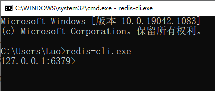
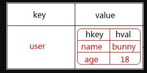
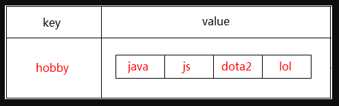
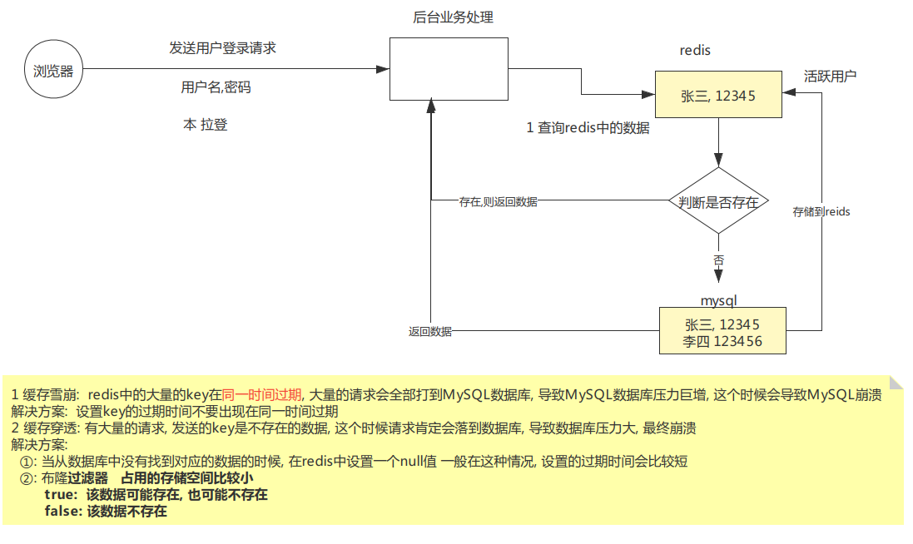

# 数据库分类

## 关系型数据库

- Oracle
- MySQL
- SqlServer
- DB2

**描述** : 关系型数据库，是指采用了[关系模型](https://baike.baidu.com/item/关系模型/3189329)来组织数据的数据库，其以行和列的形式存储数据，以便于用户理解，关系型数据库这一系列的行和列被称为表，一组表组成了[数据库](https://baike.baidu.com/item/数据库/103728)。用户通过查询来检索数据库中的数据，而查询是一个用于限定数据库中某些区域的执行代码。关系模型可以简单理解为二维表格模型，而一个关系型数据库就是由[二维表](https://baike.baidu.com/item/二维表/2863955)及其之间的关系组成的一个数据组织。


## NoSql数据库

**描述**: NoSQL，泛指非关系型的数据库。随着互联网[web2.0](https://baike.baidu.com/item/web2.0/97695)网站的兴起，传统的关系数据库在处理web2.0网站，特别是超大规模和高并发的[SNS](https://baike.baidu.com/item/SNS/10242)类型的web2.0纯[动态网](https://baike.baidu.com/item/动态网)站已经显得力不从心，出现了很多难以克服的问题，而非关系型的数据库则由于其本身的特点得到了非常迅速的发展。NoSQL数据库的产生就是为了解决大规模数据集合多重数据种类带来的挑战，特别是大数据应用难题。

NoSQL最常见的解释是“non-relational”， “Not Only SQL”也被很多人接受。***NoSQL仅仅是一个概念，泛指非关系型的数据库，区别于关系数据库，它们不保证关系数据的ACID(事务)特性***。NoSQL是一项全新的数据库革命性运动，其拥护者们提倡运用非关系型的数据存储，相对于铺天盖地的关系型数据库运用，这一概念无疑是一种全新的思维的注入。


###   键值存储

这一类数据库主要会使用到一个哈希表，这个表中有一个特定的键和一个指针指向特定的数据。Key/value模型对于IT系统来说的优势在于简单、易部署


**代表: Redis**

###   列存储数据库

这部分数据库通常是用来应对分布式存储的海量数据。键仍然存在，但是它们的特点是指向了多个列。这些列是由列家族来安排的。


**代表: HBase**

###   文档型数据库

文档型数据库的灵感是来自于Lotus Notes办公软件的，而且它同第一种键值存储相类似。该类型的数据模型是版本化的文档，半结构化的文档以特定的格式存储，比如JSON。文档型数据库可 以看作是键值数据库的升级版，允许之间嵌套键值。而且文档型数据库比键值数据库的查询效率更高


**代表: MongoDb**

###   图形数据库

图形结构的数据库同其他行列以及刚性结构的SQL数据库不同，它是使用灵活的图形模型，并且能够扩展到多个服务器上。NoSQL数据库没有标准的查询语言(SQL)，因此进行数据库查询需要制定数据模型。许多NoSQL数据库都有REST式的数据接口或者查询API


**代表: Neo4J**

###  非关系型数据库特点

1.数据模型比较简单.(主要)

2.需要灵活性更强的应用系统

3.对数据库性能要求较高(主要)

4.不需要高度的数据一致性(主要)

5.对于给定key,比较容易映射复杂值的环境.


###  与关系型数据区分

[关系型数据库和非关系型区别](https://blog.csdn.net/aaronthon/article/details/81714528)

关系型数据库最典型的数据结构是表，由二维表及其之间的联系所组成的一个数据组织

**优点**

1、易于维护：都是使用表结构，格式一致；

2、使用方便：SQL语言通用，可用于复杂查询；

3、复杂操作：支持SQL，可用于一个表以及多个表之间非常复杂的查询。

**缺点**

1、读写性能比较差，尤其是海量数据的高效率读写；

2、固定的表结构，灵活度稍欠；

3、高并发读写需求，传统关系型数据库来说，硬盘I/O是一个很大的瓶颈。


\-----------------------------------------------------------------------------------------


非关系型数据库严格上不是一种数据库，应该是一种数据结构化存储方法的集合，可以是文档或者键值对等。

**优点**

1、格式灵活：存储数据的格式可以是key,value形式、文档形式、图片形式等等，文档形式、图片形式等等，使用灵活，应用场景广泛，而关系型数据库则只支持基础类型。

2、速度快：nosql可以使用硬盘或者随机存储器作为载体，而关系型数据库只能使用硬盘；

3、高扩展性；

4、成本低：nosql数据库部署简单，基本都是开源软件。

**缺点**

1、不提供sql支持，学习和使用成本较高；

2、无事务处理；

3、数据结构相对复杂，复杂查询方面稍欠。


# Redis介绍


###  什么是redis

Redis简介:

是以key-value形式存储,和传统的关系型数据库不一样.不一定遵循传统数据库的一些基本要求.(非关系型的,分布式的,开源的,水平可拓展的)

**优点:**

对数据高并发读写(直接是内存中进行读写的)

对海量数据的高效率存储和访问

对数据的可拓展性和高可用性.

**单线程操作,**每个操作都是原子操作,没有并发相关问题(redis 6)


**缺点:**

redis(ACID处理非常简单)

无法做太复杂的关系数据库模型


**Redis是以key-value store存储**.

键可以包含:(string)字符串,哈希,(list)链表,(set)集合,(zset)有序集合.这些数据集合都指出push/pop,add/remove及取交集和并集以及更丰富的操作.redis支持各种不同方式排序,为了保证效率,数据都是缓存在内存中.它可以从周期性的把更新的数据写入到磁盘或者把修改操作写入追加的文件中.

#### 重点

**redis定位是缓存, 提高数据读写速度, 减轻对数据库存储与访问压力**


###  redis的优势

**性能极高** – Redis能支持超过 10W次每秒的读写频率。

丰富的数据类型 – Redis支持二进制案例的 Strings, Lists, Hashes, Sets 及 Ordered Sets 数据类型操作。

原子 – Redis的所有操作都是原子性的，同时Redis还支持对几个操作合并后的原子性执行。

丰富的特性 – Redis还支持 publish/subscribe(发布/订阅), 通知, key 过期等等特性。


下面是官方的bench-mark数据：

测试完成了50个并发执行100000个请求。

设置和获取的值是一个256字节字符串。

Linuxbox是运行Linux2.6,这是X3320Xeon2.5ghz。

文本执行使用loopback接口(127.0.0.1)。

结果:**读的速度是110000次/s,写的速度是81000次/s。**


# 学习Redis


###  链接文档

[Redis在线CMD命令练习](http://try.redis.io/)

[Redis官方站](https://redis.io/)

[Redis 中文资料站](http://www.redis.cn/)

[Redis菜鸟文档](https://www.runoob.com/redis/redis-tutorial.html)


###  redis的安装


官方并没有Windows版本的Redis

[Github-Redis 别人移植](https://github.com/microsoftarchive/redis/releases)

安装后记得配置环境变量,不然只能在安装目录打开

Redis默认端口是: 6379

安装好后会自动启动服务器,并且没有密码

进入到安装目录下,使用cmd命令行运行redis-cli.exe程序,出现下面界面表示安装成功

```xmd
redis-cli.exe
```




### 操作命令


####  高级命令

```java
// 掌握
keys * -> 查询所有key,返回满足的所有键(可以模糊查询)

exists key -> 是否存在指定key

expire key time -> 设置某个key的过期时间(秒)

ttl key			-> 查看key的剩余时间(秒)

persist key -> 取消过期时间

flushdb  -> 清空当前数据库

flushall -> 清空所有数据库

dbsize 查看数据库的key数量


// 拓展

选择数据库,数据库为0到15(一共16个数据库) 默认进入的是0数据库
select [index]

move [key] [数据库下标] 讲当前数据中的key转移到其他数据库中

randomkey 随机返回数据库里的一个key

rename [key] [newKey] 重命名Key

echo 用于打印给定的字符串

info 获取数据库信息

config get * 返回所有配置

config get [configName] 用于获取 redis 服务的配置参数。在 Redis 2.4 版本中， 有部分参数没有办法用 CONFIG GET 访问，但是在最新的 Redis 2.6 版本中，所有配置参数都已经可以用 CONFIG GET 访问了。


```


#### String类型

String类型包含多种类型的特殊类型,并且是二进制安全的.比如序列化的对象进行存储,比如一张图片进行二进制存储.,比如一个简单的.

**Map<String, String> map = new .....**

**map.put("name" ,  Json.toJsonString(user) );**

*存储结构*  :

| Key(String) | Value(String) |
| :---------: | :-----------: |
|    name     |     张三      |
|     age     |      18       |

```java
// 进入Redis操作模式 : 配置环境变量后直接进CMD-> redis-cli.exe 或者去安装目录下CMD

// 掌握

set key value -> 存入键值对

get key -> 根据键取出值

incr key -> 把值递增1

decr key -> 把值递减1

del key -> 根据键删除键值对

setex key timeout value -> 存入键值对,timeout表示失效时间,单位s

ttl key->可以查询出当前的key还剩余多长时间过期

setnx key value -> 如果key已经存在,不做操作, 如果key不存在,直接添加


// 拓展.....

incrby key num -> 偏移值

mset k1 v1 k2 v2 ... -> 批量存入键值对

mget k1 k2 ... -> 批量取出键值

append key 'value' -> 原值后拼接新内容

setrange key index value -> 修改键对应的值,index表示开始的索引位置

```

#####  应用情景

**计数器**：许多运用都会使用redis作为计数的基础工具，他可以实现快速计数、查询缓存的功能，

同时数据可以异步落地到其他的数据源。

如：视频播放数系统就是使用redis作为视频播放数计数的基础组件。

**incr viewnum 1**

**共享session**：出于负载均衡的考虑，分布式服务会将用户信息的访问均衡到不同服务器上，

用户刷新一次访问可能会需要重新登录，为避免这个问题可以用redis将用户session集中管理，

在这种模式下只要保证redis的高可用和扩展性的，每次获取用户更新或查询登录信息

都直接从redis中集中获取。


#### Hash类型

Hash类型是String类型的field和value的映射表.或者说是一个String集合.它特别适合存储对象,相比较而言,讲一个对象存储在Hash类型里要比存储在String类型里占用更少的内存空间,并方便存储整个对象.

**Map< String, Map<String , ? > > map = new ....**




```java
// 掌握 
hset key hashkey hashvalue -> 存入一个hash对象

hget key hashkey -> 根据hash对象键取去值

hexists key hashkey -> 判断hash对象是含有某个键

hdel key hashkey -> 根据hashkey删除hash对象键值对


// 拓展
hincrby key hashkey 递增值 -> 递增hashkey对应的值

hlen key -> 获取hash对象键的数量

hkeys key -> 获取hash对象的所有键

hvals key -> 获取hash对象的所有值

hgetall key -> 获取hash对象的所有数据

hsetnx key hashkey value -> hashkey,不做操作, hashkey,直接添加

```

#####  应用情景

哈希结构相对于字符串序列化缓存信息更加直观，并且在更新操作上更加便捷。

所以常常用于**用户信息**等管理，但是哈希类型和关系型数据库有所不同，哈希类型是稀疏的，

而关系型数据库是完全结构化的，关系型数据库可以做复杂的关系查询，而redis去模拟关系型复杂查询

开发困难，维护成本高

###### 共享session

**key：user_token ,  value： [ 两种方案 ]**

```java
class User{
    private String userame;
    private String password;
    private int age;
}
new user("dafei", "666", 18) // 转JSON 或者 Map
    

 //方案1： 将user对象转换json格式字符串存redis【侧重于查， 改非常麻烦】
	user_token ： "{name:dafei, age:19, password:666}"
	
 //方案2： 将user对象转换hash对象存redis 【侧重于改，查询相对麻烦】
	user_token: { name: ddafei , age: 19, password: 666 }


```


#### List类型

**Redis中的List类似Java中的queue,也可以当做List来用.**

List类型是一个链表结构的集合,其主要功能有push,pop,获取元素等.更详细的说,List类型是一个双端链表的结构,我们可以通过相关操作进行集合的头部或者尾部添加删除元素,list的设计非常简单精巧,即可以作为栈,又可以作为队列.满足绝大多数需求.     **Map<String, Object>**



常用命令:

```java
// 掌握
rpush key value -> 往列表右边添加数据

lrange key start end -> 范围显示列表数据,全显示则设置0 -1

lpush key value -> 往列表左边添加数据

lpop key -> 弹出列表最左边的数据

rpop key -> 弹出列表最右边的数据

llen key -> 获取列表长度

// 拓展
linsert key before/after refVal newVal -> 参考值之前/后插入数据

lset key index value -> 根据索引修改数据

lrem key count value -> 在列表中按照个数删除数据

ltrim key start end -> 范围截取列表

lindex key index -> 根据索引取列表中数据
```

#####  应用情景

用户收藏文章列表：

|      Key(String)      | Value(List)-> 有序可以重复  |
| :-------------------: | :-------------------------: |
| **user_articles:uid** | **[aid1, aid2, aid3.....]** |


####  Set类型

*Set集合是 String 类型的无序集合, set 是通过  hashtable 实现的,对集合我们可以取交集,并集,差集.*

|      Key(String)      |  Value(Set)->无序不可重复   |
| :-------------------: | :-------------------------: |
| **user_articles:uid** | **[aid1, aid2, aid3.....]** |

常用命令

```java
// 掌握
sadd key value 	-> 往set集合中添加元素

smembers key 	-> 列出set集合中的元素

srem key value 	-> 删除set集合中的元素

spop key count 	-> 随机弹出集合中的元素(理解成随机集合元素remove并返回)

sdiff key1 key2 -> 返回key1中特有元素(差集)

sinter key1 key2 -> 返回两个set集合的交集

sunion key1 key2 -> 返回两个set集合的并集

scard key -> 返回set集合中元素个数


// 拓展
sdiffstore var key1 key2 -> 返回key1中特有元素存入另一个set集合

sinterstore var key1 key2 -> 返回两个set集合的交集存入另一个set集合

sunionstore var key1 key2 -> 返回两个set集合的并集存入另一个set集合

smove key1 key2 value -> 把key1中的某元素移入key2中

sismember key value -> 判断集合是否包含某个值

srandmember key count -> 随机获取set集合中元素

```

#####  应用情景

```java
1，去重；

2，抽奖:

    1,准备一个抽奖池:sadd luckydraw 1 2 3 4 5 6 7 8 9 10 11 12 13

    2,抽3个三等奖:spop luckydraw 3

    3,抽2个二等奖:spop luckydraw 2

    4,抽1个二等奖:spop luckydraw 1
```


####  SortedSet(zset)类型

**有序集合和集合一样也是 String 类型元素的集合,且不允许重复的成员。**

不同的是每个元素都会关联一个 double 类型的分数。Redis 正是通过分数来为集合中的成员进行从小到大的排序。

**有序集合的成员是唯一的,但分数(score)却可以重复**。

集合是通过哈希表实现的，所以添加，删除，查找的复杂度都是 O(1)。 

集合中最大的成员数为 232 - 1 (4294967295, 每个集合可存储40多亿个成员)。

|      Key(String)      |  Value(Set)->有序不可重复   |
| :-------------------: | :-------------------------: |
| **user_articles:uid** | **[aid1, aid2, aid3.....]** |

常用命令:

```java
// 掌握
zadd key score column -> 存入分数和名称

zincrby key score column -> 偏移名称对应的分数

zrange key start end -> 按照分数升序输出名称

zrevrange key start end -> 按照分数降序输出名称

zrank key name -> 升序返回排名

zrevrank key name -> 降序返回排名

zcard key -> 返回元素个数


// 拓展
zrangebyscore key min max [withscores] -> 按照分数范围升序输出名称

zrevrangebyscore key max min [withscores] -> 按照分数范围降序输出名称

zrem key name -> 删除名称和分数

zremrangebyscore key min max [withscores] -> 根据分数范围删除元素

zremrangebyrank key start end -> 根据排名删除元素

zcount key min max -> 按照分数范围统计个数
```

#####  应用情景

排行榜：有序集合经典使用场景。例如视频网站需要对用户上传的视频做排行榜，榜单维护可能是多方面：   按照时间、按照播放量、按照获得的赞数等。**再者: 类似王者荣耀的经济变动排序**


####  总结

如果确定使用redis, 此时需要考虑使用哪个数据类型 【偏 redis 原生数据结构】
    1>如果要排序选用zset
    2>如果数据是多个且允许重复选用list
    3>如果数据是多个且不允许重复选用set
    4>剩下的使用string


有些公司约定: 所有的redis的key跟value都使用字符串(排除使用zset场景) 

【偏redis String类型json结构】

1>如果要排序选用zset

2>剩下的使用string

优点: java操作中如果使用各种类型: list set 其他的 操作redis时需要明确指定的泛型, 麻烦

所以有些公司统一规范, 统一使用字符串, 减少泛型操作

```java
List<String>list = ...

Set<String> set = ....

Map<String, Object> map = ....

List<Object> list = redis对象.getList

Set<Object> set =redis对象.getSet

Map<Object, Object> map = redis对象.getMap
```

3:怎么设计 key 与 value值

##### **key的设计**

- **唯一性**
- **可读性**
- **灵活性**
- **时效性**

**value :  根据需求决定**


### Redis安全性

因为redis速度非常快,所以在一台比较好的服务器下,一个外部用户在一秒内可以进行15w次的密码尝试,这意味你需要设定非常强大的密码来方式暴力破解.

**vi**编辑**redis.conf**文件,找到下面进行保存修改

**requirepass [密码]**

重启服务器 **pkill redis-server**

再次进入127.0.01:6379>  keys *

(error)NOAUTH Authentication required.

会发现没有权限进行查询 auth [密码]

输入密码则成功进入

每次进入的时候都需要输入密码,还有种简单的方式:   

**redis-cli -a [密码]**


### redis事务

Redis 事务可以一次执行多个命令， 并且带有以下三个重要的保证：

- 批量操作在发送 EXEC 命令前被放入队列缓存。
- 收到 EXEC 命令后进入事务执行，事务中任意命令执行失败，其余的命令依然被执行。
- 在事务执行过程，其他客户端提交的命令请求不会插入到事务执行命令序列中。

一个事务从开始到执行会经历以下三个阶段：

- 开始事务。
- 命令入队。
- 执行事务。

Redis的事务非常简单,使用方法如下:

首先是使用**multi**方法打开事务,然后进行设置,这时设置的数据会放到队列里进行保存.最后使用**exec**执行.把数据依次存储到redis中.使用**discard**方法取消事务.

```java
redis 127.0.0.1:7000> multi
OK
redis 127.0.0.1:7000> set a aaa 
QUEUED
redis 127.0.0.1:7000> set b bbb  
QUEUED
redis 127.0.0.1:7000> set c ccc (取消则输入 discard 回车...)
QUEUED
redis 127.0.0.1:7000> exec
1) OK
2) OK
3) OK
注意: 如果在 set b bbb 处失败，set a 已成功不会回滚，set c 还会继续执行。
```

##### 重点

单个 Redis 命令的执行是原子性的，但 Redis 没有在事务上增加任何维持原子性的机制，所以 Redis 事务的执行并不是原子性的。

事务可以理解为一个打包的批量执行脚本，但批量指令并非原子化的操作，中间某条指令的失败不会导致前面已做指令的回滚，也不会造成后续的指令不做。

再次强调Redis是**单线程操作,**每个操作都是原子操作,没有并发相关问题(redis 6)


### Redis持久化机制

####  RDB方式

1.snapshotting(快照)默认方式.将内存中以快照的方式写入到二进制文件中.默认为dump.rdb.可以配置设置自动做快照持久化方式.我们可以配置redis在n秒内如果超过m个key就修改自动做快照.

Snapshotting设置:

save 900 1 #900秒内如果超过1个Key被修改则发起快照保存

save 300 10 #300秒内如果超过10个key被修改,则发起快照保存

save 60 10000

####  AOF方式

2.append-only file (缩写aof)的方式,由于快照方式是在一定时间间隔做一次,所以可能发生reids意外down的情况就会丢失最后一次快照后的所有修改的数据.aof比快照方式有更好的持久化性,是由于在使用aof时,redis会将每一个收到的写命令都通过write函数追加到命令中,当redis重新启动时会重新执行文件中保存的写命令来在内存中重建这个数据库的内容.这个文件在bin目录下:appendonly.aof

aof不是立即写到硬盘中,可以通过配置文件修改强制写到硬盘中.

aof设置:

appendonly yes //启动aof持久化方式有三种修改方式

\#appendfsync always//收到命令就立即写到磁盘,效率最慢.但是能保证完全的持久化

\#appendfsync everysec//每秒写入磁盘一次,在性能和持久化方面做了很好的折中

\#appendfsync no //完全以依赖os 性能最好,持久化没保证


### Redis内存淘汰机制

[原文地址](https://www.cnblogs.com/maguanyue/p/12090414.html)

<div id="cnblogs_post_body" class="blogpost-body blogpost-body-html">
<p>　　“天长地久有时尽，此恨绵绵无绝期。”好诗！好诗啊！即使是天长地久，也总会有尽头，那么，Redis的内存是不是也会有时尽呢？答案是肯定的。那么，当Redis的内存满了以后，再来新的请求，我们该怎么办呢？这时候，大家就应该来了解Redis的内存淘汰策略了，了解了相关的知识点后，就能明白“Redis内存有时尽”后，会发生些什么。</p>
<p><span style="font-size: 14pt"><strong><span style="color: rgba(255, 0, 0, 1)">Redis内存淘汰机制</span></strong></span></p>
<p>　　Redis内存淘汰机制是指当内存使用达到上限（可通过maxmemory配置，0为不限制，即服务器内存上限），根据一定的算法来决定淘汰掉哪些数据，以保证新数据的存入。</p>
<p>　　常见的内存淘汰机制分为四大类：</p>
<p>　　1. LRU：LRU是Least recently used，最近最少使用的意思，简单的理解就是从数据库中删除最近最少访问的数据，该算法认为，你长期不用的数据，那么被再次访问的概率也就很小了，淘汰的数据为最长时间没有被使用，仅与时间相关。<strong><br></strong></p>
<p>　　2. LFU：LFU是Least Frequently Used，最不经常使用的意思，简单的理解就是淘汰一段时间内，使用次数最少的数据，这个与频次和时间相关。</p>
<p>　　3. TTL：Redis中，有的数据是设置了过期时间的，而设置了过期时间的这部分数据，就是该算法要解决的对象。如果你快过期了，不好意思，我内存现在不够了，反正你也要退休了，提前送你一程，把你干掉吧。</p>
<p>　　4. 随机淘汰：生死有命，富贵在天，是否被干掉，全凭天意了。</p>
<p>　　通过maxmemroy-policy可以配置具体的淘汰机制，看了网上很多文章说只有6种，其实有8种，可以看Redis5.0的配置文件，上面有说明：</p>
<p>　　1. volatile-lru -&gt; 找出已经设置过期时间的数据集，将最近最少使用（被访问到）的数据干掉。<br>　　2. volatile-ttl -&gt; 找出已经设置过期时间的数据集，将即将过期的数据干掉。<br>　　3. volatile-random -&gt; 找出已经设置过期时间的数据集，进行无差别攻击，随机干掉数据。<br>　　4. volatile-lfu -&gt; 找出已经设置过期时间的数据集，将一段时间内，使用次数最少的数据干掉。</p>
<p>　　5. allkeys-lru -&gt;与第1个差不多，数据集从设置过期时间数据变为全体数据。<br>　　6. allkeys-lfu -&gt; 与第4个差不多，数据集从设置过期时间数据变为全体数据。<br>　　7. allkeys-random -&gt; 与第3个差不多，数据集从设置过期时间数据变为全体数据。</p>
<p>　　8. no-enviction -&gt; 什么都不干，报错，告诉你内存不足，这样的好处是可以保证数据不丢失，这也是系统默认的淘汰策略。</p>
<p><strong><span style="color: rgba(255, 0, 0, 1); font-size: 14pt">Redis过期Key清除策略</span></strong></p>
<p>　　Redis中大家会对存入的数据设置过期时间，那么这些数据如果过期了，Redis是怎么样把他们消灭掉的呢？我们一起来探讨一下。下面介绍三种清除策略：</p>
<p>　　惰性删除：当访问Key时，才去判断它是否过期，如果过期，直接干掉。这种方式对CPU很友好，但是一个key如果长期不用，一直存在内存里，会造成内存浪费。</p>
<p>　　定时删除：设置键的过期时间的同时，创建一个定时器，当到达过期时间点，立即执行对Key的删除操作，这种方式最不友好。</p>
<p>　　定期删除：隔一段时间，对数据进行一次检查，删除里面的过期Key，至于要删除多少过期Key，检查多少数据，则由算法决定。举个例子方便大家理解：Redis每秒随机取100个数据进行过期检查，删除检查数据中所有已经过期的Key，如果过期的Key占比大于总数的25%，也就是超过25个，再重复上述检查操作。</p>
<p>　　Redis服务器实际使用的是惰性删除和定期删除两种策略：通过配合使用这两种删除策略，可以很好地在合理使用CPU和避免浪费内存之间取得平衡。</p>


# Java操作Redis


## 依赖

```xml
<parent>
    <groupId>org.springframework.boot</groupId>
    <artifactId>spring-boot-starter-parent</artifactId>
    <version>2.5.4</version>
</parent>

<properties>
    <project.build.sourceEncoding>UTF-8</project.build.sourceEncoding>
    <maven.compiler.source>11</maven.compiler.source>
    <maven.compiler.target>11</maven.compiler.target>
</properties>

<dependencies>

    <!--  Jedis https://mvnrepository.com/artifact/redis.clients/jedis -->
    <dependency>
        <groupId>redis.clients</groupId>
        <artifactId>jedis</artifactId>
        <!--<version>3.7.0</version>-->
    </dependency>

    <!-- https://mvnrepository.com/artifact/org.springframework.boot/spring-boot-starter-data-redis -->
    <dependency>
        <groupId>org.springframework.boot</groupId>
        <artifactId>spring-boot-starter-data-redis</artifactId>
        <!--<version>2.5.4</version>-->
    </dependency>

    <!-- Apache的工具对象转Map -->
    <dependency>
        <groupId>commons-beanutils</groupId>
        <artifactId>commons-beanutils</artifactId>
        <version>1.9.4</version>
    </dependency>

    <dependency>
        <groupId>org.projectlombok</groupId>
        <artifactId>lombok</artifactId>
        <scope>provided</scope><!--只在编译时期有效-->
    </dependency>

    <!-- https://mvnrepository.com/artifact/junit/junit -->
    <dependency>
        <groupId>junit</groupId>
        <artifactId>junit</artifactId>
        <!--<version>4.12</version>-->
        <scope>test</scope>
    </dependency>
    
    <dependency>
        <groupId>org.springframework.boot</groupId>
        <artifactId>spring-boot-starter</artifactId>
    </dependency>

    <dependency>
        <groupId>org.springframework.boot</groupId>
        <artifactId>spring-boot-starter-test</artifactId>
        <scope>test</scope>
    </dependency>

</dependencies>
```


## Test演示

```java
import org.apache.commons.pool2.impl.GenericObjectPoolConfig;
import org.junit.Test;
import redis.clients.jedis.Jedis;
import redis.clients.jedis.JedisPool;

public class JedisTest {

    @Test
    public void jedisTest() {
        // 1:创建Jedis连接池
        JedisPool pool = new JedisPool("localhost", 6379);
        // 2:从连接池中获取Jedis对象
        Jedis jedis = pool.getResource();
        /* 设置密码
        jedis.auth(密码); */
        // 3:TODO 存操作还是取操作
        jedis.set("name", "李四");
        String name = jedis.get("name");
        System.out.println(name);
        // 4:关闭资源
        jedis.close();
        pool.destroy();
    }

    @Test
    public void testTool(){
        GenericObjectPoolConfig config = new GenericObjectPoolConfig();
        ////最大连接数, 默认8个
        config.setMaxTotal(100);
        ////最大空闲连接数, 默认8个
        config.setMaxIdle(20);
        //获取连接时的最大等待毫秒数(如果设置为阻塞时BlockWhenExhausted),如果超时就抛异常, 小于零:阻塞不确定的时间,  默认-1
        config.setMaxWaitMillis(-1);
        //在获取连接的时候检查有效性, 默认false
        config.setTestOnBorrow(true);
        JedisPool pool = new JedisPool(config,"localhost",6379,5000,null);
        Jedis j = pool.getResource();
        // TODO 操作
        j.set("name","张三");
        String name = j.get("name");
        System.out.println(name);
        // 关闭资源
        j.close();
        pool.close();
        pool.destroy();
    }
}
```

## 常用方法

### 高级命令

```java
@Test
public void testTool(){
    // 默认配置连接池
    JedisPool jedisPool = new JedisPool();
    Jedis j = jedisPool.getResource();

    // [name, a, n] 查看所有 key 返回是字符串类型
    Set<String> keys = j.keys("*");

    // 判断时候存在指定Key
    Boolean hasName = j.exists("name");

    // 设置某个key的过期时间
    j.expire("a", 20);
    // 查看key剩余存活时间
    Long a = j.ttl("a");
    // 取消存活时间限制
    j.persist("a");

    // 查看key的数量
    j.dbSize();

    j.flushDB(); // 清空当前数据库
    j.flushAll(); // 清空所有数据库

    // 释放资源
    j.close();
    jedisPool.destroy();
}
```

### String类型

```java
@Test
public void stringType(){
    // 默认配置连接池
    JedisPool jedisPool = new JedisPool();
    Jedis j = jedisPool.getResource();

    // 简单的存取
    j.set("name", "张三");
    String name = j.get("name");
    System.out.println(name);

    // 递增/减放 -- sum=2
    j.set("sum", "2");
    // sum 递增 1 => sum=3
    j.incr("sum");
    // sum 递减 1 => sum=2
    j.decr("sum");

    // 删除 key
    j.del("sum");

    // name=9999 存活时间 3 秒
    j.setex("name", 3, "9999");
    // 看剩余存活时间
    j.ttl("name");

    // key 存在则无操作,不存则添加
    j.setnx("name", "王五");

    // 释放资源
    j.close();
    jedisPool.destroy();
}
```

### Hash类型

```java
@Test
public void hashType(){
    // 默认配置连接池
    JedisPool jedisPool = new JedisPool();
    Jedis j = jedisPool.getResource();

    // 简单的存取
    j.hset("user", "name","张三");
    j.hset("user", "age","18");
    j.hset("user", "sex","男");
    j.hget("user", "name");
    j.hget("user", "age");
    j.hget("user", "sex");
    j.hkeys("user");  // [name, age, sex]
    j.hvals("user"); // [张三, 18, 男]

    // 判断 hash 对象时候有某个key
    Boolean hexists = j.hexists("user", "name");
    // 删除 hash 对象的 key
    j.hdel("user","name");

    // 释放资源
    j.close();
    jedisPool.destroy();
}
```

### List类型

```java
@Test
public void listType(){
    // 默认配置连接池
    JedisPool jedisPool = new JedisPool();
    Jedis j = jedisPool.getResource();

    // 从列表左边插入
    j.lpush("list", "1");
    j.rpush("list", "2");
    // 从列表右边插入
    j.lpush("list", "3");
    // 3 1 2
    j.lrange("list",0,-1).forEach(System.err::print);

    j.lpop("list"); // 弹出最左元素
    j.rpop("list"); // 弹出最右元素
    j.llen("list"); // 获取列表长度
    j.del("list"); //删除

    // 释放资源
    j.close();
    jedisPool.destroy();
}
```

### Set类型

```java
@Test
public void setType() {
    // 默认配置连接池
    JedisPool jedisPool = new JedisPool();
    Jedis j = jedisPool.getResource();

    // 存 不允许元素重复
    j.sadd("set", "张三");
    j.sadd("set", "李四");
    j.sadd("set", "李四");
    j.sadd("set", "王五");
    j.sadd("set2","111");
    j.sadd("set2","222");
    // [张三, 王五, 李四] 列出所有元素
    System.out.println(j.smembers("set"));

    // 删除集合中元素
    j.srem("set","张三");
    // [王五, 李四]
    System.out.println(j.smembers("set"));

    // 返回 set 独有的元素
    j.sdiff("set", "set2");

    // 返回 set 和 set2 都有的元素
    j.sinter("set", "set2");

    // 返回两个集合加起来的元素
    j.sunion("set", "set2");

    // 随机弹出元素 ->集合会删除弹出元素,不只是获取
    System.out.println(j.spop("set"));

    // 返回set集合的元素个数
    Long set = j.scard("set");

    // 释放资源
    j.close();
    jedisPool.destroy();
}
```

### ZSet类型

```java
@Test
public void test() {
    // zset集合 分数为200 列名
    j.zadd("zset", 200, "张三");
    j.zadd("zset", 200, "李四");
    j.zadd("zset", 200, "王五");
    j.zadd("zset", 200, "赵六");

    // 分数升序排
    j.zrange("zset", 0, -1).forEach(System.err::println);

    // 分数降序排
    j.zrevrange("zset", 0, -1).forEach(System.err::println);

    // 给赵六加分
    j.zincrby("zset", 800, "赵六");
    // 分数降序
    j.zrevrange("zset", 0, -1).forEach(System.err::println);
    // 分数升序
    j.zrange("zset", 0, -1).forEach(System.err::println);

    // 降序排名 3
    j.zrank("zset","赵六");
    // 降序排名 0
    j.zrevrank("zset", "赵六");
    
    // 获取赵六分数 =1000.0
    Double zscore = j.zscore("zset", "赵六");
    
    // 返回元素个数
    j.zcard("zset");
}
```


## 集成SpringBoot

**application.properties**

```properties
# REDIS (RedisProperties)
# Redis数据库索引（默认为0）
spring.redis.database=0
# Redis服务器地址
spring.redis.host=localhost
# Redis服务器连接端口
spring.redis.port=6379
# Redis服务器连接密码（默认为空）
spring.redis.password=
# 连接池最大连接数（使用负值表示没有限制）
spring.redis.jedis.pool.max-active=8
# 连接池最大阻塞等待时间（使用负值表示没有限制）
spring.redis.jedis.pool.max-wait=-1
# 连接池中的最大空闲连接
spring.redis.jedis.pool.max-idle=8
# 连接池中的最小空闲连接
spring.redis.jedis.pool.min-idle=0
# 连接超时时间（毫秒）
spring.redis.timeout=0
```

**依赖在前面**

### 无法自动注入可配置

```java
@Configuration
@ConditionalOnClass({RedisOperations.class})
@EnableConfigurationProperties({RedisProperties.class})
@Import({LettuceConnectionConfiguration.class, JedisConnectionConfiguration.class})
public class RedisAutoConfiguration {
    public RedisAutoConfiguration() {
    }
 
    //@ConditionalOnMissingBean，它是修饰bean的一个注解，主要实现的是，当你的bean被注册之后，如果而注册相同类型的bean，就不会成功，它会保证你的bean只有一个，即你的实例只有一个，当你注册多个相同的bean时，会出现异常，以此来告诉开发人员。
    
    @Bean
    @ConditionalOnMissingBean(name = "redisTemplate")
    public RedisTemplate<Object, Object> redisTemplate(RedisConnectionFactory redisConnectionFactory) throws UnknownHostException {
        RedisTemplate<Object, Object> template = new RedisTemplate();
        template.setConnectionFactory(redisConnectionFactory);
        return template;
    }
 
    @Bean
    @ConditionalOnMissingBean
    public StringRedisTemplate stringRedisTemplate(RedisConnectionFactory redisConnectionFactory) throws UnknownHostException {
        StringRedisTemplate template = new StringRedisTemplate();
        template.setConnectionFactory(redisConnectionFactory);
        return template;
    }
}
```

### 详细配置

```java
@Bean
@ConditionalOnMissingBean(name = "redisTemplate") // 改成Object就能存一切类型
public RedisTemplate<String, Long> redisTemplate(RedisConnectionFactory redisConnectionFactory) {
    FastJsonRedisSerializer<Long> fastJsonRedisSerializer = new FastJsonRedisSerializer<>(Long.class); // value的类型
    RedisTemplate<String, Long> template = new RedisTemplate<>();
    template.setKeySerializer(RedisSerializer.string()); // 设置key类型
    template.setHashKeySerializer(RedisSerializer.string());// 设置 key类型
    template.setValueSerializer(fastJsonRedisSerializer); // 设置value类型
    template.setHashValueSerializer(fastJsonRedisSerializer); // 设置 value类型
    template.setConnectionFactory(redisConnectionFactory);
    return template;
}
```


### 类和方法

```java
@Autowired
private RedisTemplate<String,Object> redisTemplate; // 可以自己指定泛型

@Autowired
private StringRedisTemplate stringRedisTemplate;
    
//对应方法:
            redisTemplate.opsForValue();//操作字符串

            redisTemplate.opsForHash();	//操作hash

            redisTemplate.opsForList()	;//操作list

            redisTemplate.opsForSet();	//操作set

            redisTemplate.opsForZSet();	//操作有序set
```


### 常用方法

```java
import org.junit.jupiter.api.Test;
import org.springframework.beans.factory.annotation.Autowired;
import org.springframework.boot.test.context.SpringBootTest;
import org.springframework.data.redis.core.*;

import java.time.Duration;
import java.util.Set;

@SpringBootTest
public class SpringBootRedisTest {

    @Autowired
    private StringRedisTemplate r;

    @Test   /* 高级操作 */
    public void test() {
        // 获取所有key
        Set<String> keys = r.keys("*");
        // 清空所有 keys 数据库 用 r.keys("*") 获取所有
        r.delete(keys);

        // 判断key是否存在
        Boolean a = r.hasKey("B");
        // 设置某个key的过期时间  秒...
        r.expire("name", Duration.ofSeconds(20));
        // 获取过期时间
        r.getExpire("name");
        // 取消过期时间
        r.persist("name");
    }

    @Test /* String 类型 key=value */
    public void stringType() {
        ValueOperations<String, String> str = r.opsForValue();
        // 存取
        str.set("name", "10");
        str.get("name");
        // 递增 1
        str.increment("name");
        // 递减 1
        str.decrement("name");
        // 删除
        str.getOperations().delete("name");
        // 创建并设置失效时间
        str.set("age", "20", Duration.ofSeconds(5));
        // key已存在就不做任何操作
        str.setIfAbsent("name", "李四");
        // key存在就修改,不存在就算了
        str.setIfPresent("name", "王五");
    }

    @Test /* Hash类型无序 */
    public void hashType() {
        HashOperations<String, Object, Object> has = r.opsForHash();
        // 存取
        has.put("user", "name", "张三");
        has.put("user", "age", "18");
        has.get("user", "name"); // 取 name的value
        // 集合获取Map {name=张三, age=18}
        has.entries("user");
        //  判读是否有 user 对象是否 name 属性
        has.hasKey("user", "name");
        // 删除user 对象对应属性
        has.delete("user", "name");
    }

    @Test /* List类型 有序允许重复 */
    public void listType() {
        ListOperations<String, String> list = r.opsForList();
        // 右边追加 name
        list.rightPush("list", "name");
        // 左边追加 aaaa
        list.leftPush("list", "aaaa");
        // 第一个 name 后面插入18 ,不存在则不插入
        list.rightPush("list", "name", "张三");
        // 查看整个队列
        System.out.println(list.range("list", 0, -1));
        // 弹出最左元素
        list.leftPop("list");
        // 弹出最右元素
        list.rightPop("list");
        // 获取集合个数
        list.size("list");
    }

    @Test /* set类型 无序不允许重复 */
    public void setType() {
        SetOperations<String, String> set = r.opsForSet();
        // 添加...
        set.add("set", "1", "2", "3", "4");
        set.add("set2", "11", "22", "1", "33");
        // 列出所有 Set
        set.members("set");
        // 删除set集合对象中的元素
        set.remove("set", "3", "4");
        // 随机弹出集合中元素 3 个元素 集合元素不会减少和删除
        set.randomMembers("set", 3);
        // 返回set独有的元素
        set.difference("set", "set2");
        // 返回共同的元素
        set.intersect("set", "set2");
        // 返回两个集合所有元素
        set.union("set", "set2");
        // 返回集合中个数
        set.size("set");
    }

    @Test /* SortedSet 类型  可以排序,有序不允许重复*/
    public void sortedSetType() {
        ZSetOperations<String, String> zset = r.opsForZSet();
        // 集合 属性 分数
        zset.add("zset", "张三", 100);
        zset.add("zset", "李四", 100);
        zset.add("zset", "王五", 100);
        // 升序排序
        zset.range("zset", 0, -1);
        // 降序排序
        zset.reverseRange("zset", 0, -1);
        // 升序返回排名 0
        System.out.println(zset.rank("zset", "张三"));
        // 降序返回排名 2
        System.out.println(zset.reverseRank("zset", "张三"));
        // 增加分数 原来 100 + 900 = 1000
        zset.incrementScore("zset", "张三", 900);
        // 查看分数
        zset.score("zset", "张三");
        // 返回元素个数
        zset.size("zset");
    }
}
```


## 雪崩&穿透



## **缓存击穿**

***缓存击穿，不是缓存雪崩中的key大面积过期，而是指一个key非常热点，在不停的扛着大并发，大并发集中对这一个点进行访问，当这个key在失效的瞬间，持续的大并发就穿破缓存，直接请求数据库，就像在一个屏障上凿开了一个洞。***

**解决方法1、加分布式锁或者分布式队列**

用加分布式锁或者分布式队列的方式保证缓存的单线程写，从而避免失效时大量的并发请求落到底层存储系统上。在加锁方法内先从缓存中再获取一次(防止另外的线程优先获取锁已经写入了缓存)，没有再查DB写入缓存。 （当然也可以： 在没有获取锁的线程中一直轮询缓存，至超时）

**解决方法2、添加超时标记**

在缓存的对象上增加一个属性来标识超时时间，当获取到数据后，校验数据内部的标记时间，判定是否快超时了，如果是，异步发起一个线程（控制好并发）去主动更新该缓存。

**解决方法3、**另外还有一个粗暴的方法，如果你的热点数据要求实时性比较低，那么可以设置热点数据在热点时段不过期，在访问低峰期过期，比如每天凌晨过期。


# RedisTemplate和StringRedisTemplate的区别


1.StringRedisTemplate继承RedisTemplate


2、序列化策略不同

SDR默认采用的序列化策略有两种：

- StringRedisTemplate默认采用的是String的序列化策略，保存的key和value都是采用此策略序列化保存的。
- RedisTemplate默认采用的是JDK的序列化策略，保存的key和value都是采用此策略序列化保存的。


3、两者的数据是不共通的；

因为序列化方式不同，也就是说StringRedisTemplate只能管理StringRedisTemplate里面的数据，RedisTemplate只能管理RedisTemplate中的数据。


**4.修改序列化配置在上方的集成SpringBoot的详细配置里**


