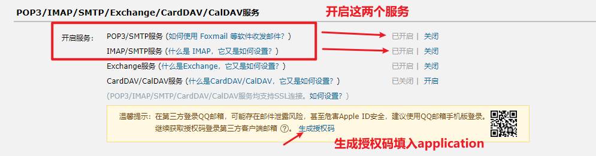
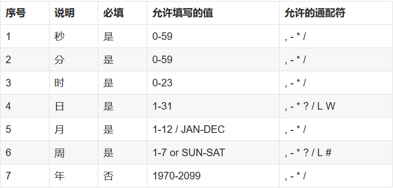
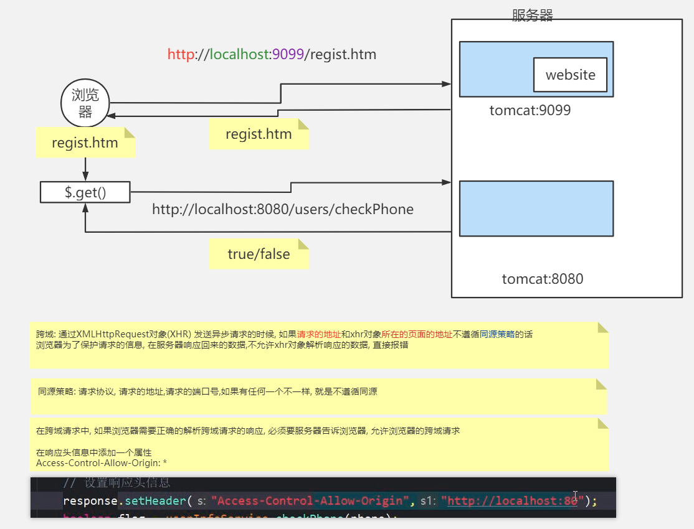

使用注解的优势：

- 采用纯java代码，不在需要配置繁杂的xml文件
- 在配置中也可享受面向对象带来的好处

- 类型安全对重构可以提供良好的支持

- 减少复杂配置文件的同时亦能享受到springIoC容器提供的功能


### SpringBoot注解

**@SpringBootApplication** 注解内部是3大注解功能的集成 

- **@ComponentScan** ：开启组件扫描 

- **@SpringBootConfiguration** ：作用等同于 *@Configuration* 注解，也是用于标记配置类 

- **@EnableAutoConfiguration** ：内部导入 AutoConfigurationImportSelector，该类中有个 getCandidateConfigurations 方法，读取 jar 包中 META-INF/spring.factories 文件中配置 类，再根据条件进行加载和配置，比如：AOP，PropertyPlaceholder，FreeMarker， HttpMessageConverter，Jackson，DataSourceDataSourceTransactionManager， DispatcherServlet，WebMvc 等等


**@EnableScheduling :** // 开启定时任务,需要贴启动类或者配置类上,配合下方的方法注解配置规则使用,**不加异步为单线程执行**

**@Scheduled(cron = "* * */24 * * *")** 配合上方注解组合使用,这个贴需要定时执行的方法上,设定规则 比如现在规则是每24小数执行一次,**不加异步为单线程执行**

**@EnableAsync :**  开启异步,贴配置类或者启动类,配合下方注解使用 **注意 : 异步服务不能在同类里调用**

**@Async :**  需要开启异步执行的方法,配合上方注解使用  **注意 : 异步服务不能在同类里调用**


**@Configuration**：相当于传统的xml配置文件，如果有些第三方库需要用到xml文件，建议仍然通过@Configuration类作为项目的配置主类——可以使用@ImportResource注解加载xml配置文件。

**@MapperScan**：指定要变成实现类的接口所在的包，然后包下面的所有接口在编译之后都会生成相应的实现类,添加位置：是在Springboot启动类上面添加

**@ComponentScan**：表示将该类自动发现扫描组件。个人理解相当于，如果扫描到有@Component、@Controller、@Service等这些注解的类，并注册为Bean，可以自动收集所有的Spring组件，包括@Configuration类。我们经常使用@ComponentScan注解搜索beans，并结合@Autowired注解导入。可以自动收集所有的Spring组件，包括@Configuration类。我们经常使用@ComponentScan注解搜索beans，并结合@Autowired注解导入。如果没有配置的话，Spring Boot会扫描启动类所在包下以及子包下的使用了@Service,@Repository等注解的类。

**@Import **:   使用场景和说明：

- @Import注解是引入带有@Configuration的java类
  一般是和@Configuration注解一起使用
  @Import(value = Hello.class)

-  假设存在一个带有@Configuration的配置类，且配置类中存在@Bean的代码
  在另一个配置类中，需要使用之前配置类中的bean
  这个时候需要在另一个配置类中使用@Import注解，引入之前配置类中的bean

  

**@ImportResource:** 使用场景具体说明

- @ImportResource是引入spring配置文件.xml
      一般是和@Configuration注解一起使用
            @ImportResource(value = "beans-another.xml")

- 假设存在一个bean，已经在配置文件中配置&lt;import resource="beans-another.xml"/&gt;   

- 在另一个配置类中，需要使用该bean, 这个时候需要在另一个配置类中使用@ImportResource注解，引入配置文件中的配置

  

**@PropertySource("classpath:code.properties")**: 加载SpringBoot配置文件(code)application.properties,防止一个项目多个组件的配置文件冲突,当这个组件没有启动类,是从别的类启动的时候,可以在没有启动类的组件增加java配置类贴上@Configuration和@PropertySource

**@ConfigurationProperties**: 这个注解和@Component注解配合，之后程序启动时将自动加载application.properties配置文件中的对应的配置项；

```properties
# 自定义需要创建对象的类头顶上贴 自定义参数绑定
# @ConfigurationProperties(prefix = "db")

db.url=jdbc:mysql:///localhost:3306/demo
db.username=root
db.password=admin
db.driver-class-name=com.mysql.jdbc.Driver
```


**@Scope**：贴在类上，标明 bean 的作用域。 

**@PostConstruct**：贴在方法上，标明 bean 创建完后调用此方法。 

**@PreDestroy**：贴在方法上，标明容器销毁时调用此方法。

**@Value**：注入Spring boot application.properties配置的属性的值.该注解的作用是将我们配置文件的属性读出来

- 有**@Value(“${}”)**和**@Value(“#{}”)**两种方式

```java
	@Value("#{1 - 2}") // 表达式赋值 number
	private int number; //获取数字 1

	@Value("#{'Spring Expression Language'}") //获取字符串常量
	private String str;
	
	@Value("#{dataSource.url}") //获取bean的属性
	private String jdbcUrl1;

 	// application.properties的属性 jdbc.user=admin
	@Value("${jdbc.user}")
	private String user;

```


**@Bean**:用@Bean标注方法等价于XML中配置的bean。放在方法的上面，而不是类，意思是产生一个bean,并交给spring管理。

```java
bean的作用域配置
　　Spring中可以使用scope属性来配置bean的作用域：
　　singleton:单例，在初始化配置文件时生成单例bean对象
　　prototype：原型的，在初始化配置文件时不生成bean对象，使用时返回不同的bean对象
　　request：web环境下每一个request请求都会返回一个不同的bean，只在本次请求中有效
　　session：web环境下每一个request请求都会返回一个不同的bean，在session中有效
```


**@ConditionalOnMissingBean**: 它是修饰bean的一个注解，主要实现的是，当你的bean被注册之后，如果而注册相同类型的bean，就不会成功，它会保证你的bean只有一个，即你的实例只有一个，当你注册多个相同的bean时，会出现异常，以此来告诉开发人员。


**@Inject**：等价于默认的@Autowired，只是没有required属性;

**@Resource**：

- 可以让 Spring 自动的把属性或字段需要的对象找出来，并注入到属性上或字段上。
- 可以贴在字段或者 setter 方法上面。
- 可以注入一些 Spring 内置的重要对象，比如 BeanFactory，ApplicationContext 等。
- Resource 注解必须要能找到对应的对象，否则报错。
- 第三方程序：Spring3.0 之前需要手动配置 Autowired 注解的解析程序：  ，在 Spring 的测试环境可以不配置， Web 开发中换一种配置解决。
- 寻找 bean 的方式： 首先按照名字去找，如果找到，就使用 setter 或者字段注入。 若按照名字找不到，再按照类型去找，但如果找到多个匹配类型，报错。 可以直接使用 name 属性指定 bean 的名称（@Resource(name="")）；但若指定的 name，就只能按照 name 去找，若找不到，就不会再按照类型去。

**@AutoWired**：

- 可以让 Spring 自动的把属性或字段需要的对象找出来，并注入到属性上或字段上。 
- 可以贴在字段或者 setter 方法上面。 
- 可以同时注入多个对象。 可以注入一些 Spring 内置的重要对象，比如 BeanFactory，ApplicationContext 等。
-  默认情况下 Autowired 注解必须要能找到对应的对象，否则报错。通过 required=false 来避免这 个问题：@Autowired(required=false)。
-  第三方程序：Spring3.0 之前需要手动配置 Autowired 注解的解析程序：  ，在 Spring 的测试环境可以不配置，在 Web 开发中换一种配置解决。
-  Autowired 注解寻找 bean 的方式： 首先按照依赖对象的类型找，若找到，就是用 setter 或者字段直接注入。 如果在 Spring 上下文中找到多个匹配的类型，再按照名字去找，若没有匹配报错。
- 可以通过使用 @Qualifier("other") 标签来规定依赖对象按照 bean 的 id 和 类型的组合方式 去找。

**@Qualifier**：当有多个同一类型的Bean时，可以用@Qualifier(“name”)来指定。与@Autowired配合使用。@Qualifier限定描述符除了能根据名字进行注入，但能进行更细粒度的控制如何选择候选者

 

**@Mapper**：作用：在接口类上添加了@Mapper，在编译之后会生成相应的接口实现类
    添加位置：接口类上面,如果想要每个接口都要变成实现类，那么需要在每个接口类上加上@Mapper注解，比较麻烦，解决这个问题用@MapperScan

**@Service**：一般用于修饰service层的组件

**@Repository**：使用@Repository注解可以确保DAO或者repositories提供异常转译，这个注解修饰的DAO或者repositories类会被ComponetScan发现并配置，同时也不需要为它们提供XML配置项。

**@Component**：泛指组件，当组件不好归类的时候，我们可以使用这个注解进行标注。

**@Controller**：用于定义控制器类，在spring项目中由控制器负责将用户发来的URL请求转发到对应的服务接口（service层），一般这个注解在类中，通常方法需要配合注解@RequestMapping。

**@RestController**：用于标注控制层组件(如struts中的action)，@ResponseBody和@Controller的合集。

**@RequestMapping**：提供路由信息，负责URL到Controller中的具体函数的映射。

**@ResponseBody**：表示该方法的返回结果直接写入HTTP response body中，一般在异步获取数据时使用，用于构建RESTful的api。在使用@RequestMapping后，返回值通常解析为跳转路径，加上@esponsebody后返回结果不会被解析为跳转路径，而是直接写入HTTP response body中。比如异步获取json数据，加上@Responsebody后，会直接返回json数据。该注解一般会配合@RequestMapping一起使用。


**@Transactional**: 增加事务,贴类或方法上,注解的属性:

- **name** 当在配置文件中有多个 TransactionManager , 可以用该属性指定选择哪个事务管理器。
- **isolation** 事务的隔离度，默认值采用 DEFAULT。
- **timeout** 事务的超时时间，默认值为-1。如果超过该时间限制但事务还没有完成，则自动回滚事务。
- **read-only** 指定事务是否为只读事务，默认值为 false；为了忽略那些不需要事务的方法，比如读取数据，可以设置 read-only 为 true。
- **rollback-for** 用于指定能够触发事务回滚的异常类型，如果有多个异常类型需要指定，各类型之间可以通过逗号分隔。
- **no-rollback- for** 抛出 no-rollback-for 指定的异常类型，不回滚事务。
- **propagation** 事务的传播行为，默认值为 REQUIRED。
  1. *REQUIRED* 支持当前已经存在的事务，如果还没有事务，就创建一个新事务。
  2. *MANDATORY* 支持当前已经存在的事务，如果还没有事务，就抛出一个异常。
  3. *NESTED* 在当前事务中创建一个嵌套事务，如果还没有事务，那么就简单地创建一个新事务。
  4. *REQUIRES_NEW* 挂起当前事务，创建一个新事务，如果还没有事务，就简单地创建一个新事务。
  5. *NEVER* 强制要求不在事务中运行，如果当前存在一个事务，则抛出异常。
  6. *NOT_SUPPORTED* 强制不在事务中运行，如果当前存在一个事务，则挂起该事务。
  7. *SUPPORTS* 支持当前事务，如果没有事务那么就不在事务中运行。


**AOP注解**:

<div class="table-box">
<table border="1" cellspacing="1" cellpadding="1">
<tbody>
<tr>
<td>@Aspect</td>
<td>切面声明，标注在类、接口（包括注解类型）或枚举上。</td>
</tr>
<tr>
<td>@Pointcut</td>
<td>切入点声明，即切入到哪些目标类的目标方法。<p></p>
<p>value 属性指定切入点表达式，默认为 “”，用于被通知注解引用，这样通知注解只需要关联此切入点声明即可，无需再重复写切入点表达式</p></td>
</tr>
<tr>
<td>@Before</td>
<td>前置通知,&nbsp;在目标方法(切入点)执行之前执行。<p></p>
<p>value 属性绑定通知的切入点表达式，可以关联切入点声明，也可以直接设置切入点表达式</p>
<p>注意：如果在此回调方法中抛出异常，则目标方法不会再执行，会继续执行后置通知 -&gt; 异常通知。</p></td>
</tr>
<tr>
<td>@After</td>
<td>后置通知,&nbsp;在目标方法(切入点)执行之后执行</td>
</tr>
<tr>
<td>@AfterRunning</td>
<td>返回通知,&nbsp;在目标方法(切入点)返回结果之后执行，在 @After 的后面执行<p></p>
<p>pointcut 属性绑定通知的切入点表达式，优先级高于 value，默认为 “”</p></td>
</tr>
<tr>
<td>@AfterThrowing</td>
<td>异常通知, 在方法抛出异常之后执行, 意味着跳过返回通知<p></p>
<p>pointcut 属性绑定通知的切入点表达式，优先级高于 value，默认为 “”</p>
<p>注意：如果目标方法自己 try-catch 了异常，而没有继续往外抛，则不会进入此回调函数</p></td>
</tr>
<tr>
<td>@Around</td>
<td>环绕通知：目标方法执行前后分别执行一些代码，发生异常的时候执行另外一些代码</td>
</tr>
</tbody>
</table>
</div>


### 全局异常处理

**@ControllerAdvice**：包含@Component。可以被扫描到。统一处理异常, 贴类上。

**@ExceptionHandler（Exception.class）**：用在方法上面表示遇到这个异常就执行以下方法。

示例:

```java
@ControllerAdvice
public class OverallException {

    @ResponseBody
    @ExceptionHandler(Exception.class)
    public JsonResult RuntimeException(RuntimeException e) {
        e.printStackTrace();
        return JsonResult.defaultError();
    }
}
```


### 配置解析和使用环境

**@MappedSuperclass**：

- @MappedSuperclass 注解使用在父类上面，是用来标识父类的
- @MappedSuperclass 标识的类不能再有@Entity或@Table注解
- @MappedSuperclass 标识的类表示其不能映射到数据库表，因为其不是一个完整的实体类, 但是它所拥有的属性能够映射在其子类对用的数据库表中

**使用条件JPA里**：

当我们进行开发项目时，我们经常会用到实体映射到数据库表的操作，此时我们经常会发现在我们需要隐射的几个实体类中，有几个共同的属性，例如编号ID，创建者，创建时间，修改者，修改时间，备注等。遇到这种情况，我们可能会想到把这些属性抽象出来当成一个父类，然后再以不同的实体类来继承这个父类。

那么，我们便可以使用@MappedSuperclass注解，通过这个注解，我们可以将该实体类当成基类实体，它不会隐射到数据库表，但继承它的子类实体在隐射时会自动扫描该基类实体的隐射属性，添加到子类实体的对应数据库表中。

**使用环境**：

1. @MappedSuperclass注解使用在父类上面，是用来标识父类的
2. @MappedSuperclass标识的类表示其不能映射到数据库表，因为其不是一个完整的实体类，但是它所拥有的属性能够隐射在其子类对用的数据库表
3. @MappedSuperclass标识得嘞不能再有@Entity或@Table注解


### SpringMVC相关注解

**@RequestMapping**：@RequestMapping(“/path”)表示该控制器处理所有“/path”的UR L请求。
					RequestMapping是一个用来处理请求地址映射的注解，可用于类或方法上。
									
用于类上注解，表示类中的所有响应请求的方法都是以该地址作为父路径。该注解有六个属性：

- **params**:指定request中必须包含某些参数值是，才让该方法处理。
- **headers**:指定request中必须包含某些指定的header值，才能让该方法处理请求。
- **value**:指定请求的实际地址，指定的地址可以是URI Template 模式
- **method**:指定请求的method类型， GET、POST、PUT、DELETE等
- **consumes**:指定处理请求的提交内容类型（Content-Type），如application/json,text/html;
- **produces**:指定返回的内容类型，仅当request请求头中的(Accept)类型中包含该指定类型才返回

**@RequestParam**：用在方法的参数前面

```java
public void test( @RequestParam("id") Long ids){ }
```

**@PathVariable**:路径变量。参数与大括号里的名字一样要相同。

@PathVariable("xxx")
通过 @PathVariable 可以将URL中占位符参数{xxx}绑定到处理器类的方法形参中@PathVariable(“xxx“)

```java
// 比如请求时候就按照注解的定义的id接收参数,方法执行还是按照形参的ids获取
@RequestMapping("show5/{id}/{name}") 
public void test(@PathVariable("id") Long ids ,@PathVariable("name") String names){ }
```


### LomBok常用注解
**@Setter**：注解在属性上；为属性提供 setting 方法 

**@Getter**：注解在属性上；为属性提供 getting 方法

**@Data**：注解在类上；提供类所有属性的 getting 和 setting 方法，此外还提供了equals、canEqual、hashCode、toString 方法

**@Log4j2** ：注解在类上；为类提供一个 属性名为log 的 log4j 日志对象，和@Log4j注解类似

**@NoArgsConstructor**：注解在类上；为类提供一个无参的构造方法

**@AllArgsConstructor**：注解在类上；为类提供一个全参的构造方法

**@EqualsAndHashCode**:默认情况下，会使用所有非瞬态(non-transient)和非静态(non-static)字段来生成equals和hascode方法
					也可以指定具体使用哪些属性。

**@toString**:生成toString方法，默认情况下，会输出类名、所有属性，属性会按照顺序输出，以逗号分割。

**@NoArgsConstructor,  @RequiredArgsConstructor ,  @AllArgsConstructor**
	无参构造器、部分参数构造器、全参构造器，当我们需要重载多个构造器的时候，只能自己手写了

**@NonNull**：注解在属性上，如果注解了，就必须不能为Null

**@val**:注解在属性上，如果注解了，就是设置为final类型，可查看源码的注释知道     


### JPA注解


**@Entity**：@Table(name=”“)：表明这是一个实体类。一般用于jpa这两个注解一般一块使用，但是如果表名和实体类名相同的话，@Table可以省略


**@MappedSuperClass**:用在确定是父类的entity上。父类的属性子类可以继承。


**@NoRepositoryBean**:一般用作父类的repository，有这个注解，spring不会去实例化该repository。


**@Column**：如果字段名与列名相同，则可以省略。


**@Id**：表示该属性为主键。


**@GeneratedValue(strategy = GenerationType.SEQUENCE,generator = “repair_seq”)**：表示主键生成策略是sequence（可以为Auto、IDENTITY、native等，Auto表示可在多个数据库间切换），指定sequence的名字是repair_seq。


**@SequenceGeneretor(name = “repair_seq”, sequenceName = “seq_repair”, allocationSize = 1)**：name为sequence的名称. 以便使用，sequenceName为数据库的sequence名称，两个名称可以一致。


**@Transient**：表示该属性并非一个到数据库表的字段的映射,ORM框架将忽略该属性。如果一个属性并非数据库表的字段映射,就务必将其标示为@Transient,否则,ORM框架默认其注解为@Basic。


**@Basic(fetch=FetchType.LAZY)**：标记可以指定实体属性的加载方式


**@JsonIgnore**：作用是json序列化时将Java bean中的一些属性忽略掉,序列化和反序列化都受影响。


**@JoinColumn**（name=”loginId”）:一对一：本表中指向另一个表的外键。一对多：另一个表指向本表的外键。


**@OneToOne、@OneToMany、@ManyToOne**：对应hibernate配置文件中的一对一，一对多，多对一。


### @Column


1.当实体的属性与其映射的数据库表的列不同名时需要使用@Column标注说明，该属性通常置于实体的属性声明语句之前，还可与 @Id 标注一起使用。


2.@Column 标注的常用属性是name，用于设置映射数据库表的列名。此外，该标注还包含其它多个属性，如：unique、nullable、length、precision等。

具体如下：

  1 name属性：name属性定义了被标注字段在数据库表中所对应字段的名称

  2 unique属性：unique属性表示该字段是否为唯一标识，默认为false，如果表中有一个字段需要唯一标识，则既可以使用该标记,
  				也可以使用@Table注解中的@UniqueConstraint

  3 nullable属性：nullable属性表示该字段是否可以为null值，默认为true

  4 insertable属性：insertable属性表示在使用”INSERT”语句插入数据时，是否需要插入该字段的值

  5 updateable属性：updateable属性表示在使用”UPDATE”语句插入数据时，是否需要更新该字段的值

  6 insertable和updateable属性：一般多用于只读的属性，例如主键和外键等，这些字段通常是自动生成的

  7 columnDefinition属性：columnDefinition属性表示创建表时，该字段创建的SQL语句，一般用于通过Entity生成表定义时使用，
  						 如果数据库中表已经建好，该属性没有必要使用

  8 table属性：table属性定义了包含当前字段的表名

  9 length属性：length属性表示字段的长度，当字段的类型为varchar时，该属性才有效，默认为255个字符

  10 precision属性和scale属性：precision属性和scale属性一起表示精度，当字段类型为double时，
  							precision表示数值的总长度，scale表示小数点所占的位数
    具体如下：
           1.double类型将在数据库中映射为double类型，precision和scale属性无效
           2.double类型若在columnDefinition属性中指定数字类型为decimal并指定精度，则最终以columnDefinition为准
           3.BigDecimal类型在数据库中映射为decimal类型，precision和scale属性有效
           4.precision和scale属性只在BigDecimal类型中有效


3.@Column 标注的columnDefinition属性: 表示该字段在数据库中的实际类型.通常 ORM 框架可以根据属性类型自动判断数据库中字段的类型,但是对于Date类型仍无法确定数据库中字段类型究竟是DATE,TIME还是TIMESTAMP.此外,String的默认映射类型为VARCHAR,如果要将 String 类型映射到特定数据库的 BLOB 或TEXT字段类型.


4.@Column标注也可置于属性的getter方法之前


### 数据库相关

**当你在执行各种持久化方法的时候实体的状态会随之改变，状态的改变会引发不同的生命周期事件。这些事件可以使用不同的注释符来指示发生时的回调函数。**

- @javax.persistence.PostLoad：加载后。

- @javax.persistence.PrePersist：持久化前。

- @javax.persistence.PostPersist：持久化后。

- @javax.persistence.PreUpdate：更新前。

- @javax.persistence.PostUpdate：更新后。

- @javax.persistence.PreRemove：删除前。

- @javax.persistence.PostRemove：删除后。        

1.数据库查询

@PostLoad事件在下列情况下触发：

- 执行EntityManager.find()或getreference()方法载入一个实体后。

- 执行JPQL查询后。

- EntityManager.refresh()方法被调用后。

2.数据库插入

@PrePersist和@PostPersist事件在实体对象插入到数据库的过程中发生：

- @PrePersist事件在调用persist()方法后立刻发生，此时的数据还没有真正插入进数据库。

- @PostPersist事件在数据已经插入进数据库后发生。

3.数据库更新

@PreUpdate和@PostUpdate事件的触发由更新实体引起：

- @PreUpdate事件在实体的状态同步到数据库之前触发，此时的数据还没有真正更新到数据库。

- @PostUpdate事件在实体的状态同步到数据库之后触发，同步在事务提交时发生。

4.数据库删除

@PreRemove和@PostRemove事件的触发由删除实体引起：

- @PreRemove事件在实体从数据库删除之前触发，即在调用remove()方法删除时发生，此时的数据还没有真正从数据库中删除。

- @PostRemove事件在实体从数据库中删除后触发。


### &SpringBoot监听器


Spring框架中有哪些不同类型的事件？

Spring 提供了以下5种标准的事件：
（1）上下文更新事件（ContextRefreshedEvent）：在调用ConfigurableApplicationContext 接口中的refresh()方法时被触发。
（2）上下文开始事件（ContextStartedEvent）：当容器调用ConfigurableApplicationContext的Start()方法开始/重新开始容器时触发该事件。
（3）上下文停止事件（ContextStoppedEvent）：当容器调用ConfigurableApplicationContext的Stop()方法停止容器时触发该事件。
（4）上下文关闭事件（ContextClosedEvent）：当ApplicationContext被关闭时触发该事件。容器被关闭时，其管理的所有单例Bean都被销毁。
（5）请求处理事件（RequestHandledEvent）：在Web应用中，当一个http请求（request）结束触发该事件。

如果一个bean实现了ApplicationListener接口，当一个ApplicationEvent 被发布以后，bean会自动被通知。

#### 代码实现

```java
import org.springframework.context.ApplicationListener;
import org.springframework.context.event.ContextRefreshedEvent;
import org.springframework.stereotype.Component;

@Component 
public class RedisDataInitListener implements ApplicationListener<ContextRefreshedEvent> {

    @Override	// 这个事件 容器启动成功会触发一次
    public void onApplicationEvent(ContextRefreshedEvent contextRefreshedEvent) {
        System.out.println("==========初始化数据========");
     	//需要执行的操作
        
        System.out.println("==========初始化完毕========");
    }
}
```


### **&参数解析器**

#### 定义注解

```java
import java.lang.annotation.ElementType;
import java.lang.annotation.Retention;
import java.lang.annotation.RetentionPolicy;
import java.lang.annotation.Target;

/* 前端控制器是否需要参数加工的注解*/
@Target(ElementType.PARAMETER)
@Retention(RetentionPolicy.RUNTIME)
public @interface MyParame {
}
```

#### 配置解析器

```java
import com.alibaba.fastjson.JSON;
import org.springframework.beans.factory.annotation.Autowired;
import org.springframework.core.MethodParameter;
import org.springframework.web.bind.support.WebDataBinderFactory;
import org.springframework.web.context.request.NativeWebRequest;
import org.springframework.web.method.support.HandlerMethodArgumentResolver;
import org.springframework.web.method.support.ModelAndViewContainer;

/* 拦截器配置 */
//@Component
public class UserInfoArgumentResolver implements HandlerMethodArgumentResolver {

    @Autowired
    private IRedisService redisService;

	@Override
    public boolean supportsParameter(MethodParameter parameter) {
        // 判断参数时候需要解析,这里不是所有参数都要解析,所有配合自定义注解 注解存在且参数类型一致才会进入 resolveArgument 方法
        return UserInfo.class == parameter.getParameterType() && parameter.hasParameterAnnotation(MyParame.class);
    }

    @Override
    public UserInfo resolveArgument(MethodParameter parameter, ModelAndViewContainer mavContainer, NativeWebRequest webRequest, WebDataBinderFactory binderFactory) throws Exception {
        // 获取请求头携带的 token
        String token = webRequest.getHeader("token");
        // 按照 Key 取 value(json数据) 转成对象 返回
        String verifyValue = redisService.getVerifyValue(RedisKeys.USER_LOGIN_TOKEN.join(token));
        return JSON.parseObject(verifyValue, UserInfo.class);
    }
}
```

#### 控制器方法

```java
/* 点赞 */
@NeedLogin // 需要登录才能点赞
@PostMapping("strategyThumbup") // url映射路径(点赞)
// 这里的形参 userInfo 贴了自定义注解,所以经过了参数解析器,没贴则不会走参数解析器
public JsonResult strategyThumbup(Long sid, @MyParame UserInfo userInfo) {
    return JsonResult.success();
}
```

#### 注入Bean

```java
/* 手动注入Bean */
@Configuration
public class MyWebMvcConfig implements WebMvcConfigurer {

    @Override	// 配置这个才会生效
    public void addArgumentResolvers(List<HandlerMethodArgumentResolver> resolvers) {
        resolvers.add(userInfoArgumentResolver());
    }

    @Bean // 可以不注入这个  但是要  @Autowired导入实体类对象 和 实体类上贴 @Component
    public UserInfoArgumentResolver userInfoArgumentResolver(){
        return new UserInfoArgumentResolver();
    }

}
```


### &邮箱验证码实现(mail)

#### 1.配置及依赖

```xml
<dependency><!-- 邮箱验证码自动配置 -->
    <groupId>org.springframework.boot</groupId>
    <artifactId>spring-boot-starter-mail</artifactId>
</dependency>
```

**application.properties**:

```properties
# 邮箱服务器地址 // 默认不动
spring.mail.host=smtp.qq.com
# 邮箱账号 作为服务给注册用户发送验证码的QQ邮箱
spring.mail.username=xxx@qq.com
# 授权码 开启POP3/SMTP 生成的授权码
spring.mail.password= 
# 邮箱默认编码 默认不该
spring.mail.default-encoding=UTF-8
# 端口 默认25 默认不该
spring.mail.port=25
# 邮箱发件人 和邮箱账号一样填QQ邮箱
my.mail.user=xxx@qq.com

```




**进入自己QQ网页的邮箱,选  设置>账户>开启上图两个服务**


#### 2注入Bean的方式

```java
// 这是手动注入,自动注入使用 application.properties 配置就行了不用配置这个
@Configuration
public class CodeConfig {
    @Bean	// 自己注入Bean的方式
    public JavaMailSenderImpl setJavaMailSender() {
        JavaMailSenderImpl javaMailSender = new JavaMailSenderImpl();
        javaMailSender.setHost("smtp.qq.com");//链接服务器
        javaMailSender.setPort(25);//默认使用25端口发送
        javaMailSender.setUsername("xxx@qq.com");//账号
        javaMailSender.setPassword("授权码xxx");//授权码
        javaMailSender.setDefaultEncoding("UTF-8");
        Properties properties = new Properties();
        properties.setProperty("mail.debug", "true");//启用调试
        properties.setProperty("mail.smtp.timeout", "1000");//设置链接超时
        //设置通过ssl协议使用465端口发送、使用默认端口(25) 时下面三行不需要
        //properties.setProperty("mail.smtp.auth", "true");//开启认证
        //properties.setProperty("mail.smtp.socketFactory.port", "465");//设置ssl端口
        //properties.setProperty("mail.smtp.socketFactory.class", "javax.net.ssl.SSLSocketFactory");
        javaMailSender.setJavaMailProperties(properties);
        return javaMailSender;
    }
}
```


#### 3.异步发送配置

##### 重点

**关键点：异步服务不能在同类里调用。**

**ThreadPoolConfig 是手动注入Bean的方式,可以不配置,直接SpringBoot启动类贴 @EnableAsync** 

```java
/* 配置线程池,可以不配置,直接启动类贴开启异步注解注解 */
@Configuration  // 配置类
@EnableAsync    // 开启异步
public class ThreadPoolConfig {
    @Bean("messageThread") // 指定注入线程对象的名字
    public TaskExecutor taskExecutor() {
        // 创建线程池
        ThreadPoolTaskExecutor executor = new ThreadPoolTaskExecutor();
        // 设置核心线程数
        executor.setCorePoolSize(4);
        // 设置最大线程数
        executor.setMaxPoolSize(8);
        // 设置队列容量
        executor.setQueueCapacity(100);
        // 设置线程活跃时间（秒）
        executor.setKeepAliveSeconds(60);
        // 设置默认线程名称 自定义
        executor.setThreadNamePrefix("CodeMessage-");
        // 设置拒绝策略
        executor.setRejectedExecutionHandler(new ThreadPoolExecutor.CallerRunsPolicy());
        // 等待所有任务结束后再关闭线程池
        executor.setWaitForTasksToCompleteOnShutdown(true);
        // 设置等待关闭时间 秒
        executor.setAwaitTerminationSeconds(60);
        return executor;
    }
}
```

#### **接口及实现类Service**

```java
// 定义Service异步接口
public interface IAsyncService {
    /**
     * 异步发送邮件验证码
     * @param message 短信内容
     * @param email 收件人
     */
    void asyncSend(String message, String email);
}

/*异步类实现类*/
@Service
public class AsyncServiceImpl implements IAsyncService {

    /*发件人 自定义*/
    @Value("${my.mail.user}")
    private String emailNameUser;

    /*邮箱对象*/
    @Autowired
    private JavaMailSenderImpl mailSender;

    @Async("messageThread") // 从线程池获取对象,可以两边都不加
    public void asyncSend(String message, String email) {
        // 获取邮件对象
        MimeMessage mimeMessage = mailSender.createMimeMessage();
        try {
            // 获取消息助手对象
            MimeMessageHelper mimeMessageHelper = new MimeMessageHelper(mimeMessage, true);
            // 设置发件人
            mimeMessageHelper.setFrom(emailNameUser);
            // 设置收件人
            mimeMessageHelper.setTo(email);
            //设置邮件主题
            mimeMessageHelper.setSubject("邮件主题");
            //设置验证码的样式
            mimeMessageHelper.setText(message);
            // 发送验证码
            mailSender.send(mimeMessage);
        } catch (MessagingException e) {
            e.printStackTrace();
        }
    }
}
```


### &SpringBoot定时器

**需要依赖  spring-context.jar**

使用方法

```java
// 启动类
@SpringBootApplication
@EnableScheduling // 开启定时任务
@EnableAsync // 开启异步
public class WebApiApp {
    public static void main(String[] args) {
        SpringApplication.run(WebApiApp.class, args);
    }
}


@Component // 用Service 也行
public class Timer {

    // 定时的方法
    @Scheduled(cron = "* * */24 * * *") // 每24小时执行一次
    @Async // 设置为异步执行 不设置则默认为单线程,不管多少个方法,都会一个个按照顺序执行,一个线程睡,所有方法停
    public void condition() {
        System.out.println(
            "当前线程: " + Thread.currentThread().getName() + "时间: " + new Date().toLocaleString());
    }
}

```

**该参数接收一个`cron表达式`，`cron表达式`是一个字符串，字符串以5或6个空格隔开，分开共6或7个域，每一个域代表一个含义。**

<pre class="hljs json"><code class="language-java hljs"><span class="hljs-keyword"><span class="hljs-selector-class"><span class="hljs-selector-class"><span class="hljs-keyword"><span class="hljs-selector-class"><span class="hljs-selector-class"><span class="hljs-keyword"><span class="hljs-selector-class"><span class="hljs-selector-class"><span class="hljs-keyword"><span class="hljs-selector-class"><span class="hljs-selector-class"><span class="hljs-selector-class"><span class="hljs-selector-class"><span class="hljs-keyword"><span class="hljs-selector-class"><span class="hljs-selector-class"><span class="hljs-selector-class"><span class="hljs-meta"><span class="hljs-variable"><span class="hljs-meta"><span class="hljs-keyword"><span class="hljs-keyword"><span class="hljs-class"><span class="hljs-keyword"><span class="hljs-class"><span class="hljs-keyword"><span class="hljs-title"><span class="hljs-class"><span class="hljs-title"><strong>cron表达式语法<br></strong></span></span></span></span></span></span></span></span></span></span></span></span></span></span></span></span></span></span></span></span></span></span></span></span></span></span></span></span></span></span></code><strong><code class="json hljs">[秒] [分] [小时] [日] [月] [周] [年]<br>注：[年]不是必须的域，可以省略[年]，则一共<span class="hljs-number">6</span>个域<br></code></strong></pre>

#### 1.cron

[在线Cron表达式生成器 ](https://cron.qqe2.com/)

 **cron 是 @Scheduled 方法注解的属性**

`cron`属性接收的`cron表达式`支持占位符

**application.properties 里配置**

<pre class="hljs undefined"><code class="hljs yaml"><span class="hljs-attr">time:</span>
  <span class="hljs-attr">cron:</span> <span class="hljs-string">*/5</span> <span class="hljs-string">*</span> <span class="hljs-string">*</span> <span class="hljs-string">*</span> <span class="hljs-string">*</span> <span class="hljs-string">*</span>
  <span class="hljs-attr">interval:</span> <span class="hljs-number">5</span></code><br>每5秒执行一次：</pre>

```java
@Scheduled(cron="${time.cron}")
void testPlaceholder1() {
    System.out.println("Execute at " + System.currentTimeMillis());
}

@Scheduled(cron="*/${time.interval} * * * * *")
void testPlaceholder2() {
    System.out.println("Execute at " + System.currentTimeMillis());
}
```

#### **2.zone**

**zone @Scheduled 方法注解的属性**

**将解析cron表达式的时区。默认情况下，此属性为空字符串（即将使用服务器的本地时区）。 返回： java.util.TimeZone.getTimeZone接受的区域id（字符串），或指示服务器默认时区的空字符串**     **比如我们一般使用的时区`Asia/Shanghai`。该字段我们一般留空。**


#### 3. fixedDelay

**@Scheduled(fixedDelay = 5000) //上一次执行完毕时间点之后5秒再执行**


#### 4. fixedDelayString

**与 `3. fixedDelay` 意思相同，只是使用字符串的形式。唯一不同的是支持占位符。**

```java
//  占位符的使用(application.properties配置：time.fixedDelay=5000)：

@Scheduled(fixedDelayString = "${time.fixedDelay}")
void testFixedDelayString() {
    System.out.println("Execute at " + System.currentTimeMillis());
}
```


#### 5. fixedRate

**上一次开始执行时间点之后多长时间再执行**. 注意和 **3. 4** 的区别是**开始执行时间**和**执行完毕时间 ** 多少秒后执行

```
@Scheduled(fixedRate = 5000) //上一次开始执行时间点之后5秒再执行
```


#### 6. fixedRateString

**与 `5. fixedRate` 意思相同，只是使用字符串的形式。唯一不同的是支持占位符。**


#### 7. initialDelay

**第一次延迟多长时间后再执行**

```java
@Scheduled(initialDelay=1000, fixedRate=5000) //第一次延迟1秒后执行，之后按fixedRate的规则每5秒执行一次
```


#### 8. initialDelayString

与 `8. initialDelayString` 意思相同，只是使用字符串的形式。唯一不同的是支持占位符。


```java
Seconds : 可出现 ", - * /" 四个字符，有效范围为0-59的整数
Minutes : 可出现 ", - * /" 四个字符，有效范围为0-59的整数
Hours : 可出现 ", - * /" 四个字符，有效范围为0-23的整数
DayofMonth : 可出现 ", - * / ? L W C" 八个字符，有效范围为0-31的整数
Month : 可出现 ", - * /" 四个字符，有效范围为1-12的整数或JAN-DEC
DayofWeek : 可出现 ", - * / ? L C #" 四个字符，有效范围为1-7的整数或SUN-SAT两个范围。1表示星期天，2表示星期一， 依次类推
Year : 可出现 ", - * /" 四个字符，有效范围为1970-2099年
```



####  通配符

<ul>
<li><code>*</code> 表示所有值。 例如:在分的字段上设置 *,表示每一分钟都会触发。</li>
<li><code>?</code> 表示不指定值。使用的场景为不需要关心当前设置这个字段的值。例如:要在每月的10号触发一个操作，但不关心是周几，所以需要周位置的那个字段设置为”?” 具体设置为 0 0 0 10 * ?</li>
<li><code>-</code> 表示区间。例如 在小时上设置 “10-12”,表示 10,11,12点都会触发。</li>
<li><code>,</code> 表示指定多个值，例如在周字段上设置 “MON,WED,FRI” 表示周一，周三和周五触发</li>
<li><code>/</code> 用于递增触发。如在秒上面设置”5/15” 表示从5秒开始，每增15秒触发(5,20,35,50)。 在月字段上设置’1/3’所示每月1号开始，每隔三天触发一次。</li>
<li><code>L</code> 表示最后的意思。在日字段设置上，表示当月的最后一天(依据当前月份，如果是二月还会依据是否是润年[leap]), 在周字段上表示星期六，相当于”7”或”SAT”。如果在”L”前加上数字，则表示该数据的最后一个。例如在周字段上设置”6L”这样的格式,则表示“本月最后一个星期五”</li>
<li><code>W</code> 表示离指定日期的最近那个工作日(周一至周五). 例如在日字段上置”15W”，表示离每月15号最近的那个工作日触发。如果15号正好是周六，则找最近的周五(14号)触发, 如果15号是周未，则找最近的下周一(16号)触发.如果15号正好在工作日(周一至周五)，则就在该天触发。如果指定格式为 “1W”,它则表示每月1号往后最近的工作日触发。如果1号正是周六，则将在3号下周一触发。(注，”W”前只能设置具体的数字,不允许区间”-“)。</li>
<li><code>#</code> 序号(表示每月的第几个周几)，例如在周字段上设置”6#3”表示在每月的第三个周六.注意如果指定”#5”,正好第五周没有周六，则不会触发该配置(用在母亲节和父亲节再合适不过了) ；小提示：’L’和 ‘W’可以一组合使用。如果在日字段上设置”LW”,则表示在本月的最后一个工作日触发；周字段的设置，若使用英文字母是不区分大小写的，即MON与mon相同。</li>
</ul>


#### 简单例子

<p>"0 0 12 * * ?" &nbsp; &nbsp;每天中午十二点触发<br>"0 15 10 ? * *" &nbsp; &nbsp;每天早上10：15触发<br>"0 15 10 * * ?" &nbsp; &nbsp;每天早上10：15触发<br>"0 15 10 * * ? *" &nbsp; &nbsp;每天早上10：15触发<br>"0 15 10 * * ? 2005" &nbsp; &nbsp;2005年的每天早上10：15触发<br>"0 * 14 * * ?" &nbsp; &nbsp;每天从下午2点开始到2点59分每分钟一次触发<br>"0 0/5 14 * * ?" &nbsp; &nbsp;每天从下午2点开始到2：55分结束每5分钟一次触发<br>"0 0/5 14,18 * * ?" &nbsp; &nbsp;每天的下午2点至2：55和6点至6点55分两个时间段内每5分钟一次触发<br>"0 0-5 14 * * ?" &nbsp; &nbsp;每天14:00至14:05每分钟一次触发<br>"0 10,44 14 ? 3 WED" &nbsp; &nbsp;三月的每周三的14：10和14：44触发<br>"0 15 10 ? * MON-FRI" &nbsp; &nbsp;每个周一、周二、周三、周四、周五的10：15触发</p>

每隔5秒执行一次：*/5 * * * * ?

每隔1分钟执行一次：0 */1 * * * ?

每天23点执行一次：0 0 23 * * ?

每天凌晨1点执行一次：0 0 1 * * ?

每月1号凌晨1点执行一次：0 0 1 1 * ?

每月最后一天23点执行一次：0 0 23 L * ?

每周星期天凌晨1点实行一次：0 0 1 ? * L

在26分、29分、33分执行一次：0 26,29,33 * * * ?

每天的0点、13点、18点、21点都执行一次：0 0 0,13,18,21 * * ?


### &参数检验依赖(validation)

**依赖**:

```xml
<dependency><!--验证操作-->
    <groupId>org.springframework.boot</groupId>
    <artifactId>spring-boot-starter-validation</artifactId>
</dependency>
```

**示例:**

```java
// 实体类
@Getter
@Setter
@ToString
@NoArgsConstructor
@AllArgsConstructor
public class UserInfoDTO{
    @NotEmpty(message = "昵称不能为空")
    private String nickname;  //昵称
    @NotEmpty(message = "手机不能为空")
    private String phone;  //手机
    @NotEmpty(message = "邮箱")
    private String email;  //邮箱
    @NotEmpty(message = "密码不能为空")
    private String password; //密码
    @NotEmpty(message = "确认密码不能为空")
    private String rpassword; //确认密码
    @NotEmpty(message = "验证码不能为空")
    private String verifyCode; //验证码
}

//例如: 
// 实现方法,形参是不满足条件则抛出异常,配合全局异常使用
@PostMapping("regist") // @Validated UserInfoDTO userInfoDTO
public void regist(@Validated UserInfoDTO userInfoDTO){
   
}

```

#### 注解详解

<div class="table-box"><table><thead><tr><th>注解</th><th>限制</th></tr></thead><tbody><tr><td>@Null</td><td>限制只能为null</td></tr><tr><td>@NotNull</td><td>限制必须不为null</td></tr><tr><td>@AssertFalse</td><td>限制必须为false</td></tr><tr><td>@AssertTrue</td><td>限制必须为true</td></tr><tr><td>@DecimalMax(value)</td><td>限制必须为一个不大于指定值的数字</td></tr><tr><td>@DecimalMin(value)</td><td>限制必须为一个不小于指定值的数字</td></tr><tr><td>@Digits(integer,fraction)</td><td>限制必须为一个小数，且整数部分的位数不能超过integer，小数部分的位数不能超过fraction</td></tr><tr><td>@Future</td><td>限制必须是一个将来的日期</td></tr><tr><td>@Max(value)</td><td>限制必须为一个不大于指定值的<strong>数字</strong></td></tr><tr><td>@Min(value)</td><td>限制必须为一个不小于指定值的<strong>数字</strong></td></tr><tr><td>@Past</td><td>限制必须是一个过去的日期</td></tr><tr><td>@Pattern(value)</td><td>限制必须符合指定的正则表达式 <strong>字符串</strong></td></tr><tr><td>@Size(max,min)</td><td>限制<strong>字符</strong>长度必须在min到max之间 【不是数字】</td></tr><tr><td>@Past</td><td>验证注解的元素值（日期类型）比当前时间早</td></tr><tr><td>@NotEmpty</td><td>验证注解的元素值不为null且不为空（字符串长度不为0、集合大小不为0）</td></tr><tr><td>@NotBlank</td><td>验证注解的元素值不为空（不为null、去除首位空格后长度为0），不同于@NotEmpty，@NotBlank只应用于字符串且在比较时会去除字符串的空格</td></tr><tr><td>@Email</td><td>验证注解的元素值是Email，也可以通过正则表达式和flag指定自定义的email格式</td></tr><tr><td>@Length(min = 6, max = 16)</td><td>指定传入的<strong>字符串</strong>的长度</td></tr></tbody></table></div>


### &SpringBoot发送Http请求

**依赖**

```xml
<dependency><!--继承在Web里-->
    <groupId>org.springframework.boot</groupId>
    <artifactId>spring-boot-starter-web</artifactId>
</dependency>

<dependency><!-- 配合Json转换使用 -->
    <groupId>com.alibaba</groupId>
    <artifactId>fastjson</artifactId>
    <version>1.2.49</version>
</dependency>
```

#### **1注入Bean配置类**

```java
@Configuration
public class JavaConfig {
    
	// 注入Bean如果在编译器中提示factory不能自动注入，那应该时跟其他类有冲突，
    // 有多个 ClientHttpRequestFactory把这个factory的名字改一下
    @Bean   // 注入Bean
    public RestTemplate restTemplate(ClientHttpRequestFactory factory) {
        return new RestTemplate(factory);
    }

    @Bean   // 简单的客户端 Http 请求工厂
    public ClientHttpRequestFactory simpleClientHttpRequestFactory() {
        SimpleClientHttpRequestFactory factory = new SimpleClientHttpRequestFactory();
        factory.setReadTimeout(5000);//读取超时 单位为ms
        factory.setConnectTimeout(5000);// 连接超时 单位为ms
        return factory;
    }
}
```

#### **2发送请求**

```java
// Put 请求和 Delete 大同小异,也就那样
@SpringBootTest
public class TestHttp {

    @Autowired
    private RestTemplate template;

    @Test/* get请求 */
    public void getForObject() {
        HashMap<String, String> map = new HashMap<>();
        map.put("name", "张三");
        map.put("age", "18");
        String object = template.getForObject("http://localhost:8080/users/list", String.class, map);
        JSON.parseArray(object, UserInfo.class).forEach(System.err::println);
    }

    @Test /*  getForEntity和getForObject的用法是一样的，只是其返回结果是一个ResponseEntity */
    public void getForEntity() {
        
        ResponseEntity<String> response = template
            .getForEntity("http://localhost:8080/users/list", String.class, "name=age", "age=18");
        
        response.getHeaders();		//响应头
        String body = response.getBody(); //响应体，即前面的result
        HttpStatus statusCode = response.getStatusCode(); //响应码
        int statusCodeValue = response.getStatusCodeValue(); // 状态码的值 int 类型
    }

    @Test
    public void postForObject() {
        //设置请求头
        HttpHeaders headers = new HttpHeaders();
        headers.setContentType(MediaType.APPLICATION_JSON);
        headers.add("Accept", MediaType.APPLICATION_JSON.toString());
        //请求体,请求头
        HttpEntity<String> formEntity = new HttpEntity<String>("name=张三", headers);
        String object = template.postForObject("http://localhost:8080/users/list", formEntity, String.class);
        JSON.parseArray(object, UserInfo.class).forEach(System.err::println);
    }
}

```

#### 3短信接口

用于做短信发送等

[京东万象](https://wx.jdcloud.com/api-66)

[中国网建](http://sms.webchinese.com.cn/)

[阿里短信](https://free.aliyun.com/product/cloudcommunication-free-trial?utm_content=se_1009977491)


### &Controller接收跨域请求





#### 1配置单个控制器方法

```java
/* 检查手机号是否注册 */
@GetMapping("checkPhone")
public Boolean checkPhone(String phone, HttpServletResponse res) {
    res.setHeader("Access-Control-Allow-Origin", "*");
    res.setHeader("Access-Control-Allow-Headers", "*");
    res.setHeader("Access-Control-Allow-Methods", "GET, POST, PUT, OPTIONS");
    return userInfoService.checkPhone(phone);
}
```

#### 2集中配置

```java
/* 接收跨域请求配置类 跨域,底层Equels判断请求三要素不一样就算跨域 */
/* 每个控制器都配置太麻烦.就在这里统一配置 */
@Configuration
public class WebMvcCrossOrigin {

    @Bean	// 不使用匿名实现的方式就继承WebMvcConfigurer实现它的方法
    public WebMvcConfigurer corsConfigurer() {
        return new WebMvcConfigurer() {
            @Override
            //重写父类提供的跨域请求处理的接口
            public void addCorsMappings(CorsRegistry registry) {
                //添加映射路径(哪些请求需要放行跨域)
                registry.addMapping("/**")
                        //放行哪些原始域
                        //.allowedOrigins("*") 旧版本的方法
                        .allowedOriginPatterns("*")
                        //是否发送Cookie信息
                        .allowCredentials(true)
                        //放行哪些原始域(请求方式)
                        .allowedMethods("GET", "POST", "PUT", "DELETE", "OPTIONS")
                        //放行哪些原始域(头部信息)
                        .allowedHeaders("*")
                        //暴露哪些头部信息（因为跨域访问默认不能获取全部头部信息）
                        .exposedHeaders("Header1", "Header2");
            }
        };
    }
}
```


#### 3 跨域请求之预检请求

简单请求&复杂请求 官方文档: [跨源资源共享（CORS） - HTTP | MDN (mozilla.org)](https://developer.mozilla.org/zh-CN/docs/Web/HTTP/CORS)

跨域简单请求不会发送预检请求,跨域复杂请求会先发送预检请求

意思就是浏览器发送请求获取服务器数据前,会先发送一个**OPTIONS**类型的请求,等待服务器告知浏览器是否支持跨域,浏览器才会发送第二次请求获取数据


### &策略设计模式

**策略模式的应用场景: 过多的 if-else**
  **①: 定义一个接口**
  **②: 需要编写实现类 有不同的处理方式**
  **③: 定义一个工厂factory**
       **需要初始化所有的实现放到一个缓存(ConcurentHashMap)**
	   **在 @PostConstruct** 
  **④: 使用IoC容器管理**

#### 代码实现

```java
// 接口
public interface IStrategyRank {
    /**
     * 查询最新的推荐数据
     * @return
     */
    List<Map<String,Object>> rank();
}

@Service // 实现类 1
public class StrategyConditionChina implements IStrategyCondition {

    @Autowired
    private IStrategyService strategyService;

    @Override
    public List<StrategyCondition> temporary() {
      	// 独特的实现
    }
}


@Service // 实现类 2
public class StrategyConditionChina implements IStrategyCondition {

    @Autowired
    private IStrategyService strategyService;

    @Override
    public List<StrategyCondition> temporary() {
      	// 独特的实现
    }
}

@Service // 实现类 3
public class StrategyConditionChina implements IStrategyCondition {
xc Z
    @Autowired
    private IStrategyService strategyService;

    @Override
    public List<StrategyCondition> temporary() {
      	// 独特的实现
    }
}
```

#### **工厂类**

```java
@Component  // 工厂类
public class StrategyRankFactory {

    @Autowired
    @Qualifier("strategyConditionChina")
    private IStrategyCondition strategyConditionChina;
    @Autowired
    @Qualifier("strategyConditionForeign")
    private IStrategyCondition strategyConditionForeign;
    @Autowired
    @Qualifier("strategyConditionHot")
    private IStrategyCondition strategyConditionHot;

    Map<Integer, IStrategyCondition> conditionMap;

    @PostConstruct // 初始化方法
    public void initData() {
        conditionMap = new ConcurrentHashMap<>();
        conditionMap.put(1, strategyConditionChina);
        conditionMap.put(2, strategyConditionForeign);
        conditionMap.put(3, strategyConditionHot);
    }

    /* 获取对应的实现  通过传对应的 key 获取 对应的 Value */ 
    public IStrategyCondition getStrategyCondition(Integer type) {
        return conditionMap.get(type);
    }
}

/*
		总结: 把相同代码抽出来,通过方法形参传参比这个简单,写的代码更少,方法就跟写填空题一样
		只不过工厂设计模式,更加方便维护,通俗易懂,逼格更高,显得更专业,也更加解耦

*/
```


### &分时统计表

互联网项目,并发量大,查询操作相对较多, 对于查询数据,数据很多的情况下 **order by** 排序查询会很慢,

解决:

常用的选择方案: 
**① : 直接使用  redis的zset集合 完成排序操作**
      		 **内存操作, 快**
      	 	**占用内存,**
     		  **对于写数据的一致性需要考虑**
**② : 缓存mysql的排行查询结果集**
       **1. 直接使用redis**
      		  **把数据缓存到redis**
       		 **非实时数据, 会有一定的误差**
     	  	 **消耗内存**
       **2. 使用一个临时表存储查询的结果集(分时统计表)  选择这种方案**
        		**非实时数据, 会有一定的误差**


**分时统计表**:   *每隔10分同步一次最新的数据  9:00  --> 9:10 -->9:20*
**① 数据怎么更新同步**
**手动 + 自动**

**②自动同步数据: 定时执行数据同步任务:**

​			**Timer: jdk自带**
​			**ScheduledExecutorService: 定时同步 线程池的方式**

​			**Spring Task: Spring  的定时同步任务**

​			**Quatz**

​			**elasicsearch-job   分布式定时任务**


#### 定时器位置

**定时任务逻辑编写的位置定义的位置:  要考虑是否是分布式项目,有可能会架服务器集群**
		**定时任务: 后台数据处理**
		**core(dao,domain 层)  定时任务  不合适**
		**api(前端交互的接口)    互联网用户时候**
		**mgrsite(后台管理模块)  定时任务  不是最佳方案** 
		**单独创建一个定时任务的项目   模块-job 或者 单独一个项目  最佳方案**


#### 总结

**简单来说,分时统计表就是把常需要高频查询的表.数据,定义出来一张临时表,每过一段时间更新维护临时表数据,让用户去查临时表,数据对比原表会更少,ORDER BY 性能会更好,查询更快**


### &登录拦截注解配置

#### 1.注解

```java
import java.lang.annotation.ElementType;
import java.lang.annotation.Retention;
import java.lang.annotation.RetentionPolicy;
import java.lang.annotation.Target;
/* 判断访问的控制器方法是否需要登录 */
@Target(ElementType.METHOD)
@Retention(RetentionPolicy.RUNTIME)
public @interface NeedLogin {
}
```

#### 2.配置类

```java
/* 接收跨域请求配置类 */
@Configuration
public class WebMvcCrossOrigin implements WebMvcConfigurer {

    @Bean/*LoginInterceptor 类上贴 @Component 就不用再配置类或者启动类上注入写@Bean的实体方法*/
    public LoginInterceptor handlerInterceptor() {
        return new LoginInterceptor();
    }

    @Override // 拦截规则,所有
    public void addInterceptors(InterceptorRegistry registry) {
        registry.addInterceptor(handlerInterceptor()).addPathPatterns("/**");
    }
}
```

#### 3.实现代码实现

```java
/* 拦截器配置 */
//@Component 贴了就不用自己写@Bean实体方法了
public class LoginInterceptor implements HandlerInterceptor {

    /*登录用户Token存活时间*/
    @Value("${my.usertoken.time}")
    private Long usertoken;

    @Autowired
    private IUserInfoRedisService userInfoRedisService;

    @Override
    public boolean preHandle(HttpServletRequest request, HttpServletResponse response, Object handler) throws Exception {

        String tokenId = request.getHeader("token");
        // 得到Key
        String tokenKey = RedisKeys.USER_LOGIN_TOKEN.join(tokenId);

        // 获取Value
        String token = userInfoRedisService.getVerifyValue(tokenKey);
		// 判断是否是访问控制器方法
        if (handler instanceof HandlerMethod) {
            HandlerMethod hm = (HandlerMethod) handler;
            // 不需要登录
            if (!hm.hasMethodAnnotation(NeedLogin.class)) {
                if (token != null) {
                    // 重置时间
                    userInfoRedisService.setVerifyKV(tokenKey, token, usertoken);
                }
                return true;
            } else { // 需要登录
                if (token != null) {
                    // 重置时间
                    userInfoRedisService.setVerifyKV(tokenKey, token, usertoken);
                    return true;
                }
                // 请登录
                response.sendRedirect("http://localhost/login.html");
                return false;
            }
        }
        return true;
    }
}
```

