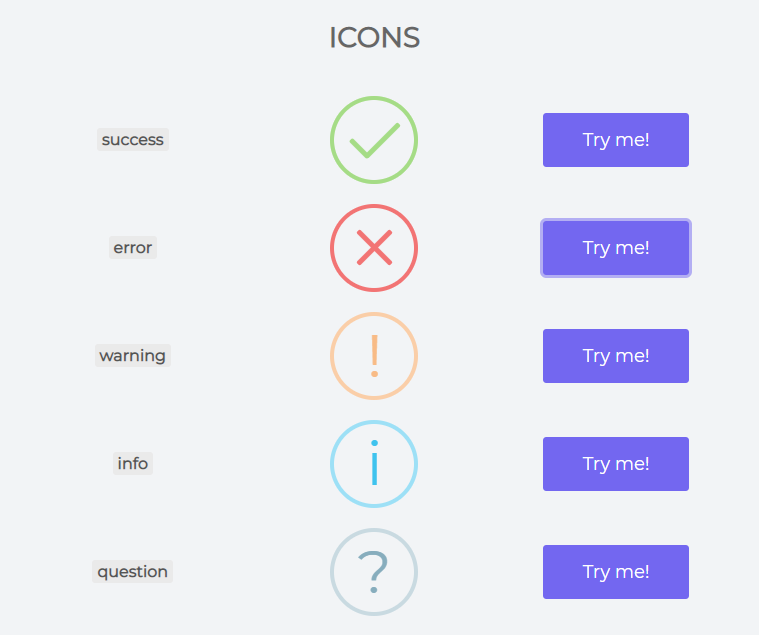
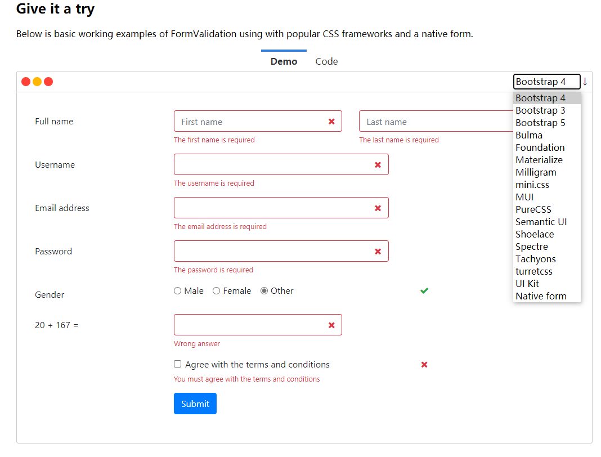

### Bootstrap

***链接*** : [Bootstrap中文网](https://www.bootcss.com/)

Bootstrap 是美国 Twitter 公司的设计师 Mark Otto 和 Jacob Thornton 合作基于 HTML、CSS、 JavaScript 开发的简洁、直观、强悍的前端开发框架，使得 Web 开发更加快捷。 Bootstrap 提供了优 雅的 HTML 和 CSS 规范，它即是由动态 CSS 语言 Less 写成。（***重点是响应式，能适应各种各种设备***）

**常用组件: 面板，栅格系统，表格，按钮，表单，字体图标，模态框，列表等。**

```html

<!-- 最新版本的 Bootstrap 核心 CSS 文件 -->
<link rel="stylesheet" href="https://stackpath.bootstrapcdn.com/bootstrap/3.4.1/css/bootstrap.min.css" integrity="sha384-HSMxcRTRxnN+Bdg0JdbxYKrThecOKuH5zCYotlSAcp1+c8xmyTe9GYg1l9a69psu" crossorigin="anonymous">

<!-- 可选的 Bootstrap 主题文件（一般不用引入） -->
<link rel="stylesheet" href="https://stackpath.bootstrapcdn.com/bootstrap/3.4.1/css/bootstrap-theme.min.css" integrity="sha384-6pzBo3FDv/PJ8r2KRkGHifhEocL+1X2rVCTTkUfGk7/0pbek5mMa1upzvWbrUbOZ" crossorigin="anonymous">

<!-- 最新的 Bootstrap 核心 JavaScript 文件 -->
<script src="https://stackpath.bootstrapcdn.com/bootstrap/3.4.1/js/bootstrap.min.js" integrity="sha384-aJ21OjlMXNL5UyIl/XNwTMqvzeRMZH2w8c5cRVpzpU8Y5bApTppSuUkhZXN0VxHd" crossorigin="anonymous"></script>

```

#### Bootstrap表格插件

***链接*** : [Bootstrap-Table](https://www.itxst.com/Bootstrap-Table/QuickStart.html)

​		**依赖插件**

​					 *1，bootstrap-4*
​					 *2，jquery*

**1.后台需要提供一个方法返回组件所需要的数据,对返回的数据格式有要求，需要如下格式**:

```java
{  "total":8  ,  "rows": [ {},{},{} ]  }
```

**2.我们需要提供一个类,把数据封装成如下格式:**

```java
@Setter
@Getter
@NoArgsConstructor
@AllArgsConstructor
public class TableDataInfo<T> {
    /** 总记录数 */
    private long total;
    /** 列表数据 */
    private List<T> rows;
}

```

**3.后台控制器方法需要返回 JSON 格式数据**

```java
@RequestMapping("/list")
public String list() {
    return "permission/list";
}

@RequestMapping("/listData")
@ResponseBody
public TableDataInfo<Permission> listData(QueryObject qo) {
    PageHelper.offsetPage(qo.getOffset(),qo.getLimit());//设置分页信息
    PageInfo<Permission> pageInfo = permissionService.query(qo);
    return new TableDataInfo<>(pageInfo.getTotal(), pageInfo.getList());
}
```

**4.前端表格代码示例模板:**

```html
<!doctype html>
<html>
    <head>
        <meta charset="utf-8">
        <meta name="viewport" content="width=device-width, initial-scale=1, shrink-to-fit=no">
        <script src="https://www.itxst.com/package/bootstrap-table-1.14.1/jquery-3.3.1/jquery.js"></script>
        <link href="https://www.itxst.com/package/bootstrap-table-1.14.1/bootstrap-4.3.1/css/bootstrap.css" rel="stylesheet" />
        <link href="https://www.itxst.com/package/bootstrap-table-1.14.1/bootstrap-table-1.14.1/bootstrap-table.css" rel="stylesheet" />
        <script src="https://www.itxst.com/package/bootstrap-table-1.14.1/bootstrap-table-1.14.1/bootstrap-table.js"></script>
        <link href="https://www.itxst.com/package/font-awesome/css/font-awesome.min.css" rel="stylesheet" />
        <title>Bootstrap Table入门例子</title>
        <style>
            .table-demo {
                width: 80%;
                margin: 30px auto 0px auto;
            }
        </style>
    </head>
    <body>
        <div class="table-demo">

            <!-- 搜索框 -->
            <form class="form-inline">
                <input class="form-control" type="text" name="keyword" placeholder="关键字">
                <a href="#" class="btn btn-success" onclick="searchOp()">
                    <span class="glyphicon glyphicon-search"></span> 查询
                </a>
            </form>

            <!-- 添加按钮 -->
            <a href="#" class="btn btn-success btn-input" style="margin: 10px"
               onclick="addOp()">
                <span class="glyphicon glyphicon-plus"></span> 添加
            </a>

            <!-- 需要提供的表格标签 -->
            <table id="table"></table>

        </div>

        <script>

            //bootstrap table初始化数据
            $('#table').bootstrapTable({
                //******服务器端分页设置****
                url: "/package/bootstrap-table-1.14.1/data.json", //服务器返回数据的网址
                method: 'GET',   //数据请求方式
                sidePagination:'server',//设置服务器端分页*********************
                search:true, //******开启搜索框****//
                searchOnEnterKey:false, //******回车后执行搜索****//
                pagination:true,//开启分页
                paginationLoop:false, //设置为 true 启用分页条无限循环的功能。
                pageNumber:1, //当前地基页
                pageSize:2, //每页显示数据条数
                pageList:"[10, 20]",
                paginationHAlign:"left",
                paginationDetailHAlign:"right",
                // $('#table').bootstrapTable('getRowByUniqueId', 1)获取某一行的数据
                uniqueId:"id",  // 设置后
                queryParams:function(params) {
                    // 获取分页数据时，这里你可以带上你自定义的参数,bootstrap table会把这些参数合并到请求里
                    params.keyword = $("[name=keyword]").val();
                    return params;
                },
                classes: "table table-bordered table-striped table-sm table-dark", //设置表格样式
                height:400,
                //设置需要显示的列
                columns: [
                    {
                        checkbox:true   // 开启多选
                    },{
                        field: 'Id',    // 后台属性
                        title: '编号',   // 显示别名
                        sortable:true //设置ID列可以排序
                    }, {
                        field: 'ProductName',
                        title: '产品名称'
                    }, {
                        field: 'Status',
                        title: 'Item 库存',
                        /*****注意这里是刷选函数****/
                        formatter: formatter
                    }, {
                        // 每行数据加上特定的按钮
                        formatter: function(value, row, index) {
                            var actions = [];
                            actions.push('<a class="btn btn-success btn-xs" href="javascript:void(0)" onclick="editOp('+row.id+')"><i class="fa fa-edit"></i>编辑</a>');
                            actions.push('<a class="btn btn-danger btn-xs btn-delete" href="javascript:void(0)" onclick="deleteOp('+row.id+')"><i class="fa faremove"></i>删除</a> ');
                            return actions.join('');
                        }
                    }
                ]
            });

            //注意这里是刷选函数
            function formatter(value, row, index) {
                if (row.Status == 0) return "待审核";
                if (row.Status == 1) return "已审核";
                if (row.Status == 2) return "已删除";
            }

            //刷新表格
            function searchOp(){
                $('#table').bootstrapTable('refresh');
            }


            /* 配合模态框 */
            function addOp() {
                $('#myModal input[name]').val('');
                $("#myModalLabel").html("部门新增");
                $('#myModal').modal('show');
            }
            /* 配合模态框 */
            function editOp(id){
                var row = $('#table').bootstrapTable('getRowByUniqueId', id);
                $('#myModal input[name]').val('');
                $('input[name=id]').val(row.id);
                $('input[name=name]').val(row.name);
                $('input[name=sn]').val(row.sn);
                $("#myModalLabel").html("部门修改");
                $('#myModal').modal('show');
            }

            /* 保存发请求 */
            function saveOp(){
                $.ajax({
                    url: "/department/saveOrUpdate",
                    type: "post",
                    dataType: "json",
                    data: $('#dataForm').serialize(),
                    success: function(data) {
                        if(data.success){
                            $('#table').bootstrapTable('refresh');
                            $('#myModal').modal('hide');
                        }else{
                            Swal.fire({
                                text: data.data,
                                icon: 'warning'
                            })
                        }
                    }
                });
            }

        </script>
    </body>
</html>
```


### 后端分页插件

***链接*** :   [Mybatis-PageHelper](https://pagehelper.github.io/)

***一个 MyBatis 的分页插件，负责将已经写好的 SQL 语句，进行分页加工。无需你自己去 封装以及关心 SQL 分页等问题，使用很方便。***

##### SpringBoot使用

```xml
<!-- SpringBoot 起步依赖(自动部署) -->
<dependency>
    <groupId>com.github.pagehelper</groupId>
    <artifactId>pagehelper-spring-boot-starter</artifactId>
    <version>1.3.0</version>
</dependency>
```


**application.properties 需要添加**

```properties

# helperDialect：指定分页插件使用哪种方言
pagehelper.helperDialect=mysql

# reasonable：分页合理化参数，默认值为false。当该参数设置为 true 时,
# pageNum<=0 时会查询第一页， pageNum>pages（超过总数时），会查询最后一页
pagehelper.reasonable=true

# page-size-zero：默认值为 false，当该参数设置为 true 时，
# 如果 pageSize=0 或者 RowBounds.limit = 0 就会查询出全部的结果
pagehelper.page-size-zero=true

```

```java
/*
实现分页: 
        删除 Mapper.xml 文件中查询数量的代码。
        删除 Mapper.xml 文件的分页查询的 SQL 中的 Limit 子句，
        QueryObject 中也不需要提供getStart 方法。
        
        使用分页插件提供的 PageInfo 类进行封装，不需要我们自己再定义 PageResult 类。
        修改页面获取分页信息的取值（这个步骤留到下面前端分页插件的使用的时候进行修改），
        因为现在我们使用 com.github.pagehelper.PageInfo 来封装分页查询的数据的。
*/

public PageInfo<Department> query(QueryObject qo) {
    // 使用分页插件，传入当前页，每页显示数量
    PageHelper.startPage(qo.getCurrentPage(), qo.getPageSize());
    List<Department> departments = departmentMapper.selectForList(qo);
    return new PageInfo(departments);
}

```


### 前端分页插件

##### twbs-pagination 分页插件

***链接*** : [twbs-pagination](http://josecebe.github.io/twbs-pagination/)

*twbs-pagination 是一个简单的自适应 Bootstrap 样式的分页插件，用于前端绘制分页相关的样式效果。*


```html
<body>
    
    <!-- 分页显示栏位 -->
    <ul id="pagination" class="pagination-sm"></ul>
    
</body>

<script>
    
    $(function () {
        // 后端获取到的数据
        var totalPages = /*[[${pageInfo.pages}]]*/ 1;
        var startPage = /*[[${pageInfo.pageNum}]]*/ 1;
        $('#pagination').twbsPagination({
            totalPages: totalPages, // 页数
            startPage: startPage,   // 开始显示的当前页面
            first: '首页',
            prev: '上一页',
            next: '下一页',
            last: '尾页',
            visiblePages: 5,    // 最大可见页面
            // 点击事件回调
            onPageClick: function (event, page) {
                console.log(event); // 什么值自己试
                console.log(page);	// 什么值自己试
            }
        });
    });

</script>
```


### 前端弹框插件

***插件名称*** : **sweetalert2**

***链接*** : [sweetalert2官方](https://sweetalert2.github.io/)   [更多好玩样式]

##### 在线依赖

```html
<!-- 引入JS -->
<script src="//cdn.jsdelivr.net/npm/sweetalert2@11"></script>

```

##### **常用**

```html
<script>

    Swal.fire(
        'Good job!',				// 自定义
        'You clicked the button!',	// 自定义
        'success'   // 对应下图可以改图标
    );

</script>
```





```html
<script>
    
	const Toast = Swal.mixin({
          toast: true,
          position: 'top-end',
          showConfirmButton: false,
          timer: 2000,  // 停留时间
          timerProgressBar: true,
          didOpen: (toast) => {
            toast.addEventListener('mouseenter', Swal.stopTimer)
            toast.addEventListener('mouseleave', Swal.resumeTimer)
 		 }
	});	

    Toast.fire({
      icon: 'success',
      title: '登录成功!'
    });
    
</script>
```


###  Excel插件

***链接*** :  [官方文档](http://poi.apache.org/)

*POI简介（Apache POI），Apache POI是Apache软件基金会的开放源码函式库，POI提供API给Java程 序对Microsoft Office格式档案读和写的功能。*

```java
/*
HSSF － 提供读写Microsoft Excel格式档案的功能。（.xls）
        XSSF － 提供读写Microsoft Excel OOXML格式档案的功能。（.xlsx）
        HWPF － 提供读写Microsoft Word格式档案的功能。
        HSLF － 提供读写Microsoft PowerPoint格式档案的功能。
        HDGF － 提供读写Microsoft Visio格式档案的功能。
*/
```

##### 依赖

```xml
<dependencies>

    <!--xls(03)版本-->
    <dependency>
        <groupId>org.apache.poi</groupId>
        <artifactId>poi</artifactId>
        <version>4.1.2</version>
    </dependency>


    <!--xlsx(07)版本-->
    <dependency>
        <groupId>org.apache.poi</groupId>
        <artifactId>poi-ooxml</artifactId>
        <version>4.1.2</version>
    </dependency>


    <!--日期格式化工具-->
    <dependency>
        <groupId>joda-time</groupId>
        <artifactId>joda-time</artifactId>
        <version>2.10.1</version>
    </dependency>


    <!-- 写Test测试类 试验依赖 -->
    <dependency>
        <groupId>junit</groupId>
        <artifactId>junit</artifactId>
        <version>4.12</version>
    </dependency>


</dependencies>
```


*Excel的文件格式分为Excel2003【后缀名为xls】和Excel2007【后缀名为xlsx】两种*

*这两种的代码操作基本上一致的*


### 富文本编辑器ckeditor

[官方页面 ](https://ckeditor.com/docs/ckeditor4/latest/guide/dev_installation.html)

去官方文档学


##### 使用方法

***具体查看 RBAC 的PDF文档***

##### Excel2003版示例

```java
public void test()throws IOException{
            // 创建新的Excel 工作簿
            Workbook workbook=new HSSFWorkbook();
    
            // 在Excel工作簿中建一工作表，其名为缺省值 Sheet0
            //Sheet sheet = workbook.createSheet();
            // 如要新建一名为"会员登录统计"的工作表，其语句为：
            Sheet sheet=workbook.createSheet("疫苗接种统计");
    
            // 创建行（row 1）
            Row row1=sheet.createRow(0);
            // 创建单元格（col 1-1）
            Cell cell11=row1.createCell(0);
            cell11.setCellValue("今日人数");
    
            // 创建单元格（col 1-2）
            Cell cell12=row1.createCell(1);
            cell12.setCellValue(666);
    
    		// 创建行（row 2）
            Row row2=sheet.createRow(1);
            // 创建单元格（col 2-1）
            Cell cell21=row2.createCell(0);
            cell21.setCellValue("统计时间");
    
            //创建单元格（第三列）
            Cell cell22=row2.createCell(1);
            String dateTime=new DateTime().toString("yyyy-MM-dd HH:mm:ss");
            cell22.setCellValue(dateTime);
    
            // 新建一输出文件流（注意：要先创建文件夹）
            FileOutputStream out=new FileOutputStream("d:/test-write03.xls");
    
            // 把相应的Excel 工作簿存盘
            workbook.write(out);
    
    		// 操作结束，关闭文件
            out.close();
            System.out.println("文件生成成功");
        }
```


### 表单验证插件

*插件名称*: **formvalidation**

***链接*** : [formvalidation](https://formvalidation.io/download)   [可能被墙]

**示例图:**




### AdminLTE

***链接*** : [AdminLET](https://adminlte.io/)

AdminLTE 是受欢迎的开源的管理仪表盘和控制面板的 WebApp 模板。它是基于 Bootstrap 的 CSS 框 架，反应灵敏的 HTML 模板。利用所有 Bootstrap 的组件对大部分使用插件进行设计和调整风格，创 建出可以用作后端应用程序的用户界面一致性设计。AdminLTE 是基于模块化设计，很容易在其之上定 制和重制。 项目的页面是基于 AdminLTE 的模板来改造的，而 AdminLTE 又是基于 Bootstrap 框架，所以后续如 果有新功能新样式要加，可以直接在 AdminLTE 官网找案例，或者 Bootstrap 官网找案例，都可以直 接使用。

