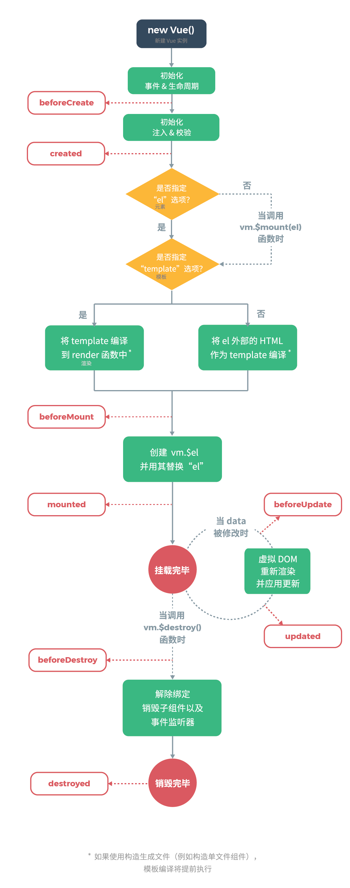

### 依赖

```java
<!-- 生产环境版本，优化了尺寸和速度 -->
<script src="https://cdn.jsdelivr.net/npm/vue@2"></script>

<!-- 开发环境版本 -->
<script src="https://cdn.jsdelivr.net/npm/vue@2/dist/vue.js"></script>
<!--JQuery-->
<script src="https://cdn.bootcdn.net/ajax/libs/jquery/1.11.3/jquery.js"></script>
```


### Vue案例

```html
<!doctype html>
<html lang="en" xmlns:v-on="http://www.w3.org/1999/xhtml">
    <head>
        <meta charset="UTF-8">
        <title>Vue</title>
        <!-- Jquery -->
        <script src="https://cdn.bootcdn.net/ajax/libs/jquery/1.11.3/jquery.js"></script>
        <!-- 引入Vue 开发版本 -->
        <script src="https://cdn.jsdelivr.net/npm/vue@2/dist/vue.js"></script>
        <!-- 生产环境版本，优化了尺寸和速度   <script src="https://cdn.jsdelivr.net/npm/vue@2"></script> -->
    </head>
    <body>
        <div id="app">
            {{ message }} <!-- Vue一直解析数据的指令: {{ }} -->

            <div>
                <!-- 循环+绑定事件,调用和传参数的示例........ -->
                <p v-for="(e,index) in emps" v-on:click="fun3(e.name)">
                    {{index}} : {{e.name}}
                    {{e.age}}
                    <!-- 把左边的值传进右边调用的函数上 -->
                    {{e.sex|setFormat}}
                </p>
            </div>
        </div>
    </body>

    <script>


        // 创建 Vue
        var app = new Vue({
            // 解析 El 模板
            el: '#app',
            // 数据对象
            data: {
                message: 'Holle',   // 展现在El模板的数据之一
                emps: []  // 展现在El模板的数据之一
            },
            // 用于 vue 语法 {{ }} 得到的参数做相应的处理
            filters: {
                setFormat: function (data) {
                    switch (data) {
                        case 0: return "女";
                        case 1: return "男";
                        default: return "保密";
                    }
                }
            },
            // vue 触发事件调的函数(vue语法的事件触发无法直接调用平时定义的函数)
            methods: {
                fun1: function () {
                    alert("你好!");
                },
                fun2: function () {
                    alert("Hello!");
                },
                fun3: function (data) {
                    alert(data);
                }
            },
            // 页面加载完执行 用于 ajax
            mounted: function () {
                // 获取正在初始化的 vue (当前Vue)
                var _this = this;
                $.get("/data/emps.json", function (data) {
                    // 更新模板数据,
                    _this.emps = data;
                });
            }
        });

    </script>
</html>
```


### 常见指令

```html
<!doctype html>
<html lang="en" xmlns:v-on="http://www.w3.org/1999/xhtml" xmlns:v-bind="http://www.w3.org/1999/xhtml"
      xmlns:v-model="http://www.w3.org/1999/xhtml" xmlns:v-html="http://www.w3.org/1999/xhtml">
    <head>
        <meta charset="UTF-8">
        <title>Vue</title>
        <!-- Jquery -->
        <script src="https://cdn.bootcdn.net/ajax/libs/jquery/1.11.3/jquery.js"></script>
        <!-- 引入Vue 开发版本 -->
        <script src="https://cdn.jsdelivr.net/npm/vue@2/dist/vue.js"></script>
        <!-- 生产环境版本，优化了尺寸和速度   <script src="https://cdn.jsdelivr.net/npm/vue@2"></script> -->
    </head>
    <body>
        <div id="app">

            <p>{{message}}</p>

            <!-- v-bind 简写 ':' 用于标签属性展示数据 -->
            v-bind:<input type="text" v-bind:value="b"><br/>
            :<input type="text" :value="b"><br/>
             <a style="color: deepskyblue" v-bind:href="'/employee/input.html?id='+ e.id">href示例</a>

            <!-- v-model 和 v-bind 差不多,不同的是,该指令展示的变量是活的,一变全变 -->
            v-model:<input type="text" v-model:value="m">跟着value的数据变动 {{m}}<br/>

            <!-- v-html 不使用该标签,浏览器不会把字符串当成 HTML 渲染 -->
            <span v-html:context="h"></span>    <br/>

            <!-- 条件判断 -->
            <div>
                <span v-if="i > 18">>>>>>>>>>>>>>>>>>>>>18</span>
                <span v-else-if="i < 18"><<<<<<<<<<<<<<<<<18</span>
                <span v-else="i == 18">====================18</span>
            </div>

            <!-- 数据的迭代 -->
            <ul><li v-for="(item,index) in arr">元素:  {{item}},索引:  {{index}}</li></ul>

            <!-- 对象数组迭代 -->
            <ol><li v-for="(item,index) in obj">元素:  {{item.name}},索引:  {{index}}</li></ol>

            <!-- 不能直接调用正常的函数,但是可以间接调用 -->
            <button v-on:click="test()">按钮</button>
            <!-- v-on的简写 -->
            <button @click="test()">按钮</button>

        </div>
    </body>

    <script>

        function 按钮() {
            alert("按钮");
        }

        var app = new Vue({
            el: '#app',
            data: {
                message: '普通的数据展示',
                b: "v-bind",
                m: "v-model",
                h: "<p style='color:springgreen'>v-html<p>",
                i: 18,
                arr: [1,2,3,4,5,6,7,8,9],
                obj: [{name:"张三"},{name:"李四"},{name:"王五"}]
            },
            methods:{
                test:按钮
            }
        });

    </script>
</html>
```


### form表单问题

**响应状态Status为canceled** 响应状态为已取消

*ajax请求被干扰了，检查代码,发现绑定的form表单button自带提交属性,我设置ajax成异步提交都没用*

在form中的button默认的时候点击会执行form的提交事件（相当于默认为type=submit类型）

浏览器刷页面

location.reload();


### 生命周期图

