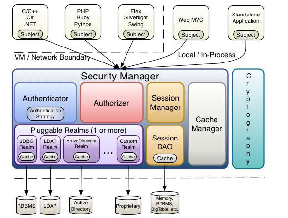
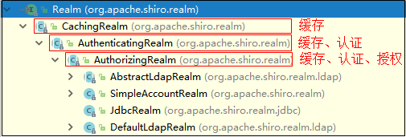

#  一、权限管理概述

权限管理，一般指根据系统设置的安全规则或者安全策略，用户可以访问而且只能访问自己被授权的资源，不多不少。权限管理几乎出现在任何系统里面，只要有用户和密码的系统。 很多人常将“用户身份认证”、“密码加密”、“系统管理”等概念与权限管理概念混淆。

在权限管理中使用最多的还是功能权限管理中的基于角色访问控制（RBAC，Role Based Access Control）。

​																													**用户---角色---权限**

当项目中需要使用权限管理的时候，我们可以选择自己去实现（前面的课程中所实现的 RBAC 系统），也可以选择使用第三方实现好的框架去实现，他们孰优孰劣这就需要看大家在项目中具体的需求了。

实现权限管理系统必备的功能:

- 1、权限管理（自定义权限注解，加载权限）
- 2、角色管理（新增，编辑，删除，关联权限）
- 3、用户管理（新增，编辑，删除，关联用户）
- 4、登录功能（定义登录拦截器并实现登录逻辑，登出功能）
- 5、权限拦截（定义权限拦截器并实现拦截逻辑）

框架能帮我们解决权限管理系统中的哪些问题呢？

<table>
    <tbody>
        <tr>
        	<td>功能</td>
          	<td>权限框架能做的事情</td>
        </tr>
        <tr>
        	<td>权限管理</td>
          	<td>×</td>
        </tr>
        <tr>
        	<td>角色管理</td>
          	<td>×</td>
        </tr>
        <tr>
        	<td>用户管理</td>
          	<td>×</td>
        </tr>
        <tr>
        	<td>登录功能</td>
          	<td>√ (密码加密、验证码、记住我)</td>
        </tr>
        <tr>
        	<td>权限拦截</td>
          	<td>√(内置很多的拦截器、提供标签/注解/编程方式进行权限认证)</td>
        </tr>
        <tr>
        	<td>其他功能</td>
          	<td>√(缓存、会话管理等)</td>
        </tr>
    </tbody>
</table>

这里我们介绍两种常用的权限管理框架：

## 1、Apache Shiro

Apache Shiro 是一个强大且易用的 Java 安全框架，使用 Apache Shiro 的人越来越多，它可实现身份验证、授权、密码和会话管理等功能。

## 2、Spring Security

Spring Security 也是目前较为流行的一个安全权限管理框架，它与 Spring 紧密结合在一起。

## 3、Shiro 和 Spring Security 比较

Shiro 比 Spring Security 更容易上手使用和理解，Shiro 可以不跟任何的框架或者容器绑定，可独立运行，而 Spring Security 则必须要有 Spring 环境， Shiro 可能没有 Spring Security 做的功能强大，但是在实际工作时可能并不需要那么复杂的东西，所以使用小而简单的 Shiro 就足够了。对于它俩到底哪个好，这个不必纠结，能更简单的解决项目问题就好了。

# 二、Shiro 概述

## 1、Shiro 能做什么事情

Shiro 可以帮助我们完成：**认证**、**授权**、加密、会话管理、与 Web 集成、缓存等。

## 2、Shiro 架构

Shiro 主要组件包括：
Subject，SecurityManager，Authenticator，Authorizer，SessionManager，CacheManager，Cryptography，Realms。



- **Subject（用户）**： 访问系统的用户，主体可以是用户、程序等，进行认证的都称为主体； Subject 一词是一个专业术语，其基本意思是“当前的操作用户”。 在程序任意位置可使用：Subject currentUser = SecurityUtils.getSubject() 获取到 Subject 主体对象，类似 Employee user = UserContext.getUser()。

- **SecurityManager（安全管理器）**：它是 Shiro 功能实现的核心，负责与后边介绍的其他组件（认证器，授权器，缓存控制器）进行交互，实现 Subject 委托的各种功能。有点类似于 Spring MVC 中的 DispatcherServlet 前端控制器，负责进行分发调度。

- **Realms（数据源）**：Realm 充当了 Shiro 与应用安全数据间的“桥梁”或者“连接器”，可以把 Realm 看成 DataSource，即安全数据源。执行认证（登录）和授权（访问控制）时，Shiro 会从应用配置的 Realm 中查找相关的比对数据。以确认用户是否合法，操作是否合理。

- Authenticator（认证器）：用于认证，从 Realm 数据源取得数据之后进行执行认证流程处理。

- Authorizer（授权器）：用户访问控制授权，决定用户是否拥有执行指定操作的权限。

- SessionManager （会话管理器）：Shiro 与生俱来就支持会话管理，这在安全类框架中都是独一无二的功能。即便不存在 Web 容器环境，Shiro 都可以使用自己的会话管理机制，提供相同的会话 API。

- CacheManager （缓存管理器）：用于缓存认证授权信息等。

- Cryptography（加密组件）：Shiro 提供了一个用于加密解密的工具包。

# 三、Shiro 认证

认证的过程即为用户的身份确认过程，所实现的功能就是我们所熟悉的登录验证，用户输入账号和密码提交到后台，后台通过访问数据库执行账号密码的正确性校验。


前面我们介绍过，Shiro 不仅在 Web 环境中可以使用，在 JavaSE 中一样可以完美的实现相关的功能，下面我们先来看看在 JavaSE 环境中它是如何实现认证功能的。

## 1、环境准备

- 在已有的 RBAC 项目中添加如下依赖：

```xml
<dependency>
    <groupId>org.apache.shiro</groupId>
    <artifactId>shiro-core</artifactId>
    <version>1.5.2</version>
</dependency>
```

## 2、基于 ini 的认证

我们先基于最简单的方式来感受一下 Shiro 认证的过程.

### 2.1、编写 ini 配置文件

名为 shiro-authc.ini，Shiro 默认支持的是 ini 配置的方式，这里只是为了方便。

```ini
# 用户的身份、凭据
[users]
zhangsan=555 
lisi=666
```

### 2.3、编写测试方法

使用 Shiro 相关的 API 完成身份认证。

```java
@Test
public void testAuthcByIni(){
    // 创建 Shiro 的安全管理器，是 Shiro 的核心
    DefaultSecurityManager securityManager = new DefaultSecurityManager();
    // 加载 shiro-authc.ini 配置，得到配置中的用户信息（账号+密码）
    IniRealm iniRealm = new IniRealm("classpath:shiro-authc.ini");
    securityManager.setRealm(iniRealm);
    // 把安全管理器注入到当前的环境中
    SecurityUtils.setSecurityManager(securityManager);
    // 无论有无登录都可以获取到 Subject 主体对象，但是判断登录状态需要利用里面的属性来判断
    Subject subject = SecurityUtils.getSubject();
    System.out.println("认证状态：" + subject.isAuthenticated());
    // 创建令牌(携带登录用户的账号和密码)
    UsernamePasswordToken token = new UsernamePasswordToken("zhangsan", "555");
    // 执行登录操作(将用户的和 ini 配置中的账号密码做匹配)
    subject.login(token);
    System.out.println("认证状态：" + subject.isAuthenticated());
    // 登出
    // subject.logout();
    // System.out.println("认证状态：" + subject.isAuthenticated());
}
```

若输入的身份和凭证和 ini 文件中配置的能够匹配，那么登录成功，登录状态为 true，反之登录状态为 false。

登录失败一般存在两种情况：
- 账号错误 org.apache.shiro.authc.UnknownAccountException
- 密码错误 org.apache.shiro.authc.IncorrectCredentialsException

## 3、流程分析


```
0、初始化 IniRealm，内部会读取 shiro-authc.ini 文件并把用户信息封装到 Map<String,SimpleAccount> 集合中。
0、初始化 SecurityManager，把 InitRealm 交给 SecurityManager 管理。
0、将 SecurityManager 绑定到当前的环境中。

1、通过 SecurityUtils 工具类获取 Subject 主体对象。

2、Subject 对象将 token 作为参数，调用 login 方法完成登录。

3、Subject.login 方法会将操作分发给 SecurityManager 中的 Authenticator 认证器。
3、Authenticator 认证器会获配置好的 Realm，然后调用里面获取用户认证信息 SimpleAccount 的方法。
3、若这个过程返回的是 NULL，则会抛出 UnknowAccountException。

4、若 SimpleAccount 返回不为空，则会拿到 Subject 传入的 token，然后获取其凭证（密码）。
4、将 UsernamePasswordToken 中的凭证（密码）和 SimpleAccount 中的凭证（密码）做比对。
4、若一致则登录成功，否则就会抛出 IncorrectCredentialsException 异常。
```

## 4、基于自定义 Realm 的认证

自定义 Realm 在实际开发中使用非常多，应该我们需要使用的账户信息通常来自程序或者数据库中，而不是前面使用到的 ini 文件的配置。


### 4.1、定义模拟数据工具类 DataMapper 和实体 User

我们学习阶段，不用用得太复杂了。所以我们现在先不集成 MyBatis，而是通过 Map 的方式来模拟数据库的数据。

```java
public class DataMapper {
    private static Map<String, User> userData = new HashMap<String, User>();
    static{
        // 初始化数据
        User u1 = new User("zhangsan", "555");
        User u2 = new User("lisi", "888");
        userData.put(u1.getUsername(), u1);
        userData.put(u2.getUsername(), u2);
    }
    // 提供静态方法，模拟数据库返回数据
    public static User getUserByName(String username){
        return userData.get(username);
    }
}
```

```java
@Setter
@Getter
@AllArgsConstructor
@NoArgsConstructor
public class User {
    private String username;//用户名
    private String password;//密码
}
```

### 4.2、编写自定义 Realm



从上图看，在继承体系中的每个类所能够实现的功能不一样，在后面的开发中，我们通常需要使用到缓存、认证、授权所有的功能，所以选择继承 AuthorizingRealm。

```java
public class UserRealm extends AuthorizingRealm {
    // 提供认证信息
    protected AuthenticationInfo doGetAuthenticationInfo(AuthenticationToken token) 
            throws AuthenticationException {
        // 页面传入的账号
        String userName = (String) token.getPrincipal();
        // 模拟从数据库中查询数据
        User user = DataMapper.getUserByName(userName);
        if(user == null) {
            // 账号不存在则返回 NULL
            return null;
        } else {
            // 如果存在需要封装成 AuthenticationInfo 对象返回
            return new SimpleAuthenticationInfo(
                user, // 身份对象，可以理解为在 Web 环境中登录成功后需要放入 Session 中的对象
                user.getPassword(),// 凭证（密码），需要和传入的凭证（密码）做比对
                this.getName()); // 当前 Realm 的名称，暂时无用，不需纠结
        }
    }
    // 提供授权信息，此时测试暂时用不到
    protected AuthorizationInfo doGetAuthorizationInfo(PrincipalCollection principals) {
        return null;
    }
}
```

### 4.3、编写测试方法

注册自定义的 Realm，并设置到 SecurityManager 对象中。

```java
@Test
public void testAuthcByRealm(){
    DefaultSecurityManager securityManager = new DefaultSecurityManager();
    // 注册自定义 Realm    
    securityManager.setRealm(new UserRealm());
    SecurityUtils.setSecurityManager(securityManager);
    
    Subject subject = SecurityUtils.getSubject();
    System.out.println("认证状态：" + subject.isAuthenticated());
    
    UsernamePasswordToken token = new UsernamePasswordToken("zhangsan", "555");
    subject.login(token);
    System.out.println("认证状态：" + subject.isAuthenticated());

    // 登出
    // subject.logout();
    // System.out.println("认证状态：" + subject.isAuthenticated());
}
```

## 5、Web 环境如何使用 Shiro 认证

****

# 四、Shiro 鉴权

- 系统中的授权功能
    就是为用户分配相关的权限的过程。
- 系统中的鉴权功能
    判断当前访问用户是否有某个资源的访问权限的过程。

若系统中无法管理用户的权限，那么将会出现客户信息泄露，数据被恶意篡改等问题，所以在绝大多数的应用中，我们都会有权限管理功能。

前面介绍过我们的权限管理系统是基于角色的权限管理，所以在系统中有以下三个部分构成：
- 用户管理。
- 角色管理。
- 权限管理。

这三个管理功能我们已经完成，同时可以很好的完成他们之间的关系管理。


那么目前我们所需要的就是将用户拥有的权限告知 Shiro，供其在权限校验的时候使用。

## 1、基于 ini 的鉴权

### 1.1、编写 ini 配置文件

名为 shiro-author.ini，记录有什么用户，其角色权限如何。

```ini
#用户的身份、凭据、角色
[users]
zhangsan=555,hr,seller
lisi=666,seller

#角色与权限信息
[roles]
hr=user:list,user:delete
seller=customer:list,customer:save
```

在 ini 文件中用户、角色、权限（权限字符串也可以使用 * 通配符）的配置规则如下：

```ini
# 用户的身份、凭据、角色
[users]
用户名=密码,角色1,角色2...

# 角色与权限信息
[roles]
角色=权限1,权限2...
```

### 1.2、编写测试方法

使用 Shiro 相关的 API完成权限校验。

```java
@Test
public void testAuthorByIni(){
    /*****************************登录逻辑开始**********************************/
    DefaultSecurityManager securityManager = new DefaultSecurityManager();
    IniRealm iniRealm = new IniRealm("classpath:shiro-author.ini");
    securityManager.setRealm(iniRealm);
    SecurityUtils.setSecurityManager(securityManager);
    Subject subject = SecurityUtils.getSubject();
    UsernamePasswordToken token = new UsernamePasswordToken("zhangsan", "555");
    subject.login(token);
    /*****************************登录逻辑结束**********************************/

    // 判断用户是否有某个角色
    System.out.println("是否有 hr 角色？" + subject.hasRole("hr"));
    System.out.println("是否有 seller 角色？"+ subject.hasRole("seller"));
    // 是否同时拥有多个角色
    System.out.println("是否同时拥有hr和seller？" + subject.hasAllRoles(Arrays.asList("hr", "seller")));
    // check 开头的方法是没有返回值的，当没有角色时就会抛出异常
    subject.checkRole("seller");

    // 判断用户是否有某个权限
    System.out.println("是否有用户删除权限？"+subject.isPermitted("user:delete"));
    // check 开头的方法是没有返回值的，当没有权限时就会抛出异常
    subject.checkPermission("customer:list");
}
```

## 2、流程分析


## 3、基于自定义 Realm 的鉴权

### 3.1、模拟数据库的数据

```java
public class DataMapper {
    // 用户集合
    private static Map<String, User> userData = new HashMap<String, User>();
    // 角色集合
    private static Map<String, List<String>> roleData = new HashMap<String, List<String>>();
    // 权限集合
    private static Map<String, List<String>> permissionData = new HashMap<String, List<String>>();
    static {
        //初始化用户数据
        User u1 = new User("zhangsan", "555");
        userData.put(u1.getUsername(), u1);
        roleData.put(u1.getUsername(), Arrays.asList("seller"));
        permissionData.put(u1.getUsername(),
            Arrays.asList("customer:list", "customer:save"));

        User u2 = new User("lisi", "666");
        userData.put(u2.getUsername(), u2);
        roleData.put(u2.getUsername(), Arrays.asList("seller", "hr"));
        permissionData.put(u1.getUsername(),
            Arrays.asList("customer:list", "customer:save", "user:list", "user:delete"));
    }
    // 提供静态方法，模拟数据库返回数据
    public static User getUserByName(String username){
        return userData.get(username);
    }
    public static List<String> getRoleByName(String username){
        return roleData.get(username);
    }
    public static List<String> getPermissionByName(String username){
        return permissionData.get(username);
    }
}

```

### 3.2、修改自定义 Realm

直接复用前面定义的 UserRealm 即可，需要重写 `doGetAuthorizationInfo` 方法，提供用户的角色权限信息。

```java
public class UserRealm extends AuthorizingRealm {
    // 提供认证信息
    protected AuthenticationInfo doGetAuthenticationInfo(AuthenticationToken token) 
            throws AuthenticationException {
        // 页面传入的账号
        String userName = (String) token.getPrincipal();
        // 模拟从数据库中查询数据
        User user = DataMapper.getUserByName(userName);
        if(user == null) {
            // 账号不存在则返回 NULL
            return null;
        } else {
            // 如果存在需要封装成 AuthenticationInfo 对象返回
            return new SimpleAuthenticationInfo(
                user, // 身份对象，可以理解为在 Web 环境中登录成功后需要放入 Session 中的对象
                user.getPassword(),// 凭证（密码），需要和传入的凭证（密码）做比对
                this.getName()); // 当前 Realm 的名称，暂时无用，不需纠结
        }
    }
    // 提供授权信息
    protected AuthorizationInfo doGetAuthorizationInfo(PrincipalCollection principals) {
        // principals.getPrimaryPrincipal()
        //其实就是在认证时放入 SimpleAuthenticationInfo 的第一个参数
        User user = (User) principals.getPrimaryPrincipal();
        SimpleAuthorizationInfo info = new SimpleAuthorizationInfo();
        // 根据登录用户的名称查询到其拥有的所有角色的编码
        List<String> roleSns = DataMapper.getRoleByName(user.getUsername());
        // 将用户拥有的角色添加到授权信息对象中，供 Shiro 权限校验时使用
        info.addRoles(roleSns);
        // 根据登录用户的名称查询到其拥有的所有权限表达式
        List<String> expressions = DataMapper.getPermissionByName(user.getUsername());
        // 将用户拥有的权限添加到授权信息对象中，供 Shiro 权限校验时使用
        info.addStringPermissions(expressions);
        return info;
    }
}
```

### 3.3、编写测试方法

使用 Shiro 相关的 API 完成权限校验。

```java
@Test
public void testAuthorByRealm(){
    /*****************************登录逻辑开始**********************************/
    DefaultSecurityManager securityManager = new DefaultSecurityManager();
    // 注册自定义 Realm
    securityManager.setRealm((new UserRealm());
    SecurityUtils.setSecurityManager(securityManager);
    Subject subject = SecurityUtils.getSubject();
    UsernamePasswordToken token = new UsernamePasswordToken("zhangsan", "555");
    subject.login(token);
    /*****************************登录逻辑结束**********************************/

    // 判断用户是否有某个角色
    System.out.println("是否有 hr 角色？" + subject.hasRole("hr"));
    System.out.println("是否有 seller 角色？"+ subject.hasRole("seller"));
    // 是否同时拥有多个角色
    System.out.println("是否同时拥有hr和seller？" + subject.hasAllRoles(Arrays.asList("hr", "seller")));
    // check 开头的方法是没有返回值的，当没有角色时就会抛出异常
    subject.checkRole("seller");

    // 判断用户是否有某个权限
    System.out.println("是否有用户删除权限？"+subject.isPermitted("user:delete"));
    // check 开头的方法是没有返回值的，当没有权限时就会抛出异常
    subject.checkPermission("customer:list");
}
```

# 五、Shiro 加密

加密的目的是从系统数据的安全考虑，如，用户的密码，如果我们不对其加密，那么所有用户的密码在数据库中都是明文，只要有权限查看数据库的都能够得知用户的密码，这是非常不安全的。所以，只要密码被写入磁盘，任何时候都不允许是明文，以及对用户来说非常机密的数据，我们都应该想到使用加密技术。

## 1、加密

在密码学中，加密（英语：Encryption）是将明文信息改变为难以读取的密文内容，使之不可读的过程。只有拥有解密方法的对象，经由解密过程，才能将密文还原为正常可读的内容。


其中加密有一种算法叫做不可逆加密算法特点：
- 加密的时候是单向的（只可以加密不能解密）；
- 加密得到的密文长度总是定长的；
- 明文相同，那么密文一定相同；
- 明文不同，那么密文一定不同；
- 性能好，效率高。

也正是因为这个特点，一般用来做密码加密，这里我们选用加密算法为 MD5。

## 2、在项目中实现密码加密

- 添加用户的时候，对用户的密码进行加密。
- 登录时，按照相同的算法对表单提交的密码进行加密然后再和数据库中的加密过的数据进行匹配。

## 3、Shiro 加密工具

在 Shiro 中实现了 MD5 的算法，所以可以直接使用它来对密码进行加密。

```java
@Test
public void testMD5() throws Exception{
    Md5Hash hash = new Md5Hash("123456");
    System.out.println(hash); // e10adc3949ba59abbe56e057f20f883e
}
```

### 3.1、加盐加密

如果 MD5 加密的明文一样，那么无论在什么时候加密的结果都是一样的，所以，相对来说还是不够安全。


比如 `lanxw` 的密码是 `123456`，加密后的密文为 `e10adc3949ba59abbe56e057f20f883e`，在数据库中发现 `stef` 和 `lucy` 的密文和 `lanxw` 密文是一样的，那么也可以推断处理 `stef` 和 `lucy` 的密码也是 `123456`。

但是我们可以对数据加“盐”。同样的数据加不同的“盐”之后就是千变万化的，因为我们不同的人加的“盐”都不一样。这样得到的结果相同率也就变低了。

**盐一般要求是固定长度的字符串，且每个用户的盐不同。**

可以选择用户的唯一的数据来作为盐（账号名，身份证等等），注意使用这些数据作为盐要求是不能改变的，假如登录账号名改变了，则再次加密时结果就对应不上了。

```java
@Test
public void testMD5() throws Exception{
    Md5Hash hash = new Md5Hash("123456", "45cb27");
    System.out.println(hash); // 173eee408921a3509be87823f2dc307d
}
```

`lanxw`、`stef`、`lucy` 的密码都为 `123456`，加盐之后，他们的密文都不一样了。


### 3.2、加密次数

Md5Hash 构造方法中的第二个参数就是对加密数据添加的“盐”，加密之后的结果也和之前不一样了。如果还觉得不够安全，我们还可以通过加密次数来增加 MD5 加密的安全性。

```java
@Test
public void testMD5() throws Exception{ 
    Md5Hash hash = new Md5Hash("123456", "45cb27", 3);
	System.out.println(hash); // 8fd16c11f8b3fde5bde2c1eaacf6fb02
}
```

## 4、Realm 加盐加密

我们在使用 Shiro 进行认证时，绝大多数情况都是使用自定义 Realm 方式进行认证。我们要求密码具备一定的安全性，所以我们需要看使用 Realm 进行加盐加密。

### 4.1、修改 DataMapper 和 User

模拟的密码存储的是密文，同时需要存储对应的盐。

```java
@Setter
@Getter
@AllArgsConstructor
@NoArgsConstructor
public class User {
    private String username; //用户名
    private String password; //密码
    private String salt; //盐
}
```

```java
static {
    // 初始化用户数据
    // 密码是 555，加密 3 次
    User u1 = new User("zhangsan", "c73789ac544955a1009e17cec74bf3e0", "45cb27");
    userData.put(u1.getUsername(), u1);
    // 密码是 666，加密 3 次
    User u2 = new User("lisi", "d7bde4363e324511aae66e3a38678086", "c4eb61");
    userData.put(u2.getUsername(), u2);
}
```

### 4.2、修改定义 Realm

Realm 返回对象信息的时候需要把盐一并返回。

```java
public class UserRealm extends AuthorizingRealm {
    // 提供认证信息
    protected AuthenticationInfo doGetAuthenticationInfo(AuthenticationToken token)
            throws AuthenticationException {
        // 页面传入的账号
        String userName = (String) token.getPrincipal();
        // 模拟从数据库中查询数据
        User user = DataMapper.getUserByName(userName);
        if(user == null) {
            // 账号不存在则返回 NULL
            return null;
        } else {
            // 如果存在需要封装成 AuthenticationInfo 对象返回
            return new SimpleAuthenticationInfo(
                user, // 身份对象，可以理解为在 Web 环境中登录成功后需要放入 Session 中的对象
                user.getPassword(), // 凭证（密码），需要和传入的凭证（密码）做比对
                ByteSource.Util.bytes(user.getSalt()), // 返回盐
                this.getName()); // 当前 Realm 的名称，暂时无用，不需纠结
        }
    }
    // 提供授权信息
    protected AuthorizationInfo doGetAuthorizationInfo(PrincipalCollection principals) {
        // 省略 ......
    }
}
```

### 4.3、编写测试方法

```java
@Test
public void testMD5() {
    DefaultSecurityManager securityManager = new DefaultSecurityManager();
    UserRealm userRealm = new UserRealm();
    // 创建凭证匹配器
    HashedCredentialsMatcher matcher = new HashedCredentialsMatcher("md5");
    // 设置加密次数
    matcher.setHashIterations(3);
    // Realm 管理凭证匹配器
    userRealm.setCredentialsMatcher(matcher);
    securityManager.setRealm(userRealm);
    SecurityUtils.setSecurityManager(securityManager);

    Subject subject = SecurityUtils.getSubject();
    UsernamePasswordToken token = new UsernamePasswordToken("zhangsan", "555");
    subject.login(token);
    System.out.println("认证状态：" + subject.isAuthenticated());
}
```

## 5、流程分析


# 六、Spring Boot 集成 Shiro


自动配置依赖

```xml
<dependency>
    <groupId>org.apache.shiro</groupId>
    <artifactId>shiro-spring-boot-web-starter</artifactId>
    <version>1.7.1</version>
</dependency>
```

### 自动配置

[springboot 集成shiro-spring-boot-web-starter-CSDN](https://blog.csdn.net/sirchenhua/article/details/100200498)


## 1、准备工作

现在我们使用 Shiro 进行项目的权限控制，所以我们首先把项目中的权限控制相关代码删除掉。

```
1、删除 WebConfig。
2、删除拦截器 CheckLoginInterceptor 和 CheckPermissionInterceptor。
3、删除 UserContext 和 RequiredPermission。
4、删除 LoginController 中的 logout 方法，注释 login 方法体内容。
```

## 2、环境搭建

添加如下依赖：

```xml
<shiro.version>1.7.1</shiro.version>
<thymeleaf.extras.shiro.version>2.0.0</thymeleaf.extras.shiro.version>
```

```xml
<!--Shiro 核心依赖 -->
<dependency>
    <groupId>org.apache.shiro</groupId>
    <artifactId>shiro-core</artifactId>
    <version>${shiro.version}</version>
</dependency>
<!--  Spring 集成 Shiro 依赖 -->
<dependency>
    <groupId>org.apache.shiro</groupId>
    <artifactId>shiro-spring</artifactId>
    <version>${shiro.version}</version>
</dependency>
<!-- Shiro 使用 EhCache 缓存依赖 -->
<dependency>
    <groupId>org.apache.shiro</groupId>
    <artifactId>shiro-ehcache</artifactId>
    <version>${shiro.version}</version>
</dependency>
<!-- Thymeleaf 模板引擎和 Shiro 整合的依赖 -->
<dependency>
    <groupId>com.github.theborakompanioni</groupId>
    <artifactId>thymeleaf-extras-shiro</artifactId>
    <version>${thymeleaf.extras.shiro.version}</version>
</dependency>
```


## 3、集成认证功能

### 3.1、Web 环境配置

添加 `ShiroConfig` 配置 Web 相关环境配置。

```java
@Configuration
public class ShiroConfig {

    @Bean
    public Realm employeeRealm() {
        return new EmployeeRealm();
    }

    @Bean
    public SecurityManager securityManager() {
        DefaultWebSecurityManager securityManager = new DefaultWebSecurityManager();
        securityManager.setRealm(employeeRealm());
        return securityManager;
    }

    @Bean
    public ShiroFilterFactoryBean shiroFilterFactoryBean() {
        ShiroFilterFactoryBean shiroFilterFactoryBean = new ShiroFilterFactoryBean();
        // Shiro 的核心安全接口，这个属性是必须的
        shiroFilterFactoryBean.setSecurityManager(securityManager());
        // 身份认证失败，则跳转到登录页面的配置
        shiroFilterFactoryBean.setLoginUrl("/static/login.html");
        // 权限认证失败，则跳转到指定页面
        // shiroFilterFactoryBean.setUnauthorizedUrl("/permission/nopermissioin");
        // Shiro 连接约束配置，即过滤链的定义
        Map<String, String> filterChainDefinitionMap = new LinkedHashMap<>();
        // 对静态资源设置匿名访问
        filterChainDefinitionMap.put("/favicon.ico", "anon");
        filterChainDefinitionMap.put("/static/**", "anon");
        // 不需要拦截的访问
        filterChainDefinitionMap.put("/login", "anon");
        // 退出 logout地址，Shiro 帮用户去清除 session
        filterChainDefinitionMap.put("/logout", "logout");
        // 所有请求需要认证
        filterChainDefinitionMap.put("/**", "authc");
        shiroFilterFactoryBean.setFilterChainDefinitionMap(filterChainDefinitionMap);
        return shiroFilterFactoryBean;
    }
}
```

### 3.3、修改登录方法

```java
// 处理登录请求的方法
@RequestMapping("/login")
@ResponseBody
public JsonResult login(String username, String password) {
    try{
        UsernamePasswordToken token = new UsernamePasswordToken(username,password);
        Subject subject = SecurityUtils.getSubject();
        subject.login(token);
        subject.getSession().setAttribute("EMPLOYEE_IN_SESSION", subject.getPrincipal());
        return new JsonResult(true, "登录成功");
    } catch (UnknownAccountException e) {
        return new JsonResult(false, "账号不存在");
    } catch (IncorrectCredentialsException e) {
        return new JsonResult(false, "账号密码有误");
    } catch (Exception e) {
        e.printStackTrace();
        return new JsonResult(false, "登录异常，请联系管理员");
    }
}
```

### 3.4、自定义 EmployeeRealm

重写 doGetAuthenticationInfo，从数据库中查询用户数据。

```java
public class EmployeeRealm extends AuthorizingRealm {

    @Autowired
    private IEmployeeService employeeService;

    // 提供认证信息
    @Override
    protected AuthenticationInfo doGetAuthenticationInfo(AuthenticationToken token) throws AuthenticationException {
        String username = (String) token.getPrincipal();
        Employee employee = employeeService.queryByUsername(username);
        if(employee == null) {
            return null;
        }
        return new SimpleAuthenticationInfo(employee, employee.getPassword(), this.getName());
    }
    
    // 提供授权信息
    @Override
    protected AuthorizationInfo doGetAuthorizationInfo(PrincipalCollection principals) {
        return null;
    }

}
```

### 3.5、Shiro 内置过滤器介绍

Shiro 中定义了多个过滤器来完成不同的预处理操作：

| 过滤器的名称 | ***Java*** 类                                                    |
| ------------ | --------------------------------------------------------------- |
| anon         | org.apache.shiro.web. lter.authc.AnonymousFilter                |
| authc        | org.apache.shiro.web. lter.authc.FormAuthenticationFilter       |
| authcBasic   | org.apache.shiro.web. lter.authc.BasicHttpAuthenticationFilter  |
| roles        | org.apache.shiro.web. lter.authz.RolesAuthorizationFilter       |
| perms        | org.apache.shiro.web. lter.authz.PermissionsAuthorizationFilter |
| user         | org.apache.shiro.web. lter.authc.UserFilter                     |
| logout       | org.apache.shiro.web. lter.authc.LogoutFilter                   |
| port         | org.apache.shiro.web. lter.authz.PortFilter                     |
| rest         | org.apache.shiro.web. lter.authz.HttpMethodPermissionFilter     |
| ssl          | org.apache.shiro.web. lter.authz.SslFilter                      |

- **anon**：匿名拦截器，即不需要登录即可访问，一般用于静态资源过滤；示例 “/static/**=anon”。
- **authc**：表示需要认证（登录）才能使用；示例 “/**=authc”。
- **authcBasic**：Basic HTTP 身份验证拦截器。
- **roles**：角色授权过滤器，验证用户是否拥有资源角色；示例 “/admin/**=roles[admin]”。
- **perms**：权限授权过滤器，验证用户是否拥有资源权限；示例 “/user/create=perms["user:create"]”。
- **user**：用户过滤器，用户已经身份验证/记住我登录的都可；示例 “/index=user”。
- **logout**：退出过滤器，主要属性：redirectUrl，退出成功后重定向的地址（默认为 /）；示例 “/logout=logout”
- **port**: 端口过滤器，主要属性：port（80）：可以通过的端口；示例 “/test= port[80]”。如果用户访问该页面是非 80，将自动将请求端口改为 80 并重定向到该 80 端口，其他路径/参数等都一样。
- **rest**：RESTful 风格过滤器；
- **ssl**：SSL 过滤器，只有请求协议是 HTTPS 才能通过，否则自动跳转会 HTTPS 端口（443）；其他和 port 过滤器一样。

```
注：
anon，authcBasic，auchc，user 是认证过滤器；
perms，roles，ssl，rest，port 是授权过滤器。
```


```
1、用户请求被 ShiroFilter 拦截到，然后会通过 PathMatchingFilterChainResolver 解析请求；
2、会形成内部的过滤器链，请求就会依次执行这些过滤器链。
```

### 3.6、400 错误问题解决

重定向会出现 JSESSIONID，页面会出现 400 的错误。


```java
/**
 * Session 管理器
 */
@Bean
public SessionManager sessionManager() {
    DefaultWebSessionManager sessionManager = new DefaultWebSessionManager();
    sessionManager.setSessionIdUrlRewritingEnabled(false);
    return sessionManager;
}
/**
 * 安全管理器
 */
@Bean
public SecurityManager securityManager() {
    DefaultWebSecurityManager securityManager = new DefaultWebSecurityManager();
    securityManager.setRealm(employeeRealm());
    securityManager.setSessionManager(sessionManager());
    return securityManager;
}
```

## 4、集成鉴权功能

### 4.1、Shiro 鉴权三种方式

- 编程式，通过写 if/else 授权代码块完成。

```java
Subject subject = SecurityUtils.getSubject();
if(subject.hasRole("hr")) {
	// 有权限
} else {
	// 无权限
}
```

- 注解式，通过在 controller 的处理方法上放置相应 Shiro 提供的注解完成。

```java
@RequiresRoles("hr") 
@RequiresPermissions("user:create")
@RequestMapping("/list")
public String list(Model model, @ModelAttribute("qo") EmployeeQueryObject qo) {
    // 有权限才会执行此方法
}
```

- 标签式，在页面使用标签完成：
    - JSP标签（Shiro 自带）
    - Freemarker 的标签（第三方）
    - ThymeLeaf 的标签（第三方）

[ThymeLeaf 标签文档](https://codechina.csdn.net/mirrors/theborakompanioni/thymeleaf-extras-shiro?utm_source=csdn_github_accelerator)

```html
<a shiro:hasRole="administrator" href="admin.html">Administer the system</a>
<a shiro:hasPermission="user:create" href="createUser.html">Create a new User</a>
```

### 4.2、完善 Realm 的授权方法

不管哪种方式鉴权，都得告知 Shiro 用户的角色和权限信息。

```java
// 提供授权信息
@Override
protected AuthorizationInfo doGetAuthorizationInfo(PrincipalCollection principals) {
    Employee employee = (Employee)principals.getPrimaryPrincipal();
    SimpleAuthorizationInfo info = new SimpleAuthorizationInfo();
    // 根据用户的 id 查询该用户拥有的角色编码
    List<String> roles = roleService.queryByEmployeeId(employee.getId());
    info.addRoles(roles);
    // 根据用户的 id 查询该用户拥有的权限表达式
    List<String> permissions = permissionService.queryExpressionsByEmployeeId(employee.getId());
    info.addStringPermissions(permissions);
    return info;
}
```

### 4.3、支持注解的配置

在 RBAC中，我们采用自定义权限注解贴在需要的方法上，然后再扫描对应类的方法，获取对应的注解生成权限表达式。其中的注解是我们自定义的，很明显，Shiro 权限框架并不认识这个注解，自然也无法完成权限的校验功能，所以我们需要使用 Shiro 自身提供的一套注解来完成，内置的注解需要被识别，所以我们需要添加相关配置让应用程序能识别到这些注解，所以在 ShiroConfig 中添加如下配置：

```java
/**
 * 开启 Shiro 注解通知器
 */
 @Bean
public AuthorizationAttributeSourceAdvisor authorizationAttributeSourceAdvisor() {
    AuthorizationAttributeSourceAdvisor authorizationAttributeSourceAdvisor = new AuthorizationAttributeSourceAdvisor();
    authorizationAttributeSourceAdvisor.setSecurityManager(securityManager());
    return authorizationAttributeSourceAdvisor;
}
/**
    * 设置改成使用 CGlib 代理
    * 详情看 DefaultAopProxyFactory#createAopProxy
    */
@Bean
public DefaultAdvisorAutoProxyCreator advisorAutoProxyCreator() {
    DefaultAdvisorAutoProxyCreator advisorAutoProxyCreator = new DefaultAdvisorAutoProxyCreator();
    advisorAutoProxyCreator.setProxyTargetClass(true);
    return advisorAutoProxyCreator;
}
```

### 4.4、注解式鉴权

在 Controller 的方法上贴上 Shiro 提供的权限注解（如 @RequiresPermissions，@RequiresRoles）。

```java
// 处理分页查询部门请求
@RequestMapping("/list")
@RequiresPermissions("department:list")
public String list(Model model, QueryObject qo) {
    PageInfo<Department> pageInfo = departmentService.query(qo);
    model.addAttribute("pageInfo", pageInfo);
    return "department/list";
}
```

若访问的用户没有该权限会报如下错误：


我们可以进行统一异常处理，跳转到没有权限的提示页面。

```java
@ControllerAdvice
public class CommonControllerAdvice {
    @ExceptionHandler(AuthorizationException.class)
    public String exceptionHandler(AuthorizationException e) {
        e.printStackTrace();
        return "/nopermission";
    }
}
```

### 4.5、超级管理员权限

由于超级管理员并没有给其分配的角色和权限，所以目前我们的代码会拦截超级管理员的访问拦，所以我们需要在授权这块代码中做特殊的处理。

```java
// 提供授权信息
@Override
protected AuthorizationInfo doGetAuthorizationInfo(PrincipalCollection principals) {
    Employee employee = (Employee) principals.getPrimaryPrincipal();
    SimpleAuthorizationInfo info = new SimpleAuthorizationInfo();

    if (employee.isAdmin()) {
        List<String> roles = roleService.listAll().stream()
            .map(Role::getSn)
            .collect(Collectors.toList());
        info.addRoles(roles);
        info.addStringPermission("*:*");
        return info;
    }

    // 根据用户的 id 查询该用户拥有的角色编码
    List<String> roles = roleService.queryByEmployeeId(employee.getId());
    info.addRoles(roles);
    // 根据用户的 id 查询该用户拥有的权限表达式
    List<String> permissions = permissionService.queryExpressionsByEmployeeId(employee.getId());
    info.addStringPermissions(permissions);
    return info;
}
```

### 4.6、编程式鉴权

有时候我们需要在代码中根据用户的角色或者权限信息做不同的业务逻辑，这时候我们就需要用到编程式的鉴权。

```java
@RequestMapping("/list")
public String list(Model model, QueryObject qo) {
    Subject subject = SecurityUtils.getSubject();
    PageInfo<Department> pageInfo = null;
    if(subject.isPermitted("department:list")) {
        pageInfo = departmentService.query(qo);
    } else {
        pageInfo = new PageInfo<>(Collections.EMPTY_LIST);
    }
    model.addAttribute("pageInfo", pageInfo);
    return "department/list";
}
```

### 4.7、标签式鉴权

需要配置 Shiro 集成 ThymeLeaf 标签支持，在 ShiroConfig 中编写如下代码：

```java
/**
 * Thymeleaf 模板引擎和 Shiro 框架的整合
 */
@Bean
public ShiroDialect shiroDialect() {
    return new ShiroDialect();
}
```

在页面中添加如下约束头。

```html
<html lang="zh" xmlns:th="http://www.thymeleaf.org" xmlns:shiro="http://www.pollix.at/thymeleaf/shiro">
```

在页面上[使用标签](https://codechina.csdn.net/mirrors/theborakompanioni/thymeleaf-extras-shiro?utm_source=csdn_github_accelerator)。


```html
<a href="#" class="btn btn-success btn-input" style="margin: 10px" shiro:hasPermission="department:saveOrUpdate">
    <span class="glyphicon glyphicon-plus"></span> 添加
</a>
```

shiro常用标签: 

版权声明：本文为CSDN博主「lovoo」的原创文章，遵循CC 4.0 BY-SA版权协议，转载请附上原文出处链接及本声明。
原文链接：https://blog.csdn.net/lovoo/article/details/116653456

```html
guest标签
　　<shiro:guest>
　　</shiro:guest>
　　用户没有身份验证时显示相应信息，即游客访问信息。

user标签
　　<shiro:user>　　
　　</shiro:user>
　　用户已经身份验证/记住我登录后显示相应的信息。

authenticated标签
　　<shiro:authenticated>　　
　　</shiro:authenticated>
　　用户已经身份验证通过，即Subject.login登录成功，不是记住我登录的。

notAuthenticated标签
　　<shiro:notAuthenticated>
　　
　　</shiro:notAuthenticated>
　　用户已经身份验证通过，即没有调用Subject.login进行登录，包括记住我自动登录的也属于未进行身份验证。

principal标签
　　<shiro: principal/>
　　
　　<shiro:principal property="username"/>
　　相当于((User)Subject.getPrincipals()).getUsername()。

lacksPermission标签
　　<shiro:lacksPermission name="org:create">
　
　　</shiro:lacksPermission>
　　如果当前Subject没有权限将显示body体内容。

hasRole标签
　　<shiro:hasRole name="admin">　　
　　</shiro:hasRole>
　　如果当前Subject有角色将显示body体内容。

hasAnyRoles标签
　　<shiro:hasAnyRoles name="admin,user">
　　　
　　</shiro:hasAnyRoles>
　　如果当前Subject有任意一个角色（或的关系）将显示body体内容。

lacksRole标签
　　<shiro:lacksRole name="abc">　　
　　</shiro:lacksRole>
　　如果当前Subject没有角色将显示body体内容。

hasPermission标签
　　<shiro:hasPermission name="user:create">　　
　　</shiro:hasPermission>
　　如果当前Subject有权限将显示body体内容

```


# 七、其他集成

## 1、集成 EhCache

我们通过操作发现，每当应用程序进行鉴权的时候，都会调用 Realm 中的 doGetAuthorizationInfo 来获取用户的角色信息和权限信息，这个方法是需要访问数据库的。而用户的角色信息和权限信息基本上是不变的，所以目前我们的程序是每次鉴权都需要访问数据库，而且返回的数据都是一样的，这样会造成加大数据库的查询压力。

我们可以集成 EhCache，将角色信息和权限信息都缓存起来，只有用户第一次鉴权的时候才会查询数据库，后续的鉴权都直接从缓存中获取。

在 `resource` 目录下新建 `ehcache/ehcache-shiro.xml` 文件，内容如下:

### 1.1、编写缓存配置

```xml
<?xml version="1.0" encoding="UTF-8"?>
<ehcache>
    <defaultCache
        maxElementsInMemory="1000"
        eternal="false"
        timeToIdleSeconds="600"
        timeToLiveSeconds="600"
        memoryStoreEvictionPolicy="LRU">
    </defaultCache>
</ehcache>
```

配置属性说明：

<table>
    <tbody>
        <tr>
        	<td>参数</td>
          	<td>说明</td>
        </tr>
        <tr>
        	<td>maxElementsInMemory</td>
          	<td>缓存对象最大个数</td>
        </tr>
        <tr>
        	<td>eternal</td>
          	<td>对象是否永久有效，一但设置了，timeout 将不起作用。</td>
        </tr>
        <tr>
        	<td>timeToIdleSeconds</td>
          	<td>对象空闲时间，指对象在多长时间没有被访问就会失效（单位：秒）。仅当 eternal = false 对象不是永久有效时使用，可选属性，默认值是 0，也就是可闲置时间无穷大。</td>
        </tr>
        <tr>
        	<td>timeToLiveSeconds</td>
          	<td>对象存活时间，指对象从创建到失效所需要的时间（单位：秒）。仅当 eternal = false 对象不是永久有效时使用，默认是 0，也就是对象存活时间无穷大。</td>
        </tr>
        <tr>
        	<td>memoryStoreEvictionPolicy</td>
          	<td>当达到 maxElementsInMemory 限制时，Ehcache 将会根据指定的策略去清理内存。</td>
        </tr>
    </tbody>
</table>

缓存淘汰策略:

<table>
    <tbody>
        <tr>
        	<td>策略</td>
          	<td>说明</td>
        </tr>
        <tr>
        	<td>LRU</td>
          	<td>默认，最近最少使用，距离现在最久没有使用的元素将被清出缓存</td>
        </tr>
        <tr>
        	<td>FIFO</td>
          	<td>先进先出， 如果一个数据最先进入缓存中，则应该最早淘汰掉</td>
        </tr>
        <tr>
        	<td>LFU</td>
          	<td>较少使用，意思是一直以来最少被使用的，缓存的元素有一个hit 属性（命中率），hit 值最小的将会被清出缓存</td>
        </tr>
    </tbody>
</table>

### 1.2、配置缓存管理器

在 ShiroConfig 类编写如下代码：

```java
/**
 * 缓存管理器
 */
@Bean
public EhCacheManager ehCacheManager() {
    EhCacheManager ehCacheManager = new EhCacheManager();
    ehCacheManager.setCacheManagerConfigFile("classpath:ehcache/ehcache-shiro.xml");
    return ehCacheManager;
}

/**
 * 自定义 Realm
 */
@Bean
public EmployeeRealm userRealm(){
    EmployeeRealm employeeRealm = new EmployeeRealm();
    // 设置缓存管理器
    employeeRealm.setCacheManager(ehCacheManager());
    return employeeRealm;
}
```

## 2、集成加盐加密

拓展...

