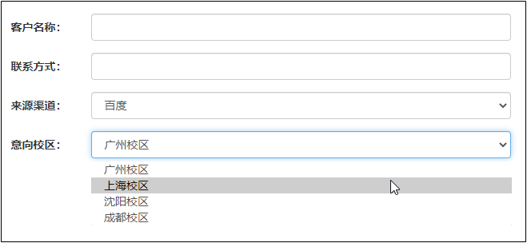
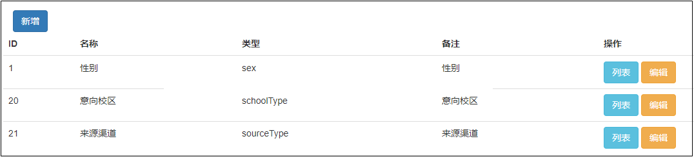
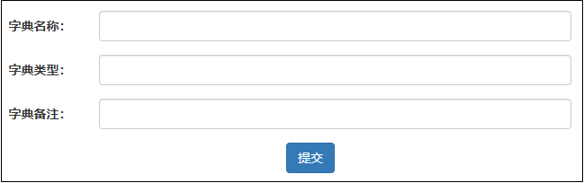
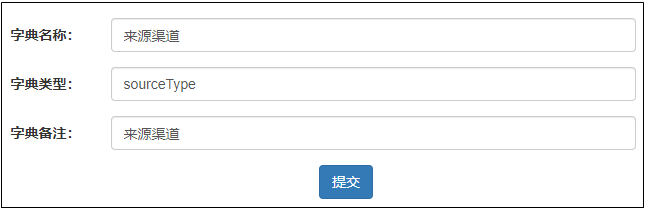
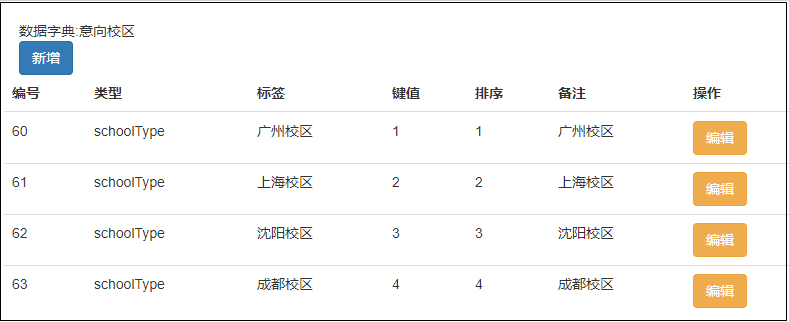
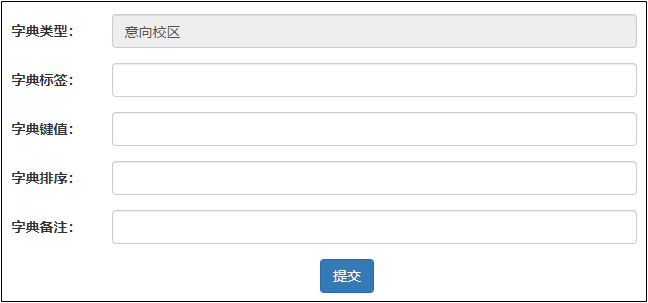
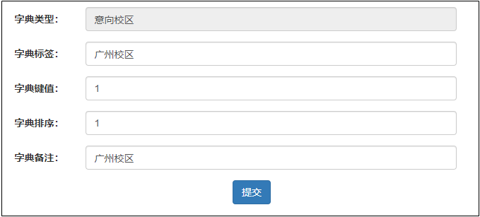
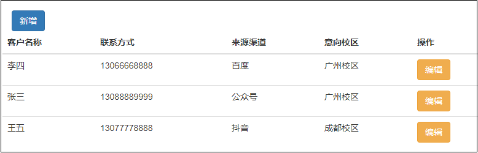
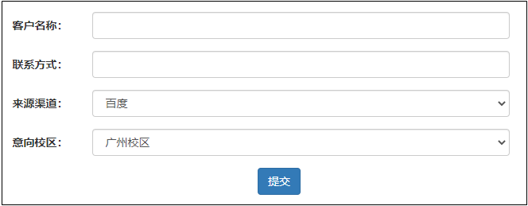
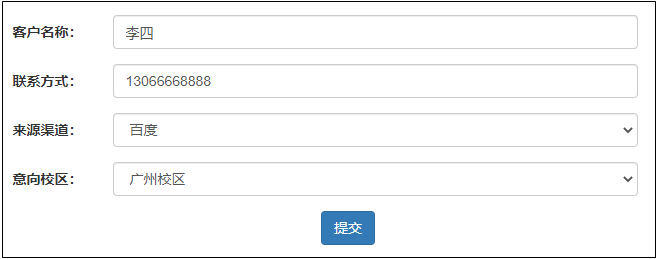

# 数据字典

# 一、需求分析

背景：我们在项目中会有很多的下拉框，这些下拉框都有一个特点，就是键值对的存在。

同学们思考一下，这些下拉框我们应该存储什么值呢？

实现方案：

- 直接硬编码写在html代码中。
- 为每个下拉框都设计一个表，然后提供 CRUD 功能。
- 使用数据字典的方式。

同学们可以分析一下每种方案的优劣。

# 二、表设计

## 1、字典类型表 sys_dict_type

<table>
    <tbody>
        <tr>
        	<td>字段</td>
          	<td>描述</td>
        </tr>
        <tr>
        	<td>id</td>
          	<td>主键</td>
        </tr>
        <tr>
        	<td>name</td>
          	<td>字典名称</td>
        </tr>
        <tr>
        	<td>type</td>
          	<td>字典类型</td>
        </tr>
        <tr>
        	<td>remark</td>
          	<td>备注</td>
        </tr>
    </tbody>
</table>

## 2、字典数据表 sys_dict_data

<table>
    <tbody>
        <tr>
        	<td>字段</td>
          	<td>描述</td>
        </tr>
        <tr>
        	<td>id</td>
          	<td>主键</td>
        </tr>
        <tr>
        	<td>type</td>
          	<td>字典类型</td>
        </tr>
        <tr>
        	<td>label</td>
          	<td>字典标签</td>
        </tr>
        <tr>
        	<td>value</td>
          	<td>字典键值</td>
        </tr>
        <tr>
        	<td>sort</td>
          	<td>字典排序</td>
        </tr>
        <tr>
        	<td>remark</td>
          	<td>备注</td>
        </tr>
    </tbody>
</table>

## 3、客户表 customer

<table>
    <tbody>
        <tr>
        	<td>字段</td>
          	<td>描述</td>
        </tr>
        <tr>
        	<td>id</td>
          	<td>主键</td>
        </tr>
        <tr>
        	<td>name</td>
          	<td>客户名称</td>
        </tr>
        <tr>
        	<td>phone</td>
          	<td>联系方式</td>
        </tr>
        <tr>
        	<td>source_value</td>
          	<td>来源渠道</td>
        </tr>
        <tr>
        	<td>school_value</td>
          	<td>意向校区</td>
        </tr>
    </tbody>
</table>

# 三、功能实现

## 1、数据字典功能

### 1.1、列表功能

### 1.2、新增数据字典

### 1.3、编辑数据字典

## 2、数据字典明细

### 2.1、列表功能

### 2.2、新增字典明细

### 2.3、编辑字典明细

## 3、客户管理功能

### 3.1、列表功能

### 3.2、新增用户

### 3.3、编辑用户

