# Activiti7工作流

# 一、工作流介绍

## 1.1 概念

工作流(Workflow)，就是通过计算机对业务流程自动化执行管理。它主要解决的是“使在多个参与者之间按照某种预定义的规则自动进行传递文档、信息或任务的过程，从而实现某个预期的业务目标，或者促使此目标的实现”。

案例:  出差费用报销

目标:  公司把出差费用转账到自己的账户中.

参与人: 申请人、部门主管、总经理、财务

**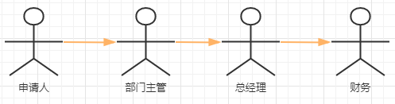**

传递文件/执行任务

**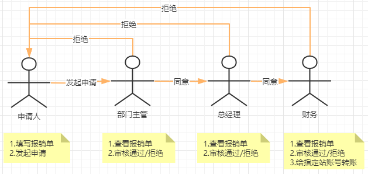**


**什么是工作流系统**?

一个软件系统中具有工作流的功能，我们把它称为工作流系统。


## 1.2 适用行业

消费品行业，制造业，电信服务业，银证险等金融服务业，物流服务业，物业服务业，物业管理，大中型进出口贸易公司，政府事业机构，研究院所及教育服务业等，特别是大的跨国企业和集团公司。


## 1.3 应用领域

企业: 采购流程、合同审核流程

客户: 客户电话投诉处理流程

生活中: 住房贷款审批流程、办理身份证、办理准生手续

行政: 出差审批、报销流程、请假审批、用车流程、会议室申请

银行业: 信贷审批、信用卡发卡审批

人事: 员工培训、绩效考核、职位变动


## 1.4 传统实现方式

我们可以思考下,如果需要实现【**出差费用报销**】工作流程,代码应该如何实现?

**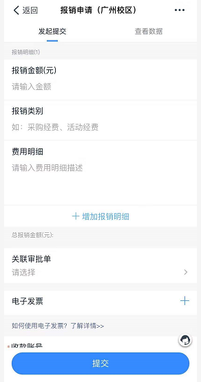**

****


## 1.5 工作流中的共同逻辑

【**出差费用报销**】、【**采购流程**】这两个工作流程中，除了审核角色不一样，以及每个节点做的业务逻辑不一样之外.这些工作流程中都存在一些共同的逻辑,比如:

1.发起审核流程

2.查看目前流程处于哪个节点

3.查看审批历史

4.其他...

我们会发现，在不同的流程中存在共同的逻辑，如果我们自己实现工作流的控制的话，这些代码都是重复的.


## 1.6 什么是工作流引擎

是一种按照预定义规则【需要符合BPMN规范】进行部署，将业务和节点的流程进行分离【特定形式进行关联】，

实现节点的自动流转的工作流框架.

****

1.需要将预定于的流程文件BPMN部署到工作流引擎中,会把节点,路径信息存储到数据库中.

2.工作流引擎提供了大量的API对流程进行查询处理,细节都是对应用程序屏蔽的,大大提供开发效率

3.业务逻辑的处理和流程的流转是分离的，是通过BusinessKey进行关联的.


# 二、什么是Activiti7？

## 2.1 概述

- Alfresco 软件在 2010 年 5 月 17 日宣布 Activiti 业务流程管理（BPM）开源项目的正式启动， 其
  首席架构师由业务流程管理 BPM 的专家 Tom Baeyens 担任， Tom Baeyens 就是原来 jbpm 的架构师，
  而 jbpm 是一个非常有名的工作流引擎，当然 activiti 也是一个工作流引擎。
- Activiti 是一个工作流引擎， activiti 可以将业务系统中复杂的业务流程抽取出来，使用专门的
  建模语言（BPMN2.0）进行定义，业务系统按照预先定义的流程进行执行，实现了业务系统的业务
  流程由 activiti 进行管理，减少业务系统由于流程变更进行系统升级改造的工作量，从而提高系统的
  健壮性，同时也减少了系统开发维护成本。

官方网站:  https://www.activiti.org

**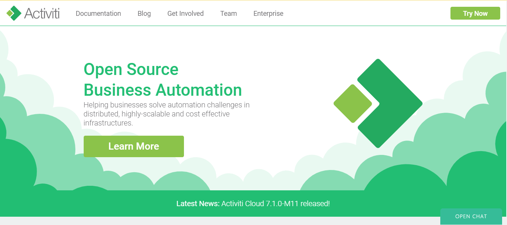**

## 2.2 Activiti7内部核心机制

- 1️⃣业务流程图要规范化，需要遵守一套标准。
- 2️⃣业务流程图本质上就是一个XML文件，而XML可以存放所要的数据。
- 3️⃣读取业务流程图的过程就是解析XML文件的过程。
- 4️⃣读取一个业务流程图的结点就相当于解析一个XML的结点，进一步将数据插入到MySQL表中，形成一条记录。
- 5️⃣将一个业务流程图的所有节点都读取并存入到MySQL表中。
- 6️⃣后面只要读取MySQL表中的记录就相当于读取业务流程图的一个节点。
- 7️⃣业务流程的推进，后面就转换为读取表中的数据，并且处理数据，结束的时候这一行数据就可以删除了。


## 2.3 BPMN

- BPMN（Business Process Model And Notation），业务流程模型和符号，是由BPMI（Business Process Management Initiative）开发的一套的业务流程建模符号，使用BPMN提供的符号可以创建业务流程。2004年5月发布了BPMN1.0规范。BPMI于2005年9月并入OMG（The Object Management Group，对象管理组织）组织。OMG于2011年1月发布BPMN2.0的最终版本。

- Activit就是使用BPMN2.0进行流程建模、流程执行管理，它包括很多的建模符号。

  **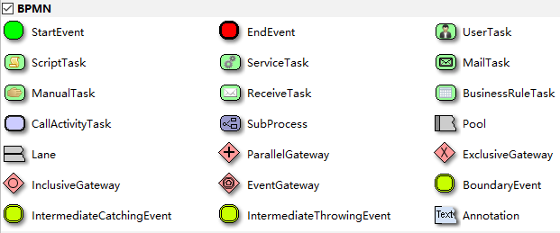**

- 一个BPMN的例子：

  1. 当事人填写请假单，启动流程后把请假单ID绑定到流程中；
  2. 部门经理对请假单进行审核；
  3. 然后人事经理进行复核并进行备案；
  4. 最后请假流程结束。

  **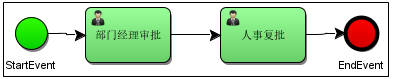**

  思考: 我们看到的是一张图片(png),但是应用程序如何知道下一个节点应该流向到哪里呢?拿到需要去解析png文件吗?

  

- BPMN其实是用XML表示业务流程的，上面的.bpmn文件使用文本编辑器打开：

  ```xml
  <?xml version="1.0" encoding="UTF-8" standalone="yes"?>
  <definitions xmlns="http://www.omg.org/spec/BPMN/20100524/MODEL" xmlns:activiti="http://activiti.org/bpmn" xmlns:bpmndi="http://www.omg.org/spec/BPMN/20100524/DI" xmlns:omgdc="http://www.omg.org/spec/DD/20100524/DC" xmlns:omgdi="http://www.omg.org/spec/DD/20100524/DI" xmlns:tns="http://www.activiti.org/test" xmlns:xsd="http://www.w3.org/2001/XMLSchema" xmlns:xsi="http://www.w3.org/2001/XMLSchema-instance" expressionLanguage="http://www.w3.org/1999/XPath" id="m1620716847764" name="" targetNamespace="http://www.activiti.org/test" typeLanguage="http://www.w3.org/2001/XMLSchema">
    <process id="leave" isClosed="false" isExecutable="true" processType="None">
      <startEvent id="_2" name="StartEvent"/>
      <userTask activiti:candidateUsers="lisi,wangwu" activiti:exclusive="true" id="_4" name="部门经理审批"/>
      <userTask activiti:assignee="rose" activiti:exclusive="true" id="_6" name="人事复批"/>
      <endEvent id="_7" name="EndEvent"/>
      <sequenceFlow id="_12" sourceRef="_6" targetRef="_7"/>
      <sequenceFlow id="_13" sourceRef="_2" targetRef="_4"/>
      <sequenceFlow id="_14" sourceRef="_4" targetRef="_6"/>
    </process>
    <bpmndi:BPMNDiagram documentation="background=#FFFFFF;count=1;horizontalcount=1;orientation=0;width=842.4;height=1195.2;imageableWidth=832.4;imageableHeight=1185.2;imageableX=5.0;imageableY=5.0" id="Diagram-_1" name="New Diagram">
      <bpmndi:BPMNPlane bpmnElement="leave">
        <bpmndi:BPMNShape bpmnElement="_2" id="Shape-_2">
          <omgdc:Bounds height="32.0" width="32.0" x="175.0" y="185.0"/>
          <bpmndi:BPMNLabel>
            <omgdc:Bounds height="32.0" width="32.0" x="0.0" y="0.0"/>
          </bpmndi:BPMNLabel>
        </bpmndi:BPMNShape>
        <bpmndi:BPMNShape bpmnElement="_4" id="Shape-_4">
          <omgdc:Bounds height="55.0" width="85.0" x="245.0" y="175.0"/>
          <bpmndi:BPMNLabel>
            <omgdc:Bounds height="55.0" width="85.0" x="0.0" y="0.0"/>
          </bpmndi:BPMNLabel>
        </bpmndi:BPMNShape>
        <bpmndi:BPMNShape bpmnElement="_6" id="Shape-_6">
          <omgdc:Bounds height="55.0" width="85.0" x="380.0" y="175.0"/>
          <bpmndi:BPMNLabel>
            <omgdc:Bounds height="55.0" width="85.0" x="0.0" y="0.0"/>
          </bpmndi:BPMNLabel>
        </bpmndi:BPMNShape>
        <bpmndi:BPMNShape bpmnElement="_7" id="Shape-_7">
          <omgdc:Bounds height="32.0" width="32.0" x="505.0" y="185.0"/>
          <bpmndi:BPMNLabel>
            <omgdc:Bounds height="32.0" width="32.0" x="0.0" y="0.0"/>
          </bpmndi:BPMNLabel>
        </bpmndi:BPMNShape>
        <bpmndi:BPMNEdge bpmnElement="_13" id="BPMNEdge__13" sourceElement="_2" targetElement="_4">
          <omgdi:waypoint x="207.0" y="201.0"/>
          <omgdi:waypoint x="245.0" y="202.5"/>
          <bpmndi:BPMNLabel>
            <omgdc:Bounds height="0.0" width="0.0" x="0.0" y="0.0"/>
          </bpmndi:BPMNLabel>
        </bpmndi:BPMNEdge>
        <bpmndi:BPMNEdge bpmnElement="_12" id="BPMNEdge__12" sourceElement="_6" targetElement="_7">
          <omgdi:waypoint x="465.0" y="202.5"/>
          <omgdi:waypoint x="505.0" y="201.0"/>
          <bpmndi:BPMNLabel>
            <omgdc:Bounds height="0.0" width="0.0" x="0.0" y="0.0"/>
          </bpmndi:BPMNLabel>
        </bpmndi:BPMNEdge>
        <bpmndi:BPMNEdge bpmnElement="_14" id="BPMNEdge__14" sourceElement="_4" targetElement="_6">
          <omgdi:waypoint x="330.0" y="202.5"/>
          <omgdi:waypoint x="380.0" y="202.5"/>
          <bpmndi:BPMNLabel>
            <omgdc:Bounds height="0.0" width="0.0" x="0.0" y="0.0"/>
          </bpmndi:BPMNLabel>
        </bpmndi:BPMNEdge>
      </bpmndi:BPMNPlane>
    </bpmndi:BPMNDiagram>
  </definitions>
  ```

  

## 2.4 Activiti如何使用

### 2.4.1 整合Activiti

- Activiti是一个工作流引擎，业务系统使用Activiti来对系统的业务流程进行自动化管理，为了方便业务系统访问（操作）Activiti的接口或功能，通常将Activiti和业务系统的环境集成在一起。

### 2.4.2 业务流程建模

- 使用Activiti流程建模工具(Activity-designer)定义业务流程(.bpmn文件)。
- .bpmn文件就是业务流程定义文件，通过xml定义业务流程。
- 如果使用其他公司开发的工作引擎一般都提供了可视化的建模工具（Process Designer）用于生成流程定义文件，建模工具操作直观，一般都支持图形化拖拽方式、多窗口的用户界面、丰富的过程图形元素、过程元素拷贝、粘贴、删除等功能。

### 2.4.3 部署业务流程

- 向Activiti部署业务流程定义(.bpmn文件)。
- 使用Activiti提供的API向Activiti中部署.bpmn文件（一般情况下还需要一起部署业务流程的图片.png）。

### 2.4.4 启动流程实例

- 启动一个流程实例表示开始一次业务流程的运行，比如员工请假流程部署完成，如果张三要请假就可以启动一个流程实例，如果李四要请假也需要启动一个流程实例，两个流程的执行互不影响，就好比定义一个Java类，实例化两个Java对象一样，部署的流程就好比Java类，启动一个流程实例就好比new一个Java对象。

### 2.4.5 查询待办任务

- 因为现在系统的业务流程已经交给Activiti管理，通过Activiti就可以查询当前流程执行到哪里了，当前用户需要办理什么任务了，这些Activiti帮我们管理了，而不像传统方式中需要我们在SQL语句中的WHERE条件中指定当前查询的状态值是多少。

### 2.4.6 处理待办任务

- 用户查询待办任务后，就可以办理某个任务，如果这任务办理完成还需要其他用户办理，比如采购单创建后由部门经理审核，这个过程也是由Activiti帮我们完成了，不需要我们在代码中硬编码指定下一个任务办理人了

### 2.4.7 结束流程

- 当任务办理完成没有下一个任务/结点了，这个流程实例就完成了。


# 三、Activiti7环境

## 3.1 开发环境

Jdk1.8或以上版本

Mysql 5及以上的版本

Tomcat8.5

IDEA

Activiti 7.0.0.SR1

## 3.2 安装Activiti流程设计器

### 3.2.1 在线安装

在`Plugins`中搜索`actiBPM`，然后点击`Search in repositories`,无法在线安装的同学请选择本地安装

**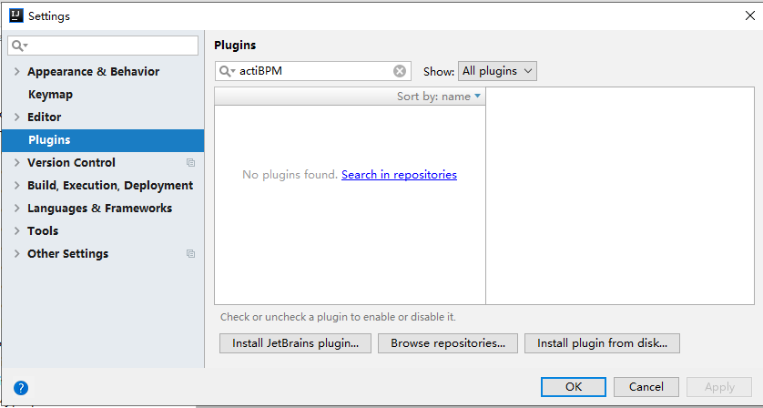**

会弹出如下窗口

**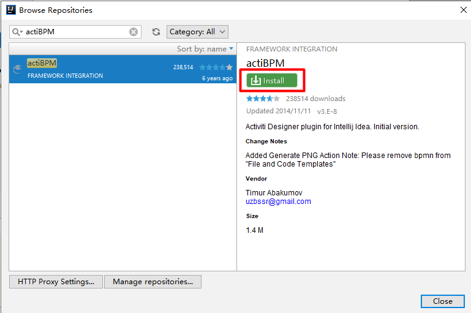**

安装完成之后，点击`Restart IntelliJ IDEA` 重启IDEA即可

### 3.2.2 本地安装

1. 从IDEA官网下载`actiBPM.jar`包,下载地址:https://plugins.jetbrains.com/plugin/7429-actibpm/versions

2. 从本地安装actiBPM

   **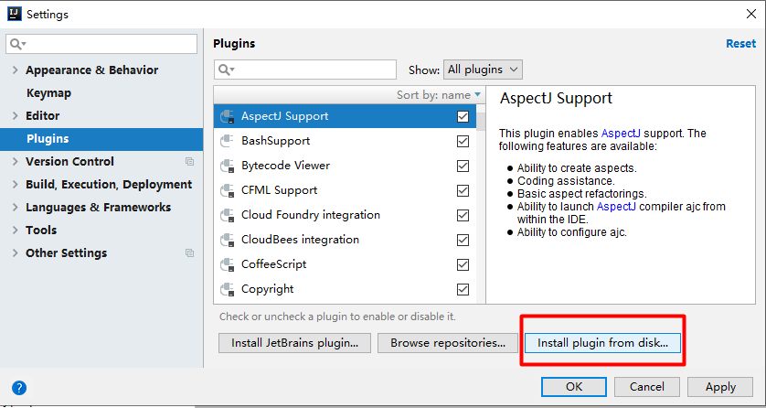**

   点击`Install plugin from disk` 后选择下载好的`actiBPM.jar`，然后重启IDEA即可.


## 3.3 解决actiBPM中文乱码

- 在IDEA中将File-->Settings-->Editor-->File Encodings修改为UTF-8

  **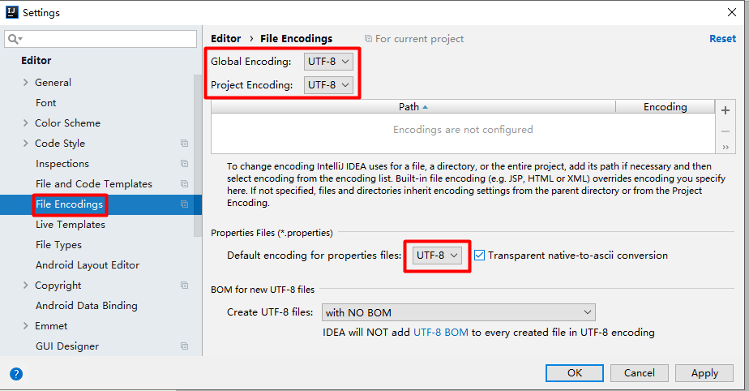**

- 在IDEA的Help-->Edit Custom VM Options中末尾添加`-Dfile.encoding=UTF-8`

  **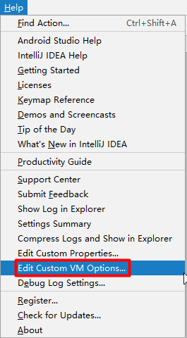**

  **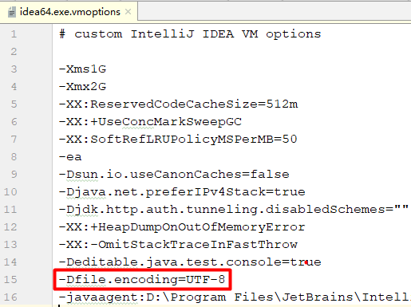**

- 在IDEA的安装目录的bin目录下将idea.exe.vmoptions和idea64.exe.vmoptions两个文件末尾添加`-Dfile.encoding=UTF-8`

  **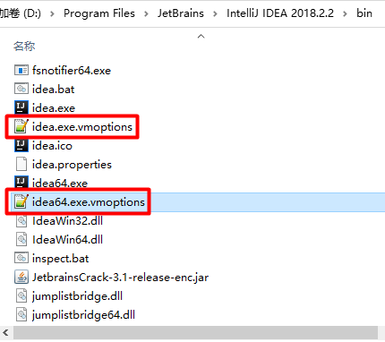**

- 重启IDEA即可。


## 3.4  Activiti支持的数据库

- Activiti的运行需要数据库的支撑，支持如下:
  - h2
  - MySQL
  - Oracle
  - Db2
  - postgres
  - mssql

- 在Navicat工具中创建`activiti`的数据库，用于后续的实验.


# 四、集成Activiti7

## 4.1 创建Maven项目

- 通过IDEA创建Maven的Java工程。

## 4.2 添加Maven依赖

在Java工程中加入ProcessEngine所需要的jar包，包括：

- activiti-engine-7.0.0.GA.jar
- activiti依赖的jar包：mybatis、slf4j、log4j等
- activiti依赖的spring的jar包
- 数据库驱动
- 第三方数据库连接池dbcp
- 单元测试junit

`pom.xml`文件

```xml
    <properties>
        <slf4j.version>1.6.6</slf4j.version>
        <log4j.version>1.2.12</log4j.version>
        <activiti.version>7.0.0.SR1</activiti.version>
    </properties>
    <dependencies>
        <!-- activiti引擎 -->
        <dependency>
            <groupId>org.activiti</groupId>
            <artifactId>activiti-engine</artifactId>
            <version>${activiti.version}</version>
        </dependency>
        <!-- 整合Spring -->
        <dependency>
            <groupId>org.activiti</groupId>
            <artifactId>activiti-spring</artifactId>
            <version>${activiti.version}</version>
        </dependency>
        <!-- bpmn 模型处理 -->
        <dependency>
            <groupId>org.activiti</groupId>
            <artifactId>activiti-bpmn-model</artifactId>
            <version>${activiti.version}</version>
        </dependency>
        <!-- bpmn 转换 -->
        <dependency>
            <groupId>org.activiti</groupId>
            <artifactId>activiti-bpmn-converter</artifactId>
            <version>${activiti.version}</version>
        </dependency>
        <!-- bpmn json数据转换 -->
        <dependency>
            <groupId>org.activiti</groupId>
            <artifactId>activiti-json-converter</artifactId>
            <version>${activiti.version}</version>
        </dependency>
        <!-- bpmn 布局 -->
        <dependency>
            <groupId>org.activiti</groupId>
            <artifactId>activiti-bpmn-layout</artifactId>
            <version>${activiti.version}</version>
        </dependency>
        <!-- mysql驱动 -->
        <dependency>
            <groupId>mysql</groupId>
            <artifactId>mysql-connector-java</artifactId>
            <version>5.1.40</version>
        </dependency>
        <!-- mybatis -->
        <dependency>
            <groupId>org.mybatis</groupId>
            <artifactId>mybatis</artifactId>
            <version>3.4.5</version>
        </dependency>
        <!-- 链接池 -->
        <dependency>
            <groupId>commons-dbcp</groupId>
            <artifactId>commons-dbcp</artifactId>
            <version>1.4</version>
        </dependency>
        <!-- 单元测试 -->
        <dependency>
            <groupId>junit</groupId>
            <artifactId>junit</artifactId>
            <version>4.12</version>
        </dependency>
        <!-- log start -->
        <dependency>
            <groupId>log4j</groupId>
            <artifactId>log4j</artifactId>
            <version>${log4j.version}</version>
        </dependency>
        <dependency>
            <groupId>org.slf4j</groupId>
            <artifactId>slf4j-api</artifactId>
            <version>${slf4j.version}</version>
        </dependency>
        <dependency>
            <groupId>org.slf4j</groupId>
            <artifactId>slf4j-log4j12</artifactId>
            <version>${slf4j.version}</version>
        </dependency>
        <!-- log end -->
        <dependency>
            <groupId>commons-io</groupId>
            <artifactId>commons-io</artifactId>
            <version>2.6</version>
        </dependency>
        <!--数据库连接池-->
        <dependency>
            <groupId>com.alibaba</groupId>
            <artifactId>druid</artifactId>
            <version>1.2.4</version>
        </dependency>
    </dependencies>

```


## 4.3 添加log4j日志配置

我们使用log4j日志包，可以对日志进行配置，在`resources`下创建`log4j.properties`,内容如下:

```properties
# Set root category priority to INFO and its only appender to CONSOLE.
#log4j.rootCategory=INFO, CONSOLE debug info warn error fatal
log4j.rootCategory=debug, CONSOLE, LOGFILE
# Set the enterprise logger category to FATAL and its only appender to CONSOLE.
log4j.logger.org.apache.axis.enterprise=FATAL, CONSOLE
# CONSOLE is set to be a ConsoleAppender using a PatternLayout.
log4j.appender.CONSOLE=org.apache.log4j.ConsoleAppender
log4j.appender.CONSOLE.layout=org.apache.log4j.PatternLayout
log4j.appender.CONSOLE.layout.ConversionPattern=%d{ISO8601} %-6r[%15.15t] %-5p %30.30c %x - %m\n
# LOGFILE is set to be a File appender using a PatternLayout.
log4j.appender.LOGFILE=org.apache.log4j.FileAppender
log4j.appender.LOGFILE.File=./activiti.log
log4j.appender.LOGFILE.Append=true
log4j.appender.LOGFILE.layout=org.apache.log4j.PatternLayout
log4j.appender.LOGFILE.layout.ConversionPattern=%d{ISO8601} %-6r[%15.15t] %-5p %30.30c %x - %m\n
```

## 4.4 添加核心配置文件

需要在`resource`目录中添加配置文件`activiti.cfg.xml`,内容如下:

- - 数据库连接池
  - Activiti单独运行的ProcessEngine配置

```xml
<?xml version="1.0" encoding="UTF-8"?>
<beans xmlns="http://www.springframework.org/schema/beans"
       xmlns:xsi="http://www.w3.org/2001/XMLSchema-instance"
       xmlns:context="http://www.springframework.org/schema/context"
       xmlns:tx="http://www.springframework.org/schema/tx"
       xsi:schemaLocation="http://www.springframework.org/schema/beans
                    http://www.springframework.org/schema/beans/spring-beans.xsd
http://www.springframework.org/schema/contex
http://www.springframework.org/schema/context/spring-context.xsd
http://www.springframework.org/schema/tx
http://www.springframework.org/schema/tx/spring-tx.xsd">
    <!--数据库连接池-->
    <bean id="dataSource" class="com.alibaba.druid.pool.DruidDataSource">
        <property name="driverClassName" value="com.mysql.jdbc.Driver" />
        <property name="url" value="jdbc:mysql:///activiti" />
        <property name="username" value="root" />
        <property name="password" value="admin" />
    </bean>
    <!-- 默认id对应的值 为processEngineConfiguration -->
    <bean id="processEngineConfiguration" class="org.activiti.engine.impl.cfg.StandaloneProcessEngineConfiguration">
        <property name="dataSource" ref="dataSource"/>
        <!--
            activiti数据库表处理策略
                false(默认值)：检查数据库的版本和依赖库的版本，如果不匹配就抛出异常
                true：构建流程引擎时，执行检查，如果需要就执行更新。如果表不存在，就创建。
                create-drop：构建流程引擎时创建数据库报表，关闭流程引擎时就删除这些表。
                drop-create：先删除表再创建表。
                create：构建流程引擎时创建数据库表，关闭流程引擎时不删除这些表
        -->
        <property name="databaseSchemaUpdate" value="true"/>
    </bean>
</beans>
```

如果mysql8以上，查询出现乱码的这么配置

```xml
<property name="url" value="jdbc:mysql:///activiti?useUnicode=true&amp;characterEncoding=utf-8&amp;useSSL=true&amp;serverTimezone=UTC" />
```

## 4.5 测试

- 创建一个测试类，调用activiti的工具类，生成acitivti需要的数据库表。代码如下:

```java
package cn.wolfcode.demo;

import org.activiti.engine.ProcessEngine;
import org.activiti.engine.ProcessEngines;
import org.junit.Test;

public class Demo1 {
    @Test
    public void testInit(){
        ProcessEngine processEngine = ProcessEngines.getDefaultProcessEngine();
        System.out.println(processEngine);
    }
}
```

## 4.6 数据库表的命名规则

- 此时我们查看数据库，发现25张表，结果如下所示：

  **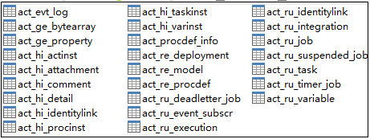**

Activiti的表都是以`ACT_`开头。第二部分是表示表的用途的两个字母标识。用途也和服务的API对应。

- `ACT_RE_*`：'RE'表示Repository。这个前缀的表包含了流程定义和流程静态资源（图片、规则等等）。
- `ACT_RU_*`：'RU'表示Runtime。这些运行时的表，包含流程实例，任务、变量，异步任务等运行中的数据。Activiti只在流程实例执行过程中保存这些数据，在流程结束时就会删除这些记录。这些运行时表可以一直很小并且速度很快。
- `ACT_HI_*`：'HI'表示History。这些表包含历史数据，比如历史流程实例，变量，任务等等。
- `ACT_GE_*`：'GE'表示General。通用数据，用于不同场景下。

# 五、流程引擎API

**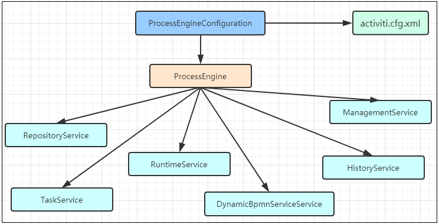**

`ProcessEngine processEngine = ProcessEngines.getDefaultProcessEngine();`

这行代码默认是读取`resource`目录下的`activiti.cfg.xml`文件，这个文件本质上就是spring的配置文件，加载之后会读取配置文件中id名为`processEngineConfiguration`的bean,通过这个配置对象可以获取到流程引擎对象`ProcessEngine`

## 5.1 Service总览

| Service接口       | 说明                       |
| ----------------- | -------------------------- |
| RepositoryService | Activiti的资源管理接口     |
| RuntimeService    | Activiti的流程运行管理接口 |
| TaskService       | Activiti的任务管理接口     |
| HistoryService    | Activiti的历史管理接口     |
| ManagementService | Activiti的引擎管理接口     |


- **RepositoryService**，是Activiti的资源管理接口，提供了管理和控制流程发布包和流程定义的操作。使用工作流建模工具设计的业务流程图需要使用此Service将流程定义文件的内容部署到计算机中。

- **RuntimeService**，是Activiti的流程运行管理接口，可以从这个接口中获取很多关于流程执行相关的信息。

- **TaskService**，是Activiti的任务管理接口，可以从这个接口中获取任务的信息。

- **HistoryService**，是Activiti的历史管理类，可以查询历史信息，执行流程时，引擎会包含很多数据（根据配置），比如流程实例启动时间，任务的参与者，完成任务的时间，每个流程实例的执行路径，等等。

- **ManagementService**，是Activiti的引擎管理接口，提供了对Activiti流程引擎的管理和维护功能，这些功能不在工作流驱动的应用程序中使用，主要用于Activiti系统的日常维护。


# 六、Activiti7入门

## 6.1 业务流程建模

### 6.1.1 绘制流程图

在`resource`目录下新建`bpmn`目录用于存放所有的流程文件 ,在`bpmn`目录下新建`leave.bpmn`,内容如下:

**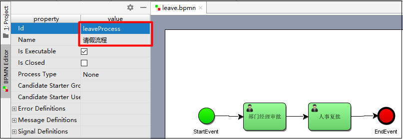**

### 6.1.2 指定任务负责人

- 为每个任务结点指定负责人，如部门经理的审核人是李四。

**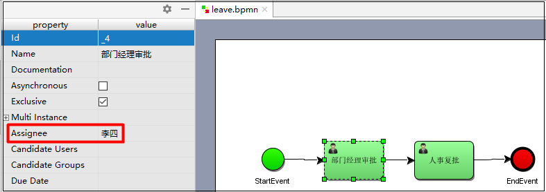**

### 6.1.3 生成png格式流程图

`bpmn`文件本质上是xml格式,我们打开看到的是图片格式是因为我们在IDEA中安装了actiBPM的插件.

如果我们把`bpmn`文件部署到Web环境,那么就只能看到xml信息,无法看到类似上面的图形了.

我们可以再部署之前，根据`bpmn`文件生成`png`文件，然后把`bpmn`和`png`文件同时部署到Web环境中.如果我们想查看流程图的话，我们就可以通过Activiti把这个`png`文件读取出来. 接下来我们把`bpmn`导出为`png`文件

- 将`leave.bpmn`文件重命名为`leave.xml`文件

  **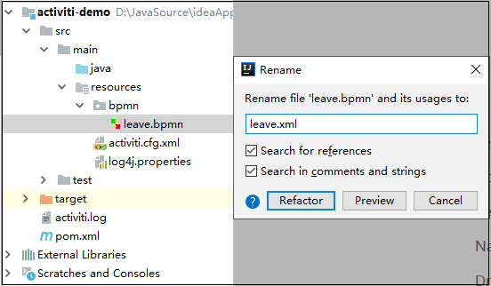**

- 右键点击`leave.xml`文件 --> `Diagrams` -->  `Show BPMN Designer...`

  **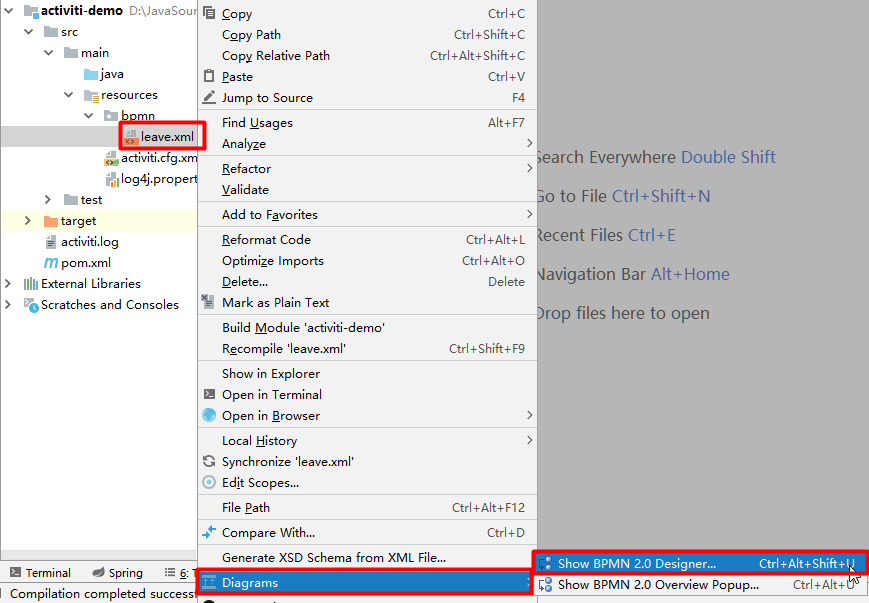**

- 点击导出按钮,保存在`resource/bpmn`同级目录下

  **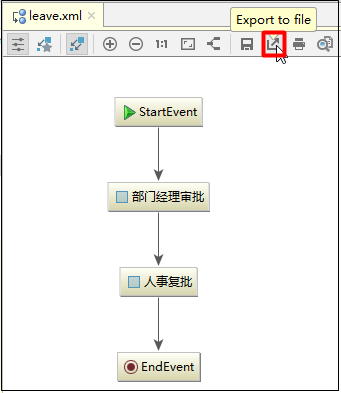**

- 导出`png`之后,把`leave.xml`更名为`leave.bpmn`

  **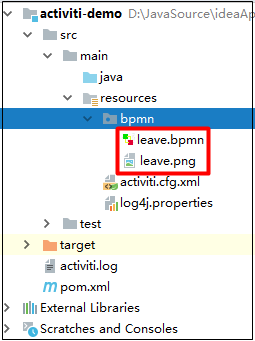**


## 6.2 部署流程定义

- 使用RepositoryService部署流程定义

```java
package cn.wolfcode.demo;

import org.activiti.engine.ProcessEngine;
import org.activiti.engine.ProcessEngines;
import org.activiti.engine.RepositoryService;
import org.activiti.engine.repository.Deployment;
import org.junit.Test;

/**
 * Created by wolfcode
 */
public class ActivitiTest {
    @Test
    public void testDeploy(){
        //创建ProcessEngine对象
        ProcessEngine processEngine = ProcessEngines.getDefaultProcessEngine();
        //获取RepositoryService对象
        RepositoryService repositoryService = processEngine.getRepositoryService();
        //进行部署
        Deployment deployment = repositoryService.createDeployment()
                .addClasspathResource("bpmn/leave.bpmn")
                .addClasspathResource("bpmn/leave.png")
                .name("请假流程")
                .deploy();
        //输出部署的一些信息
        System.out.println("流程部署ID:"+deployment.getId());
        System.out.println("流程部署名称:"+deployment.getName());
    }
}
```

观察日志发现，进行部署会操作如下表.

- ACT_GE_PROPERTY 引擎属性表

```sql
Preparing: update ACT_GE_PROPERTY SET REV_ = ?, VALUE_ = ? where NAME_ = ? and REV_ = ? 

Parameters: 2(Integer), 2501(String), next.dbid(String), 1(Integer)
```

- ACT_RE_PROCDEF 流程定义表

```sql
Preparing: insert into ACT_RE_PROCDEF(ID_, REV_, CATEGORY_, NAME_, KEY_, VERSION_, DEPLOYMENT_ID_, RESOURCE_NAME_, DGRM_RESOURCE_NAME_, DESCRIPTION_, HAS_START_FORM_KEY_, HAS_GRAPHICAL_NOTATION_ , SUSPENSION_STATE_, TENANT_ID_, ENGINE_VERSION_) values (?, 1, ?, ?, ?, ?, ?, ?, ?, ?, ?, ?, ?, ?, ?) 

Parameters: leaveProcess:1:4(String), http://www.activiti.org/test(String), 请假流程(String), leaveProcess(String), 1(Integer), 1(String), bpmn/leave.bpmn(String), bpmn/leave.png(String), null, false(Boolean), true(Boolean), 1(Integer), (String), null
```

- ACT_RE_DEPLOYMENT 流程部署表

```sql
Preparing: insert into ACT_RE_DEPLOYMENT(ID_, NAME_, CATEGORY_, KEY_, TENANT_ID_, DEPLOY_TIME_, ENGINE_VERSION_) values(?, ?, ?, ?, ?, ?, ?) 

Parameters: 1(String), 请假流程(String), null, null, (String), 2021-06-02 11:01:44.838(Timestamp), null
```

-  ACT_GE_BYTEARRAY 二进制资源表

```sql
Preparing: INSERT INTO ACT_GE_BYTEARRAY(ID_, REV_, NAME_, BYTES_, DEPLOYMENT_ID_, GENERATED_) VALUES (?, 1, ?, ?, ?, ?) , (?, 1, ?, ?, ?, ?) 

Parameters: 2(String), bpmn/leave.png(String), java.io.ByteArrayInputStream@7fe7c640(ByteArrayInputStream), 1(String), false(Boolean), 3(String), bpmn/leave.bpmn(String), java.io.ByteArrayInputStream@4c4748bf(ByteArrayInputStream), 1(String), false(Boolean)
```


## 6.3 启动流程实例

- 流程定义部署在Activiti中之后就可以通过工作流管理业务流程了。
- 针对该流程，启动一个流程表示发起一个新的请假申请单，这就相当于Java类和Java对象的关系，类定义好之后需要new创建一个对象使用，当然，也可以new多个对象。
- 对于请假申请流程，张三发起一个请假申请单需要启动一个流程实例，李四发起一个请求申请单也需要启动一个流程实例。

```java
@Test
public void testStartProcess(){
	//创建ProcessEngine对象
	ProcessEngine processEngine = ProcessEngines.getDefaultProcessEngine();
	//获取RuntimeService对象
	RuntimeService runtimeService = processEngine.getRuntimeService();
	//根据流程定义的key启动流程实例,这个key是在定义bpmn的时候设置的
	ProcessInstance instance = runtimeService.
								startProcessInstanceByKey("leaveProcess");
	//获取流程实例的相关信息
	System.out.println("流程定义的id = " + instance.getProcessDefinitionId());
	System.out.println("流程实例的id = " + instance.getId());
}
```

观察日志发现，启动流程会操作如下表.

- ACT_HI_TASKINST 历史任务表

```sql
Preparing: insert into ACT_HI_TASKINST ( ID_, PROC_DEF_ID_, PROC_INST_ID_, EXECUTION_ID_, NAME_, PARENT_TASK_ID_, DESCRIPTION_, OWNER_, ASSIGNEE_, START_TIME_, CLAIM_TIME_, END_TIME_, DURATION_, DELETE_REASON_, TASK_DEF_KEY_, FORM_KEY_, PRIORITY_, DUE_DATE_, CATEGORY_, TENANT_ID_ ) values ( ?, ?, ?, ?, ?, ?, ?, ?, ?, ?, ?, ?, ?, ?, ?, ?, ?, ?, ?, ? ) 

Parameters: 2505(String), leaveProcess:1:4(String), 2501(String), 2502(String), 部门经理审批(String), null, null, null, 李四(String), 2021-06-02 16:34:52.827(Timestamp), null, null, null, null, _4(String), null, 50(Integer), null, null, (String)
```

- ACT_HI_PROCINST 历史流程实例表

```sql
Preparing: insert into ACT_HI_PROCINST ( ID_, PROC_INST_ID_, BUSINESS_KEY_, PROC_DEF_ID_, START_TIME_, END_TIME_, DURATION_, START_USER_ID_, START_ACT_ID_, END_ACT_ID_, SUPER_PROCESS_INSTANCE_ID_, DELETE_REASON_, TENANT_ID_, NAME_ ) values ( ?, ?, ?, ?, ?, ?, ?, ?, ?, ?, ?, ?, ?, ? ) 

Parameters: 2501(String), 2501(String), null, leaveProcess:1:4(String), 2021-06-02 16:34:52.798(Timestamp), null, null, null, _2(String), null, null, null, (String), null
```

- ACT_HI_ACTINST 历史活动信息表

```sql
Preparing: insert into ACT_HI_ACTINST ( ID_, PROC_DEF_ID_, PROC_INST_ID_, EXECUTION_ID_, ACT_ID_, TASK_ID_, CALL_PROC_INST_ID_, ACT_NAME_, ACT_TYPE_, ASSIGNEE_, START_TIME_, END_TIME_, DURATION_, DELETE_REASON_, TENANT_ID_ ) values (?, ?, ?, ?, ?, ?, ?, ?, ?, ?, ?, ?, ?, ?, ?) , (?, ?, ?, ?, ?, ?, ?, ?, ?, ?, ?, ?, ?, ?, ?) 

Parameters: 2503(String), leaveProcess:1:4(String), 2501(String), 2502(String), _2(String), null, null, StartEvent(String), startEvent(String), null, 2021-06-02 16:34:52.815(Timestamp), 2021-06-02 16:34:52.816(Timestamp), 1(Long), null, (String), 2504(String), leaveProcess:1:4(String), 2501(String), 2502(String), _4(String), 2505(String), null, 部门经理审批(String), userTask(String), 李四(String), 2021-06-02 16:34:52.817(Timestamp), null, null, null, (String)
```

- ACT_HI_IDENTITYLINK 历史身份连接表

```sql
Preparing: insert into ACT_HI_IDENTITYLINK (ID_, TYPE_, USER_ID_, GROUP_ID_, TASK_ID_, PROC_INST_ID_) values (?, ?, ?, ?, ?, ?) 

Parameters: 2506(String), participant(String), 李四(String), null, null, 2501(String)
```

- ACT_RU_EXECUTION 运行时执行实例表

```sql
insert into ACT_RU_EXECUTION (ID_, REV_, PROC_INST_ID_, BUSINESS_KEY_, PROC_DEF_ID_, ACT_ID_, IS_ACTIVE_, IS_CONCURRENT_, IS_SCOPE_,IS_EVENT_SCOPE_, IS_MI_ROOT_, PARENT_ID_, SUPER_EXEC_, ROOT_PROC_INST_ID_, SUSPENSION_STATE_, TENANT_ID_, NAME_, START_TIME_, START_USER_ID_, IS_COUNT_ENABLED_, EVT_SUBSCR_COUNT_, TASK_COUNT_, JOB_COUNT_, TIMER_JOB_COUNT_, SUSP_JOB_COUNT_, DEADLETTER_JOB_COUNT_, VAR_COUNT_, ID_LINK_COUNT_) values (?, 1, ?, ?, ?, ?, ?, ?, ?, ?, ?, ?, ?, ?, ?, ?, ?, ?, ?, ?, ?, ?, ?, ?, ?, ?, ?, ?) , (?, 1, ?, ?, ?, ?, ?, ?, ?, ?, ?, ?, ?, ?, ?, ?, ?, ?, ?, ?, ?, ?, ?, ?, ?, ?, ?, ?) 

Parameters: 2501(String), 2501(String), null, leaveProcess:1:4(String), null, true(Boolean), false(Boolean), true(Boolean), false(Boolean), false(Boolean), null, null, 2501(String), 1(Integer), (String), null, 2021-06-02 16:34:52.798(Timestamp), null, false(Boolean), 0(Integer), 0(Integer), 0(Integer), 0(Integer), 0(Integer), 0(Integer), 0(Integer), 0(Integer), 2502(String), 2501(String), null, leaveProcess:1:4(String), _4(String), true(Boolean), false(Boolean), false(Boolean), false(Boolean), false(Boolean), 2501(String), null, 2501(String), 1(Integer), (String), null, 2021-06-02 16:34:52.813(Timestamp), null, false(Boolean), 0(Integer), 0(Integer), 0(Integer), 0(Integer), 0(Integer), 0(Integer), 0(Integer), 0(Integer)
```

- ACT_RU_TASK 运行时任务表

```sql
Preparing: insert into ACT_RU_TASK (ID_, REV_, NAME_, PARENT_TASK_ID_, DESCRIPTION_, PRIORITY_, CREATE_TIME_, OWNER_, ASSIGNEE_, DELEGATION_, EXECUTION_ID_, PROC_INST_ID_, PROC_DEF_ID_, TASK_DEF_KEY_, DUE_DATE_, CATEGORY_, SUSPENSION_STATE_, TENANT_ID_, FORM_KEY_, CLAIM_TIME_) values (?, 1, ?, ?, ?, ?, ?, ?, ?, ?, ?, ?, ?, ?, ?, ?, ?, ?, ?, ? ) 

Parameters: 2505(String), 部门经理审批(String), null, null, 50(Integer), 2021-06-02 16:34:52.817(Timestamp), null, 李四(String), null, 2502(String), 2501(String), leaveProcess:1:4(String), _4(String), null, null, 1(Integer), (String), null, null
```

- ACT_RU_IDENTITYLINK 运行时身份连接表

```sql
Preparing: insert into ACT_RU_IDENTITYLINK (ID_, REV_, TYPE_, USER_ID_, GROUP_ID_, TASK_ID_, PROC_INST_ID_, PROC_DEF_ID_) values (?, 1, ?, ?, ?, ?, ?, ?) 

Parameters: 2506(String), participant(String), 李四(String), null, null, 2501(String), null
```


## 6.4 任务查询

- 流程启动后，各个任务的负责人就可以查询自己当前需要处理的任务，查询出来的任务都是该用户的待办任务。

```java
@Test
public void testSelectTodoTaskList(){
    //任务负责人
    String assignee = "李四";
    //创建ProcessEngine对象
    ProcessEngine processEngine = ProcessEngines.getDefaultProcessEngine();
    //获取TaskService
    TaskService taskService = processEngine.getTaskService();
    //获取任务集合
    List<Task> taskList = taskService.createTaskQuery()
            .processDefinitionKey("leaveProcess")
            .taskAssignee(assignee)
            .list();
    //遍历任务列表
    for(Task task:taskList){
        System.out.println("流程定义id = " + task.getProcessDefinitionId());
        System.out.println("流程实例id = " + task.getProcessInstanceId());
        System.out.println("任务id = " + task.getId());
        System.out.println("任务名称 = " + task.getName());
    }
}
```

观察日志发现，查询任务会操作如下表.

- ACT_RU_TASK 运行时任务表
- ACT_RE_PROCDEF 流程定义表

```sql
Preparing: select distinct RES.* from ACT_RU_TASK RES inner join ACT_RE_PROCDEF D on RES.PROC_DEF_ID_ = D.ID_ WHERE RES.ASSIGNEE_ = ? and D.KEY_ = ? order by RES.ID_ asc LIMIT ? OFFSET ? 

Parameters: 李四(String), leaveProcess(String), 2147483647(Integer), 0(Integer)
```


## 6.5 任务处理

- 任务负责人查询待办任务，选择任务进行处理，完成任务。

```java
@Test
public void testCompleteTask(){
    //任务负责人
    String assignee = "李四";
    //创建ProcessEngine对象
    ProcessEngine processEngine = ProcessEngines.getDefaultProcessEngine();
    //获取TaskService
    TaskService taskService = processEngine.getTaskService();
    //获取任务集合
    List<Task> taskList = taskService.createTaskQuery()
            .processDefinitionKey("leaveProcess")
            .taskAssignee(assignee)
            .list();
    //遍历任务列表
    for(Task task:taskList){
        taskService.complete(task.getId());
    }
}
```

观察日志发现，查询任务会操作如下表.

- ACT_GE_PROPERTY 引擎属性表

```sql
Preparing: update ACT_GE_PROPERTY SET REV_ = ?, VALUE_ = ? where NAME_ = ? and REV_ = ? 

Parameters: 4(Integer), 7501(String), next.dbid(String), 3(Integer)
```

- ACT_HI_TASKINST 历史任务表

```sql
Preparing: insert into ACT_HI_TASKINST ( ID_, PROC_DEF_ID_, PROC_INST_ID_, EXECUTION_ID_, NAME_, PARENT_TASK_ID_, DESCRIPTION_, OWNER_, ASSIGNEE_, START_TIME_, CLAIM_TIME_, END_TIME_, DURATION_, DELETE_REASON_, TASK_DEF_KEY_, FORM_KEY_, PRIORITY_, DUE_DATE_, CATEGORY_, TENANT_ID_ ) values ( ?, ?, ?, ?, ?, ?, ?, ?, ?, ?, ?, ?, ?, ?, ?, ?, ?, ?, ?, ? ) 

Parameters: 5002(String), leaveProcess:1:4(String), 2501(String), 2502(String), 人事复批(String), null, null, null, 王五(String), 2021-06-02 16:39:19.036(Timestamp), null, null, null, null, _5(String), null, 50(Integer), null, null, (String)
```

- ACT_HI_ACTINST 历史活动信息表

```sql
Preparing: insert into ACT_HI_ACTINST ( ID_, PROC_DEF_ID_, PROC_INST_ID_, EXECUTION_ID_, ACT_ID_, TASK_ID_, CALL_PROC_INST_ID_, ACT_NAME_, ACT_TYPE_, ASSIGNEE_, START_TIME_, END_TIME_, DURATION_, DELETE_REASON_, TENANT_ID_ ) values ( ?, ?, ?, ?, ?, ?, ?, ?, ?, ?, ?, ?, ?, ?, ? ) 

Parameters: 5001(String), leaveProcess:1:4(String), 2501(String), 2502(String), _5(String), 5002(String), null, 人事复批(String), userTask(String), 王五(String), 2021-06-02 16:39:19.025(Timestamp), null, null, null, (String)
```

- ACT_HI_IDENTITYLINK 历史身份连接表

```sql
Preparing: insert into ACT_HI_IDENTITYLINK (ID_, TYPE_, USER_ID_, GROUP_ID_, TASK_ID_, PROC_INST_ID_) values (?, ?, ?, ?, ?, ?) 

Parameters: 5003(String), participant(String), 王五(String), null, null, 2501(String)
```

- ACT_RU_TASK 运行时任务表

```sql
Preparing: insert into ACT_RU_TASK (ID_, REV_, NAME_, PARENT_TASK_ID_, DESCRIPTION_, PRIORITY_, CREATE_TIME_, OWNER_, ASSIGNEE_, DELEGATION_, EXECUTION_ID_, PROC_INST_ID_, PROC_DEF_ID_, TASK_DEF_KEY_, DUE_DATE_, CATEGORY_, SUSPENSION_STATE_, TENANT_ID_, FORM_KEY_, CLAIM_TIME_) values (?, 1, ?, ?, ?, ?, ?, ?, ?, ?, ?, ?, ?, ?, ?, ?, ?, ?, ?, ? ) 

Parameters: 5002(String), 人事复批(String), null, null, 50(Integer), 2021-06-02 16:39:19.025(Timestamp), null, 王五(String), null, 2502(String), 2501(String), leaveProcess:1:4(String), _5(String), null, null, 1(Integer), (String), null, null
```

- ACT_RU_IDENTITYLINK 运行时身份连接表

```sql
Preparing: insert into ACT_RU_IDENTITYLINK (ID_, REV_, TYPE_, USER_ID_, GROUP_ID_, TASK_ID_, PROC_INST_ID_, PROC_DEF_ID_) values (?, 1, ?, ?, ?, ?, ?, ?) 

Parameters: 5003(String), participant(String), 王五(String), null, null, 2501(String), null
```

- ACT_RU_EXECUTION 运行时执行实例表

```sql
Preparing: update ACT_RU_EXECUTION set REV_ = ?, BUSINESS_KEY_ = ?, PROC_DEF_ID_ = ?, ACT_ID_ = ?, IS_ACTIVE_ = ?, IS_CONCURRENT_ = ?, IS_SCOPE_ = ?, IS_EVENT_SCOPE_ = ?, IS_MI_ROOT_ = ?, PARENT_ID_ = ?, SUPER_EXEC_ = ?, ROOT_PROC_INST_ID_ = ?, SUSPENSION_STATE_ = ?, NAME_ = ?, IS_COUNT_ENABLED_ = ?, EVT_SUBSCR_COUNT_ = ?, TASK_COUNT_ = ?, JOB_COUNT_ = ?, TIMER_JOB_COUNT_ = ?, SUSP_JOB_COUNT_ = ?, DEADLETTER_JOB_COUNT_ = ?, VAR_COUNT_ = ?, ID_LINK_COUNT_ = ? where ID_ = ? and REV_ = ? 

Parameters: 2(Integer), null, leaveProcess:1:4(String), _5(String), true(Boolean), false(Boolean), false(Boolean), false(Boolean), false(Boolean), 2501(String), null, 2501(String), 1(Integer), null, false(Boolean), 0(Integer), 0(Integer), 0(Integer), 0(Integer), 0(Integer), 0(Integer), 0(Integer), 0(Integer), 2502(String), 1(Integer)
```

- ACT_HI_TASKINST 历史任务表

```sql
Preparing: update ACT_HI_TASKINST set PROC_DEF_ID_ = ?, EXECUTION_ID_ = ?, NAME_ = ?, PARENT_TASK_ID_ = ?, DESCRIPTION_ = ?, OWNER_ = ?, ASSIGNEE_ = ?, CLAIM_TIME_ = ?, END_TIME_ = ?, DURATION_ = ?, DELETE_REASON_ = ?, TASK_DEF_KEY_ = ?, FORM_KEY_ = ?, PRIORITY_ = ?, DUE_DATE_ = ?, CATEGORY_ = ? where ID_ = ? 

Parameters: leaveProcess:1:4(String), 2502(String), 部门经理审批(String), null, null, null, 李四(String), null, 2021-06-02 16:39:18.995(Timestamp), 266168(Long), null, _4(String), null, 50(Integer), null, null, 2505(String)
```

- ACT_HI_TASKINST 历史任务表

```sql
Preparing: update ACT_HI_ACTINST set EXECUTION_ID_ = ?, ASSIGNEE_ = ?, END_TIME_ = ?, DURATION_ = ?, DELETE_REASON_ = ? where ID_ = ? 

Parameters: 2502(String), 李四(String), 2021-06-02 16:39:19.009(Timestamp), 266192(Long), null, 2504(String)
```

- ACT_RU_TASK 运行时任务表

```sql
Preparing: delete from ACT_RU_TASK where ID_ = ? and REV_ = ? 

Parameters: 2505(String), 1(Integer)
```

## 6.6 添加审批意见

- 在执行任务之前可以给该任务添加审批意见,会存储在历史表中,我们后续可以审批历史中查看到该意见

```java
@Test
public void testAddComment(){
    //任务负责人
    String assignee = "王五";
    //创建ProcessEngine对象
    ProcessEngine processEngine = ProcessEngines.getDefaultProcessEngine();
    //获取TaskService
    TaskService taskService = processEngine.getTaskService();
    //获取任务集合
    List<Task> taskList = taskService.createTaskQuery()
            .processDefinitionKey("leaveProcess")
            .taskAssignee(assignee)
            .list();
    //遍历任务列表
    for(Task task:taskList){
        //在任务执行之前任务添加批注信息
        taskService.addComment(task.getId(),task.getProcessInstanceId(),task.getName()+"审批通过");
        taskService.complete(task.getId());
    }
}
```

观察日志发现，其余操作和任务处理的表是一致的，但是添加批注会往如下表中插入记录:

```sql
Preparing: insert into ACT_HI_COMMENT (ID_, TYPE_, TIME_, USER_ID_, TASK_ID_, PROC_INST_ID_, ACTION_, MESSAGE_, FULL_MSG_) values (?, ?, ?, ?, ?, ?, ?, ?, ?) 

Parameters: 7501(String), comment(String), 2021-06-02 16:43:09.13(Timestamp), null, 5002(String), 2501(String), AddComment(String), 人事复批审批通过(String), java.io.ByteArrayInputStream@1b765a2c(ByteArrayInputStream)
```


## 6.6 查看历史审批

- 用户可以查看历史审批记录

```JAVA
@Test
public void testSelectHistoryTask(){
    //流程实例ID
    String processInstanceId = "2501";
    //任务审核人
    String taskAssignee = "王五";
    //创建ProcessEngine对象
    ProcessEngine processEngine = ProcessEngines.getDefaultProcessEngine();
    //获取historyService
    HistoryService historyService = processEngine.getHistoryService();
    //获取taskService
    TaskService taskService = processEngine.getTaskService();
    //获取历史审核信息
    List<HistoricActivityInstance> list = historyService
            .createHistoricActivityInstanceQuery()
            .activityType("userTask")//只获取用户任务
            .processInstanceId(processInstanceId)
            .taskAssignee(taskAssignee)
            .finished()
            .list();
    for(HistoricActivityInstance instance:list){
        System.out.println("任务名称:"+instance.getActivityName());
        System.out.println("任务开始时间:"+instance.getStartTime());
        System.out.println("任务结束时间:"+instance.getEndTime());
        System.out.println("任务耗时:"+instance.getDurationInMillis());
        //获取审核批注信息
        List<Comment> taskComments = taskService.getTaskComments(instance.getTaskId());
        if(taskComments.size()>0){
            System.out.println("审批批注:"+taskComments.get(0).getFullMessage());
        }
    }
}
```


# 七、Activiti7进阶

## 7.1 流程定义相关

### 7.1.1 流程定义查询

- 查询流程相关信息，包含流程定义，流程部署，流程定义版本

```java
@Test
public void testDefinitionQuery(){
    //创建ProcessEngine对象
    ProcessEngine processEngine = ProcessEngines.getDefaultProcessEngine();
    //获取仓库服务
    RepositoryService repositoryService = processEngine.getRepositoryService();
    //获取流程定义集合
    List<ProcessDefinition> processDefinitionList = repositoryService
            .createProcessDefinitionQuery()
            .processDefinitionKey("leaveProcess")
            .list();
    //遍历集合
    for (ProcessDefinition definition:processDefinitionList){
        System.out.println("流程定义ID:"+definition.getId());
        System.out.println("流程定义名称:"+definition.getName());
        System.out.println("流程定义key:"+definition.getKey());
        System.out.println("流程定义版本:"+definition.getVersion());
        System.out.println("流程部署ID:"+definition.getDeploymentId());
        System.out.println("====================");
    }
}
```


### 7.1.2 流程资源下载

- 现在我们的流程资源文件已经上传到数据库了，如果其他用户想要查看这些资源文件，可以从数据库中把资源文件下载到本地。

  ```java
  @Test
  public void testDownloadResource() throws Exception {
      //创建ProcessEngine对象
      ProcessEngine processEngine = ProcessEngines.getDefaultProcessEngine();
      //获取仓库服务
      RepositoryService repositoryService = processEngine.getRepositoryService();
      //获取流程定义集合
      List<ProcessDefinition> list = repositoryService
              .createProcessDefinitionQuery()
              .processDefinitionKey("leaveProcess")
              .orderByProcessDefinitionVersion()//按照版本排序
              .desc()//降序
              .list();
      //获取最新那个
      ProcessDefinition definition =list.get(0);
      //获取部署ID
      String deploymentId = definition.getDeploymentId();
      //获取bpmn的输入流
      InputStream bpmnInput = repositoryService.getResourceAsStream(
                                          deploymentId,
                                          definition.getResourceName());
      //获取png的输入流
      InputStream pngInput = repositoryService.getResourceAsStream(
                                          deploymentId,
                                          definition.getDiagramResourceName());
      //设置bpmn输入
      FileOutputStream bpmnOutPut = new FileOutputStream("D:/leave.bpmn");
      //设置png输入
      FileOutputStream pngOutPut = new FileOutputStream("D:/leave.png");
      IOUtils.copy(bpmnInput,bpmnOutPut);
      IOUtils.copy(pngInput,pngOutPut);
  }
  ```

  

### 7.1.3 流程定义删除

- 根据部署Id删除对应的流程定义

```java
@Test
public void testDeleteDeploy(){
    //流程部署Id
    String deploymentId = "10001";
    //创建ProcessEngine对象
    ProcessEngine processEngine = ProcessEngines.getDefaultProcessEngine();
    //获取仓库服务
    RepositoryService repositoryService = processEngine.getRepositoryService();
    //删除流程定义，如果该流程定义已有流程实例启动则删除时出错
    repositoryService.deleteDeployment(deploymentId);
    //设置true 级联删除流程定义，即使该流程有流程实例启动也可以删除，设置为false非级别删除方式，如果流程
    //repositoryService.deleteDeployment(deploymentId,true);
}
```

说明：

  1)  如果该流程定义下没有正在运行的流程，则可以用普通删除。

  2)  如果该流程定义下存在已经运行的流程，使用普通删除报错，可用级联删除方法将流程及相关记录全部删除。

  3)  项目开发中级联删除操作一般只开放给超级管理员使用.


## 7.2 流程实例相关

### 7.2.1 什么是流程实例

用户或程序按照流程定义内容发起一个流程，这就是一个流程实例。

流程定义和流程实例的图解：

**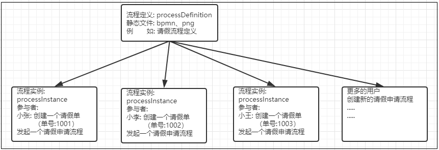**


### 7.2.2 BusinessKey（业务标识）

1. 小张要在5.1~5.10这段时间请假,请假理由为:回家相亲.
2. 小陈要在5.5~5.15这段时间请假,请假理由为:家里拆迁,回家办手续.

请问会创建几个流程实例?

流程发起之后，目前设定的部门审批人都是李四，李四在审批之前需要看到申请人申请的时间和申请的理由，才能决定是否同意.

那么申请人的请假信息【请假时间、请假理由】是如何绑定到流程中的呢? 

此时就需要使用到`BusinessKey`

- 启动流程实例时，指定的businessKey，就会在act_run_execution表中存储businessKey。
- BusinessKey：业务标识，通常为业务表的主键，业务标识和流程实例一一对应。业务标识来源于业务系统。存储业务标识就是根据业务标识来关联查询业务系统的数据。比如：请假流程启动一个流程实例，就可以将请假单的id作为业务标识存储到Activiti中，将来查询Activiti的流程实例信息就可以获取请假单的id从而关联查询业务系统数据库得到请假单信息。

****

```java
@Test
public void testStartProcess(){
    String businessKey = "8001";
    //创建ProcessEngine对象
    ProcessEngine processEngine = ProcessEngines.getDefaultProcessEngine();
    //获取RuntimeService对象
    RuntimeService runtimeService = processEngine.getRuntimeService();
    //根据流程定义的key启动流程实例,这个key是在定义bpmn的时候设置的
    //在启动流程的时候将业务key加入进去
    ProcessInstance instance = runtimeService
            .startProcessInstanceByKey("leaveProcess",businessKey);
    //获取流程实例的相关信息
    System.out.println("流程定义的id = " + instance.getProcessDefinitionId());
    System.out.println("流程实例的id = " + instance.getId());
}
```

观察数据库可以发现，在activiti的act_ru_execution表，字段BUSINESS_KEY就是存放业务KEY的。

**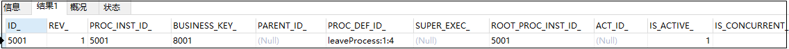**

- 在用户执行任务的时候如何获取`BusinessKey`并关联对应的业务信息呢?

```java
@Test
public void testGetBusinessKey(){
    //任务负责人
    String assignee = "李四";
    //创建ProcessEngine对象
    ProcessEngine processEngine = ProcessEngines.getDefaultProcessEngine();
    //获取TaskService
    TaskService taskService = processEngine.getTaskService();
    //获取RuntimeService
    RuntimeService runtimeService = processEngine.getRuntimeService();
    //获取任务集合
    List<Task> taskList = taskService.createTaskQuery()
            .processDefinitionKey("leaveProcess")
            .taskAssignee(assignee)
            .list();
    //遍历任务列表
    for(Task task:taskList){
        System.out.println("流程定义id = " + task.getProcessDefinitionId());
        System.out.println("流程实例id = " + task.getProcessInstanceId());
        System.out.println("任务id = " + task.getId());
        System.out.println("任务名称 = " + task.getName());
        //根据任务上的流程实例Id查询出对应的流程实例对象，从流程实例对象中获取BusinessKey
        ProcessInstance instance = runtimeService
                .createProcessInstanceQuery()
                .processInstanceId(task.getProcessInstanceId())
                .singleResult();
        System.out.println("业务key:"+instance.getBusinessKey());
        System.out.println("===================");
    }
}
```

### 7.2.3 流程定义/实例挂起/激活

**全部流程实例挂起场景**:

1) 例如公司制度改变过程中的流程, 总经理更换过程中的流程，有100个人的流程, 70个人已经完成,30个人流程正好在总经理更换中,就需要挂起.

2)  比如我们的业务流程为:

【开始节点】-->【A节点】-->【B节点】-->【C节点】-->【结束节点】

【C节点】的业务逻辑需要和外部接口交互，刚好外部接口出问题了,如果剩下的流程都走到【C节点】，执行【C节点】的业务逻辑，那都会报错，我们就可以把流程挂起，等待外部接口可用之后再重新激活流程.

3) 业务流程发生改变,已经发起的流程实例继续按照旧的流程走,如果新发起的流程就按照新的业务流程走.这时候我们就需要挂起流程定义,但是不挂起流程实例.

- 操作流程定义为挂起状态，该操作定义下面的所有的流程实例将全部暂停。
- 流程定义为挂起状态，该流程定义下将不允许启动新的流程实例，同时该流程定义下的所有流程实例将全部挂起暂停执行

```java
@Test
public void testSuspendAllProcessInstance(){
    //创建ProcessEngine对象
    ProcessEngine processEngine = ProcessEngines.getDefaultProcessEngine();
    //获取RepositoryService
    RepositoryService repositoryService = processEngine.getRepositoryService();
    //获取流程定义对象
    ProcessDefinition processDefinition = repositoryService
            .createProcessDefinitionQuery()
            .processDefinitionKey("leaveProcess")
            .singleResult();
    boolean suspended = processDefinition.isSuspended();
    //输出流程定义状态
    System.out.println("流程定义状态:"+(suspended ?"已挂起":"已激活"));
    String processDefinitionId = processDefinition.getId();
    if(suspended){
        //如果是挂起，可以执行激活操作 ,参数1 ：流程定义id ，参数2：是否激活流程实例，参数3：激活时间
        repositoryService.activateProcessDefinitionById(processDefinitionId,true,null);
        System.out.println("流程ID:"+processDefinitionId+",已激活");
    }else{
        //如果是激活，可以执行挂起操作 ,参数1 ：流程定义id ，参数2：是否暂停流程实例，参数3：激活时间
        repositoryService.suspendProcessDefinitionById(processDefinitionId,true,null);
        System.out.println("流程ID:"+processDefinitionId+",已挂起");
    }
}
```

- 查询待办任务的状态,如果是【已挂起】,前台则不允许点击【任务处理】按钮

```java
@Test
public void testSuspendStatus(){
    //任务负责人
    String assignee = "李四";
    //创建ProcessEngine对象
    ProcessEngine processEngine = ProcessEngines.getDefaultProcessEngine();
    //获取TaskService
    TaskService taskService = processEngine.getTaskService();
    //获取任务集合
    List<Task> taskList = taskService.createTaskQuery()
            .processDefinitionKey("leaveProcess")
            .taskAssignee(assignee)
            .list();
    //遍历任务列表
    for(Task task:taskList){
        System.out.println("流程定义id = " + task.getProcessDefinitionId());
        System.out.println("流程实例id = " + task.getProcessInstanceId());
        System.out.println("任务id = " + task.getId());
        System.out.println("任务名称 = " + task.getName());
        System.out.println("任务状态:"+(task.isSuspended()?"已挂起":"已激活"));
        System.out.println("===================");
    }
}
```

- 利用之前的测试用例，测试在流程挂起的情况是否能发起新的流程实例

  ```java
  org.activiti.engine.ActivitiException: Cannot start process instance. Process definition 请假流程 (id = leaveProcess:1:4) is suspended
  ```

- 利用之前的测试用例，测试在流程挂起的情况是否可以处理任务

  ```java
  org.activiti.engine.ActivitiException: Cannot complete a suspended task
  ```


## 7.3 任务分配负责人

### 7.3.1 固定分配

- 在进行业务流程建模的时候指定固定的任务负责人。

  

### 7.3.2 UEL表达式分配

Activiti 使用 UEL 表达式， UEL 是 java EE6 规范的一部分， UEL（Unified Expression Language）即 统一表达式语言。

**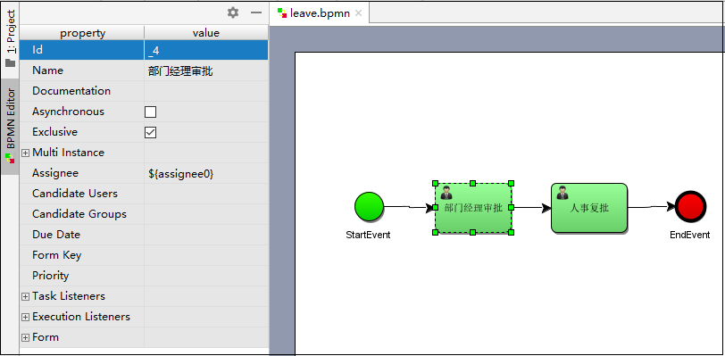**

IDEA中的actiBPM插件在修改Assignee存在bug,在界面上修改了,但是实际文件并没有修改.所以我们需要借助编辑工具在xml文件中修改一下Assignee

**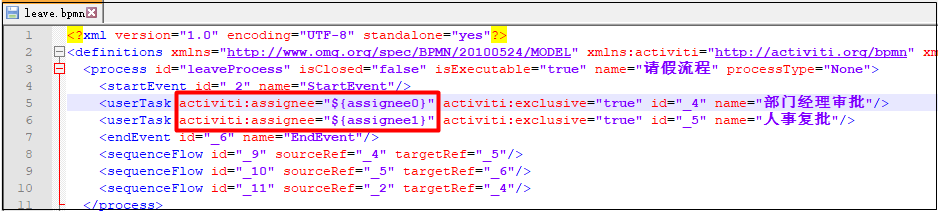**

- 修改流程定义之后重新进行部署

- 编写代码配置负责人 

```java
@Test
public void testStartProcess(){
    //创建ProcessEngine对象
    ProcessEngine processEngine = ProcessEngines.getDefaultProcessEngine();
    //获取RuntimeService对象
    RuntimeService runtimeService = processEngine.getRuntimeService();
    Map<String,Object> variables  = new HashMap<String, Object>();
    variables.put("assignee0","zhangsan");
    variables.put("assignee1","lisi");
    //根据流程定义的key启动流程实例,这个key是在定义bpmn的时候设置的
    ProcessInstance instance = runtimeService
            .startProcessInstanceByKey("leaveProcess",variables);
    //获取流程实例的相关信息
    System.out.println("流程定义的id = " + instance.getProcessDefinitionId());
    System.out.println("流程实例的id = " + instance.getId());
}
```

执行成功后，可以在act_ru_variable表中看到刚才map中的数据

**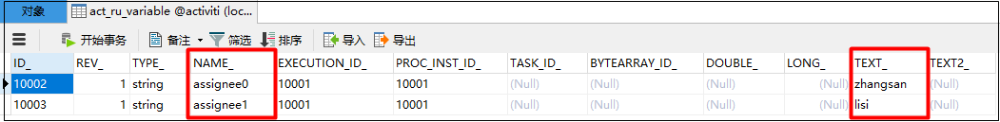**

### 7.3.3 监听器分配[拓展]

- 任务监听器是发生对应的任务相关事件时执行自定义的Java逻辑或表达式。
- 任务相关事件包括：
  - Event：
    - Create：任务创建后触发。
    - Assignment：任务分配后触发。
    - Delete：任务完成后触发。
    - All：所有事件发生都触发。

1. 自定义一个任务监听器类，然后此类必须实现org.activiti.engine.delegate.TaskListener接口

   ```java
   package cn.wolfcode;
   
   import org.activiti.engine.delegate.DelegateTask;
   import org.activiti.engine.delegate.TaskListener;
   
   /**
    * Created by wolfcode
    */
   public class AssigneeTaskListener implements TaskListener {
       public void notify(DelegateTask delegateTask) {
           if(delegateTask.getName().equals("部门经理审批")){
               delegateTask.setAssignee("赵六");
           }else if(delegateTask.getName().equals("部门经理审批")){
               delegateTask.setAssignee("孙七");
           }
       }
   }
   ```

2. 在bpmn文件中配置监听器

   **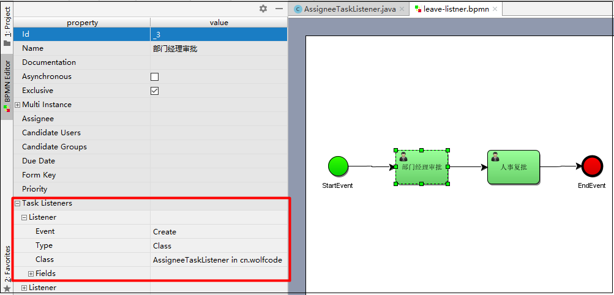**

- 在实际开发中，一般也不使用监听器分配方式，太麻烦了。


## 7.4 流程变量

### 7.4.1 什么是流程变量？

- 流程变量在Activiti中是一个非常重要的角色，流程运转有时需要靠流程变量，业务系统和Activiti结合时少不了流程变量，流程变量就是Activiti在管理工作流时根据管理需要而设置的变量。
- 比如在请假流程流转时如果请假天数>3天则有总经理审批，否则由人事直接审批，请假天数就可以设置流程变量，在流程流转时使用。

```
注意：虽然流程变量中可以存储业务数据，可以通过Activiti的API查询流程变量从而实现查询业务数据，但是不建议这么使用，因为业务数据查询由业务系统负责，Activiti设置流程变量是为了流程执行需要而创建的。
```

### 7.4.2 流程变量类型

****

```
注意：
如果将POJO存储到流程变量中，必须实现序列化接口Serializable，为了防止由于新增字段无法反序列化。
```

### 7.4.3 流程变量的作用域

流程变量的作用域范围可以是一个流程实例（ProcessInstance）、一个任务（Task）或一个执行实例（Execution）。

- global变量: 流程变量的作用域范围的默认值是流程实例，作用域范围最大。
- local变量   : 流程变量的作用域范围如果仅仅针对一个任务或一个执行实例，那么作用域范围没有流程实例大

```
实际开发中一般不用local变量，了解即可.
```

### 7.4.4 流程变量的使用方法 

- 在属性上使用UEL表达式

  可以在 assignee 处设置 UEL 表达式，表达式的值为任务的负责人，比如： ${assignee}， assignee 就是一个流程变量名称。

  Activiti获取UEL表达式的值，即流程变量assignee的值 ，将assignee的值作为任务的负责人进行任务分配

- 在连线上使用UEL表达式

  可以在连线上设置UEL表达式，决定流程走向。

  比如：${price<10000} 。price就是一个流程变量名称，uel表达式结果类型为布尔类型。

  如果UEL表达式是true，要决定 流程执行走向。

### 7.4.5 使用global变量控制流程

需求:员工创建请假流程申请单，由部门经理审批，部门经理审批通过后请假3天以下(含3天)的由人事经理直接审批，3天以上的由总经理审批，总经理审批通过再通过人事经理审批。

**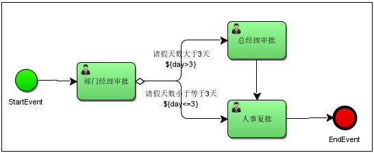**

- 在连线处添加判断条件

**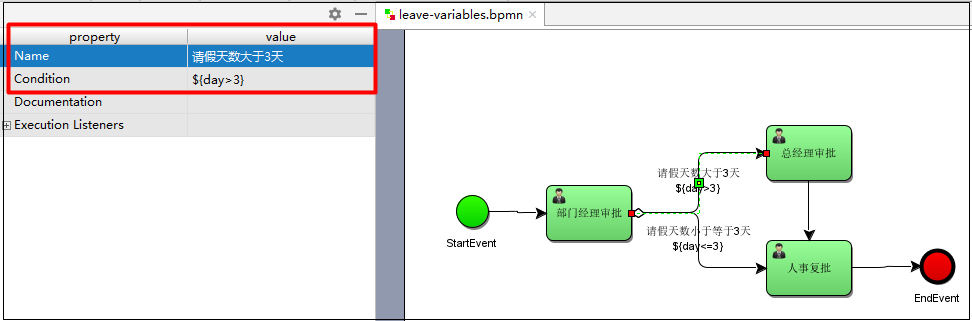**

```
本次画BPMN文件的时候将部门经理的assignee设置为李四，总经理审批的assignee设置为王五，总经理审批的assignee设置为王五，人事复批存档设置为赵六。
```

```java
package cn.wolfcode.demo;

import org.activiti.engine.*;
import org.activiti.engine.repository.Deployment;
import org.activiti.engine.runtime.ProcessInstance;
import org.activiti.engine.task.Task;
import org.junit.Test;

import java.util.HashMap;
import java.util.List;
import java.util.Map;

/**
 * Created by wolfcode
 */
public class VariablesTest {

    /**
     * 部署
     */
    @Test
    public void testDeploy(){
        //创建ProcessEngine对象
        ProcessEngine processEngine = ProcessEngines.getDefaultProcessEngine();
        //获取RepositoryService对象
        RepositoryService repositoryService = processEngine.getRepositoryService();
        //进行部署
        Deployment deployment = repositoryService.createDeployment()
                .addClasspathResource("bpmn/leave-variables.bpmn")
                .name("请假流程")
                .deploy();
        //输出部署的一些信息
        System.out.println("流程部署ID:"+deployment.getId());
        System.out.println("流程部署名称:"+deployment.getName());
    }
    @Test
    public void testStartProcess(){
        //创建ProcessEngine对象
        ProcessEngine processEngine = ProcessEngines.getDefaultProcessEngine();
        //获取RuntimeService对象
        RuntimeService runtimeService = processEngine.getRuntimeService();
        Map<String,Object> variables = new HashMap<String,Object>();
        variables.put("day",2);
        //根据流程定义的key启动流程实例,这个key是在定义bpmn的时候设置的
        ProcessInstance instance = runtimeService.startProcessInstanceByKey("leaveVariablesProcess",variables);
        //获取流程实例的相关信息
        System.out.println("流程定义的id = " + instance.getProcessDefinitionId());
        System.out.println("流程实例的id = " + instance.getId());
    }
    @Test
    public void testSelectTodoTaskList(){
        //任务负责人
        String assignee = "李四";
        //创建ProcessEngine对象
        ProcessEngine processEngine = ProcessEngines.getDefaultProcessEngine();
        //获取TaskService
        TaskService taskService = processEngine.getTaskService();
        //获取任务集合
        List<Task> taskList = taskService.createTaskQuery()
                .processDefinitionKey("leaveVariablesProcess")
                .taskAssignee(assignee)
                .list();
        //遍历任务列表
        for(Task task:taskList){
            System.out.println("流程定义id = " + task.getProcessDefinitionId());
            System.out.println("流程实例id = " + task.getProcessInstanceId());
            System.out.println("任务id = " + task.getId());
            System.out.println("任务名称 = " + task.getName());
        }
    }
    @Test
    public void testCompleteTask(){
        //任务负责人
        String assignee = "李四";
        //创建ProcessEngine对象
        ProcessEngine processEngine = ProcessEngines.getDefaultProcessEngine();
        //获取TaskService
        TaskService taskService = processEngine.getTaskService();
        //获取任务集合
        List<Task> taskList = taskService.createTaskQuery()
                .processDefinitionKey("leaveVariablesProcess")
                .taskAssignee(assignee)
                .list();
        //遍历任务列表
        for(Task task:taskList){
            taskService.complete(task.getId());
        }
    }
}

```

**注意事项**:

```
1.如果UEL表达式中流程变量名不存在则报错。
2.如果如果UEL表达式都不符合条件,流程报错。
3.如果连接不设置条件/条件都满足,每个连线都会走.
```


## 7.5 任务候选人

在流程定义中在任务结点的 assignee 固定设置任务负责人，在流程定义时将参与者固定设置在.bpmn 文件中，如果临时任务负责人变更则需要修改流程定义，系统可扩展性差。

针对这种情况可以给任务设置多个候选人，可以从候选人中选择参与者来完成任务。

### 7.5.1 设置任务候选人 

- 在流程图中任务节点的配置中设置 candidate-users(候选人)，多个候选人之间用逗号分开。 

  **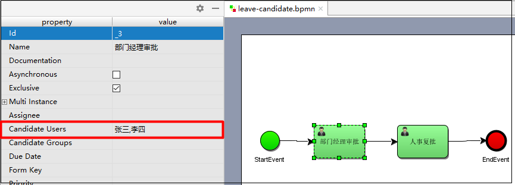**

- 查看bpmn文件

  

- 我们可以看到部门经理的审核人已经设置为 lisi,wangwu 这样的一组候选人，可以使用activiti:candiateUsers=”用户 1,用户 2,用户 3”的这种方式来实现设置一组候选人 

### 7.5.2 部署&启动流程

```java
package cn.wolfcode.demo;

import org.activiti.engine.*;
import org.activiti.engine.repository.Deployment;
import org.activiti.engine.runtime.ProcessInstance;
import org.activiti.engine.task.Task;
import org.junit.Test;

import java.util.HashMap;
import java.util.List;
import java.util.Map;

/**
 * Created by wolfcode
 */
public class CandidateTest {
    /**
     * 部署
     */
    @Test
    public void testDeploy(){
        //创建ProcessEngine对象
        ProcessEngine processEngine = ProcessEngines.getDefaultProcessEngine();
        //获取RepositoryService对象
        RepositoryService repositoryService = processEngine.getRepositoryService();
        //进行部署
        Deployment deployment = repositoryService.createDeployment()
                .addClasspathResource("bpmn/leave-candidate.bpmn")
                .name("请假流程-候选人")
                .deploy();
        //输出部署的一些信息
        System.out.println("流程部署ID:"+deployment.getId());
        System.out.println("流程部署名称:"+deployment.getName());
    }
    //启动流程
    @Test
    public void testStartProcess(){
        //创建ProcessEngine对象
        ProcessEngine processEngine = ProcessEngines.getDefaultProcessEngine();
        //获取RuntimeService对象
        RuntimeService runtimeService = processEngine.getRuntimeService();
        //根据流程定义的key启动流程实例,这个key是在定义bpmn的时候设置的
        ProcessInstance instance = runtimeService.startProcessInstanceByKey("leaveCandidateProcess");
        //获取流程实例的相关信息
        System.out.println("流程定义的id = " + instance.getProcessDefinitionId());
        System.out.println("流程实例的id = " + instance.getId());
    }
}
```

### 7.5.3 查询候选人任务

```java
//查询候选任务
@Test
public void testSelectCandidateTaskList(){
    //任务负责人
    String candidateUser = "李四";
    //创建ProcessEngine对象
    ProcessEngine processEngine = ProcessEngines.getDefaultProcessEngine();
    //获取TaskService
    TaskService taskService = processEngine.getTaskService();
    //获取任务集合
    List<Task> taskList = taskService.createTaskQuery()
            .processDefinitionKey("leaveCandidateProcess")
            .taskCandidateUser(candidateUser)
            .list();
    //遍历任务列表
    for(Task task:taskList){
        System.out.println("流程定义id = " + task.getProcessDefinitionId());
        System.out.println("流程实例id = " + task.getProcessInstanceId());
        System.out.println("任务id = " + task.getId());
        System.out.println("任务名称 = " + task.getName());
    }
}
```

### 7.5.4 领取候选人任务/归还任务

```java
@Test
public void testClaimTask(){
    //任务ID
    String taskId = "2505";
    String assignee = "张三";
    //创建ProcessEngine对象
    ProcessEngine processEngine = ProcessEngines.getDefaultProcessEngine();
    //获取TaskService
    TaskService taskService = processEngine.getTaskService();
    //领取任务
    taskService.claim(taskId,assignee);
    //归还任务
    //taskService.setAssignee(taskId, null);
}
```

### 7.5.4 完成任务

如果候选任务没有进行领取就直接完成的话，那么在历史记录中就不会记录是哪个用户执行了这个任务.

所以对于这种候选人的任务，我们需要先领取再完成.

```java
//执行任务
@Test
public void testCompleteTask(){
    //任务ID
    String taskId = "2505";
    //创建ProcessEngine对象
    ProcessEngine processEngine = ProcessEngines.getDefaultProcessEngine();
    //获取TaskService
    TaskService taskService = processEngine.getTaskService();
    taskService.complete(taskId);
}
```


## 7.6 网关

### 7.6.1 排他网关

排他网关(ExclusiveGateway)（异或网关或基于数据的排他网关），用来在流程中实现决策。当流程执行到这个网关的时候，所有分支都会判断条件是否为true，如果为true则执行该分支。

```
注意：
排他网关只会选择一个为true的分支执行（即使有两个分支条件都为true，排他网关也只会选择一条分支去执行,选择序号小的路径执行）。
```


**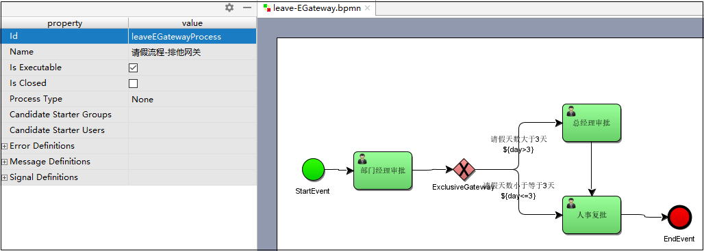**

```
本次画BPMN文件的时候将部门经理的assignee设置为李四，总经理审批的assignee设置为王五，总经理审批的assignee设置为王五，人事复批存档设置为赵六。
```

```java
package cn.wolfcode.demo;

import org.activiti.engine.*;
import org.activiti.engine.repository.Deployment;
import org.activiti.engine.runtime.ProcessInstance;
import org.activiti.engine.task.Task;
import org.junit.After;
import org.junit.Test;

import java.util.HashMap;
import java.util.List;
import java.util.Map;

/**
 * Created by wolfcode
 */
public class EGatewayTest {

    /**
     * 部署
     */
    @Test
    public void testDeploy(){
        //创建ProcessEngine对象
        ProcessEngine processEngine = ProcessEngines.getDefaultProcessEngine();
        //获取RepositoryService对象
        RepositoryService repositoryService = processEngine.getRepositoryService();
        //进行部署
        Deployment deployment = repositoryService.createDeployment()
                .addClasspathResource("bpmn/leave-EGateway.bpmn")
                .name("请假流程-排他网关")
                .deploy();
        //输出部署的一些信息
        System.out.println("流程部署ID:"+deployment.getId());
        System.out.println("流程部署名称:"+deployment.getName());
    }
    @Test
    public void testStartProcess(){
        //创建ProcessEngine对象
        ProcessEngine processEngine = ProcessEngines.getDefaultProcessEngine();
        //获取RuntimeService对象
        RuntimeService runtimeService = processEngine.getRuntimeService();
        Map<String,Object> variables = new HashMap<String,Object>();
        variables.put("day",0);
        //根据流程定义的key启动流程实例,这个key是在定义bpmn的时候设置的
        ProcessInstance instance = runtimeService.startProcessInstanceByKey("leaveEGatewayProcess",variables);
        //获取流程实例的相关信息
        System.out.println("流程定义的id = " + instance.getProcessDefinitionId());
        System.out.println("流程实例的id = " + instance.getId());
    }

    @Test
    public void testCompleteTask(){
        //任务负责人
        String assignee = "张三";
        //创建ProcessEngine对象
        ProcessEngine processEngine = ProcessEngines.getDefaultProcessEngine();
        //获取TaskService
        TaskService taskService = processEngine.getTaskService();
        //获取任务集合
        List<Task> taskList = taskService.createTaskQuery()
                .processDefinitionKey("leaveEGatewayProcess")
                .taskAssignee(assignee)
                .list();
        //遍历任务列表
        for(Task task:taskList){
            taskService.complete(task.getId());
        }
    }
}
```

### 7.6.2 并行网关

并行网关(ParallelGateway)允许将流程分成多条分支，也可以把多条分支汇聚到一起，并行网关的功能是基于进入和外出的顺序流的。

```
并行网关不会解析条件。即使顺序流中定义了条件，也会被忽略
```

**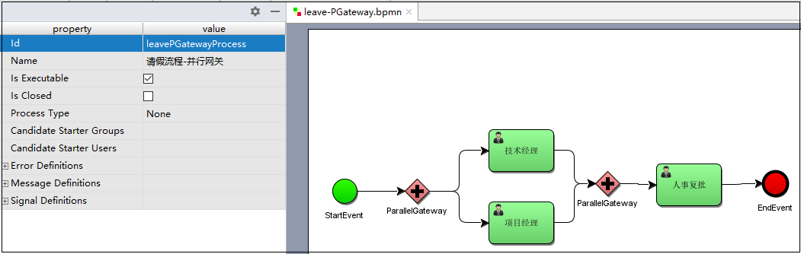**

```
本次画BPMN文件的时候将技术经理的assignee设置为李四，项目经理审批的assignee设置为王五，人事复批的assignee设置为王五
```

```java
package cn.wolfcode.demo;

import org.activiti.engine.*;
import org.activiti.engine.repository.Deployment;
import org.activiti.engine.runtime.ProcessInstance;
import org.activiti.engine.task.Task;
import org.junit.Test;

import java.util.HashMap;
import java.util.List;
import java.util.Map;

/**
 * Created by wolfcode
 */
public class PGatewayTest {
    /**
     * 部署
     */
    @Test
    public void testDeploy(){
        //创建ProcessEngine对象
        ProcessEngine processEngine = ProcessEngines.getDefaultProcessEngine();
        //获取RepositoryService对象
        RepositoryService repositoryService = processEngine.getRepositoryService();
        //进行部署
        Deployment deployment = repositoryService.createDeployment()
                .addClasspathResource("bpmn/leave-PGateway.bpmn")
                .name("请假流程-并行网关")
                .deploy();
        //输出部署的一些信息
        System.out.println("流程部署ID:"+deployment.getId());
        System.out.println("流程部署名称:"+deployment.getName());
    }
    @Test
    public void testStartProcess(){
        //创建ProcessEngine对象
        ProcessEngine processEngine = ProcessEngines.getDefaultProcessEngine();
        //获取RuntimeService对象
        RuntimeService runtimeService = processEngine.getRuntimeService();
        Map<String,Object> variables = new HashMap<String,Object>();
        //根据流程定义的key启动流程实例,这个key是在定义bpmn的时候设置的
        ProcessInstance instance = runtimeService.startProcessInstanceByKey("leavePGatewayProcess");
        //获取流程实例的相关信息
        System.out.println("流程定义的id = " + instance.getProcessDefinitionId());
        System.out.println("流程实例的id = " + instance.getId());
    }
	//完成任务
    @Test
    public void testCompleteTask(){
        //任务负责人
        String assignee = "张三";
        //创建ProcessEngine对象
        ProcessEngine processEngine = ProcessEngines.getDefaultProcessEngine();
        //获取TaskService
        TaskService taskService = processEngine.getTaskService();
        //获取任务集合
        List<Task> taskList = taskService.createTaskQuery()
                .processDefinitionKey("leavePGatewayProcess")
                .taskAssignee(assignee)
                .list();
        //遍历任务列表
        for(Task task:taskList){
            taskService.complete(task.getId());
        }
    }
}
```


### 7.6.3 包含网关

包含网关可以看做是排他网关和并行网关的结合体。

需求:出差申请大于3天需要由项目经理审批，小于3等于天由技术经理审批，出差申请必须经过人事助理审批。 

**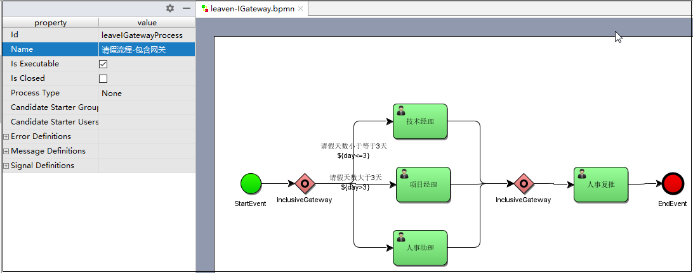**

```
本次画BPMN文件的时候将技术经理的assignee设置为张三，项目经理的assignee设置为李四，人事助理的assignee设置为王五，人事复批存档设置为赵六。
```

```java
package cn.wolfcode.demo;

import org.activiti.engine.*;
import org.activiti.engine.repository.Deployment;
import org.activiti.engine.runtime.ProcessInstance;
import org.activiti.engine.task.Task;
import org.junit.Test;

import java.util.HashMap;
import java.util.List;
import java.util.Map;

/**
 * Created by wolfcode
 */
public class IGatewayTest {

    /**
     * 部署
     */
    @Test
    public void testDeploy(){
        //创建ProcessEngine对象
        ProcessEngine processEngine = ProcessEngines.getDefaultProcessEngine();
        //获取RepositoryService对象
        RepositoryService repositoryService = processEngine.getRepositoryService();
        //进行部署
        Deployment deployment = repositoryService.createDeployment()
                .addClasspathResource("bpmn/leave-IGateway.bpmn")
                .name("请假流程-包含网关")
                .deploy();
        //输出部署的一些信息
        System.out.println("流程部署ID:"+deployment.getId());
        System.out.println("流程部署名称:"+deployment.getName());
    }
    @Test
    public void testStartProcess(){
        //创建ProcessEngine对象
        ProcessEngine processEngine = ProcessEngines.getDefaultProcessEngine();
        //获取RuntimeService对象
        RuntimeService runtimeService = processEngine.getRuntimeService();
        Map<String,Object> variables = new HashMap<String,Object>();
        variables.put("day",5);
        //根据流程定义的key启动流程实例,这个key是在定义bpmn的时候设置的
        ProcessInstance instance = runtimeService.startProcessInstanceByKey("leaveIGatewayProcess",variables);
        //获取流程实例的相关信息
        System.out.println("流程定义的id = " + instance.getProcessDefinitionId());
        System.out.println("流程实例的id = " + instance.getId());
    }
	//完成任务
    @Test
    public void testCompleteTask(){
        //任务负责人
        String assignee = "王五";
        //创建ProcessEngine对象
        ProcessEngine processEngine = ProcessEngines.getDefaultProcessEngine();
        //获取TaskService
        TaskService taskService = processEngine.getTaskService();
        //获取任务集合
        List<Task> taskList = taskService.createTaskQuery()
                .processDefinitionKey("leaveIGatewayProcess")
                .taskAssignee(assignee)
                .list();
        //遍历任务列表
        for(Task task:taskList){
            taskService.complete(task.getId());
        }
    }
}

```


# SpringBoot集成Activiti7

### **SpringBoot自动配置**

#### 依赖

```xml
<parent>
    <artifactId>spring-boot-starter-parent</artifactId>
    <groupId>org.springframework.boot</groupId>
    <version>2.5.4</version>
</parent>


<dependencies>
    <!--添加activiti和SpringBoot整合的依赖
    MyBatis版本会有冲突，所以需要排除-->
    <dependency>
        <groupId>org.activiti</groupId>
        <artifactId>activiti-spring-boot-starter</artifactId>
        <version>7.0.0.SR1</version>
        <exclusions>
            <exclusion>
                <artifactId>mybatis</artifactId>
                <groupId>org.mybatis</groupId>
            </exclusion>
        </exclusions>
    </dependency>
    <!--activiti可以绘制流程的的依赖-->
    <dependency>
        <groupId>org.activiti</groupId>
        <artifactId>activiti-image-generator</artifactId>
        <version>7.0.0.SR1</version>
    </dependency>

    <dependency>
        <groupId>org.springframework.boot</groupId>
        <artifactId>spring-boot-starter</artifactId>
    </dependency>

    <dependency>
        <groupId>org.mybatis.spring.boot</groupId>
        <artifactId>mybatis-spring-boot-starter</artifactId>
        <version>2.2.0</version>
    </dependency>


    <dependency>
        <groupId>org.springframework.boot</groupId>
        <artifactId>spring-boot-starter-test</artifactId>
        <scope>test</scope>
    </dependency>


    <dependency>
        <groupId>mysql</groupId>
        <artifactId>mysql-connector-java</artifactId>
    </dependency>

    <dependency>
        <groupId>com.alibaba</groupId>
        <artifactId>druid-spring-boot-starter</artifactId>
        <version>1.2.6</version>
    </dependency>

    <dependency>
        <groupId>org.projectlombok</groupId>
        <artifactId>lombok</artifactId>
        <scope>provided</scope><!--只在编译时期有效-->
    </dependency>


</dependencies>

```

#### 配置

异常: 如果运行报错:Cause: java.sql.SQLSyntaxErrorException: Table 'myactiviti.act_ge_property' doesn't exist

解决: 配置mysql连接时加上：nullCatalogMeansCurrent=true 

原因: 出现这种问题的原因是mysql版本问题，mysql8.xxx以上驱动会出现这个问题

总结:

因为mysql使用schema标识库名而不是catalog，因此mysql会扫描所有的库来找表，如果其他库中有相同名称的表，activiti就以为找到了，本质上这个表在当前数据库中并不存在。
设置nullCatalogMeansCurrent=true，表示mysql默认当前数据库操作，在mysql-connector-java 5.xxx该参数默认为true，在6.xxx以上默认为false，因此需要设置nullCatalogMeansCurrent=true。


```properties
server.port=80
spring.datasource.driver-class-name=com.mysql.cj.jdbc.Driver
# 有可能报错 加 &nullCatalogMeansCurrent=true
spring.datasource.url=jdbc:mysql:///activiti?serverTimezone=GMT%2B8&useUnicode=true&characterEncoding=UTF-8&nullCatalogMeansCurrent=true
spring.datasource.username=root
spring.datasource.password=admin

# 配置文件中添加Activiti7的配置信息
spring.activiti.database-schema-update: true
spring.activiti.db-history-used: true
spring.activiti.history-level: full
spring.activiti.check-process-definitions: false
spring.activiti.use-strong-uuids: false
```

- database-schema-update属性

  ```
  1.flase：默认值。activiti在启动时，对比数据库表中保存的版本，如果没有表或者版本不匹配，将抛出异常
  2.true： activiti会对数据库中所有表进行更新操作。如果表不存在，则自动创建
  3.create_drop： 在activiti启动时创建表，在关闭时删除表（必须手动关闭引擎，才能删除表）
  4.drop-create： 在activiti启动时删除原来的旧表，然后在创建新表（不需要手动关闭引擎）
  ```

- db-history-used

  ```
  检测历史表是否存在 activiti7默认没有开启数据库历史记录,true启动数据库历史记录
  ```

- history-level

  ```
  #记录历史等级 可配置的历史级别有none, activity, audit, full
  1.none：不保存任何的历史数据，因此，在流程执行过程中，这是最高效的。
  2.activity：级别高于none，保存流程实例与流程行为，其他数据不保存。
  3.audit：除activity级别会保存的数据外，还会保存全部的流程任务及其属性。audit为history的默认值。
  4.full：保存历史数据的最高级别，除了会保存audit级别的数据外，还会保存其他全部流程相关的细节数据，包括一些流程参数等。
  ```

- check-process-definitions

  ```
  #校验流程文件，默认校验resources下的processes文件夹里的流程文件
  ```

- use-strong-uuids

  ```
  是否使用UUID作为主键生成策略
  ```

#### 排除Spring Security配置

如果权限认证用的Shiro需要排除

Activiti7默认和Spring Security集成了,但是我们的项目中使用的是Shiro,所以我们需要在项目中排除掉Spring Security的自动装配配置

```java
@SpringBootApplication(exclude = { 
        SecurityAutoConfiguration.class,
        ManagementWebSecurityAutoConfiguration.class
})
```

运行项目，如果在数据库中出现25张act_开头的表说明集成是没问题的.


#### 简单演示

```java
@SpringBootTest
class AppTest {

    @Autowired
    private TaskService taskService;
    @Autowired
    private RepositoryService repositoryService;
    @Autowired
    private RuntimeService runtimeService;
    @Autowired
    private HistoryService historyService;
    @Autowired
    private ManagementService managementService;

    @Test
    public void 部署流程() {
        repositoryService.createDeployment()
                .addClasspathResource("请假流程.bpmn")
                .name("请假")
                .deploy();
    }
    @Test
    public void 启动流程() {
        ProcessInstance instance = runtimeService.startProcessInstanceByKey("请假流程");
    }

    @Test
    public void 流程查询() {
        Task task = taskService.createTaskQuery().taskAssignee("老师").processDefinitionKey("请假流程").singleResult();
        System.out.println("审核人: " + task.getAssignee());
        System.out.println("任务节点名字: " + task.getName());
        taskService.complete(task.getId()); // 审批流程
    }
}
```


#### 审核样例

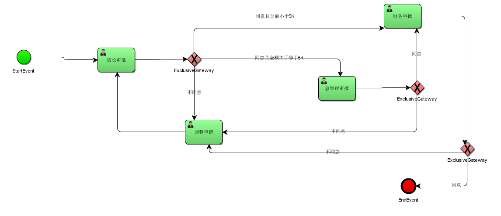

```java
// 这个没有结合业务表,关联buinessKey
/* car-o2o,填写出差单 */
public class Test04 {

    @Test
    public void 部署() {
        ProcessEngine defaultProcessEngine = ProcessEngines.getDefaultProcessEngine();
        Deployment deploy = defaultProcessEngine
                .getRepositoryService()
                .createDeployment()
                .addClasspathResource("leave/car-o2o.bpmn")
                .name("car-o2o")
                .key("car-o2o唯一标识")
                .deploy();
    }

    @Test /*  */
    public void 启动() {

        test(); /* 部署 */
        ProcessEngine processEngine = ProcessEngines.getDefaultProcessEngine();
        RuntimeService runtimeService = processEngine.getRuntimeService();
        TaskService taskService = processEngine.getTaskService();
        Map<String, Object> map = new HashMap<>();
        /* 申请金额 */
        map.put("money", 100000);
        /* 启动 流程 */
        runtimeService.startProcessInstanceByKey("car-o2o", map);

    }


    @Test /* 店长审批 */
    public void 审批1() {
        ProcessEngine processEngine = ProcessEngines.getDefaultProcessEngine();
        TaskService taskService = processEngine.getTaskService();

        Task task = taskService.createTaskQuery()
                .taskAssignee("张三")
                .processDefinitionKey("car-o2o")
                .singleResult();

        Map<String, Object> map = new HashMap<>();
        /* 审批意见 */
        map.put("b", true);
        taskService.complete(task.getId(), map);
        System.out.println("店长审批....");
    }

    @Test /* 调整申请 */
    public void 调整申请() {
        ProcessEngine processEngine = ProcessEngines.getDefaultProcessEngine();
        TaskService taskService = processEngine.getTaskService();

        Task task = taskService.createTaskQuery()
                .processDefinitionKey("car-o2o")
                .singleResult();

        Map<String, Object> map = new HashMap<>();
        /* 审批意见 */
        map.put("money", 4000);
        taskService.complete(task.getId(), map);
        System.out.println("调整申请....");
    }


    @Test /* 财务  money < 5K */
    public void 审批2() {
        ProcessEngine processEngine = ProcessEngines.getDefaultProcessEngine();
        TaskService taskService = processEngine.getTaskService();
        HistoryService historyService = processEngine.getHistoryService();
        /* 李四查询是否有审核提交 */
        Task task = taskService.createTaskQuery().processDefinitionKey("car-o2o")
                .taskAssignee("李四")
                .singleResult();

        Map<String, Object> map = new HashMap<>();
        /* 审批意见 */
        map.put("f", true);
        taskService.complete(task.getId(), map);
        System.out.println("财务批准....");
    }

    @Test /* 总经理  money >= 5K */
    public void 审批3() {
        ProcessEngine processEngine = ProcessEngines.getDefaultProcessEngine();
        TaskService taskService = processEngine.getTaskService();
        /* 李四查询是否有审核提交 */
        Task task = taskService.createTaskQuery().processDefinitionKey("car-o2o")
                .taskAssignee("王五")
                .singleResult();

        Map<String, Object> map = new HashMap<>();
        /* 审批意见 */
        map.put("p", false);
        taskService.complete(task.getId(), map);
        System.out.println("总经理批准....");
    }
}
```

#### 结合业务表,用buinessKey关联

```java
/* 请假流程 */
public class Test06Leave {

    @Test
    public void test() {
        ProcessEngine defaultProcessEngine = ProcessEngines.getDefaultProcessEngine();
        Deployment deploy = defaultProcessEngine
                .getRepositoryService()
                .createDeployment()
                .addClasspathResource("leave/请假流程.bpmn")
                .name("请假流程")
                .key("请假流程唯一标识")
                .deploy();
    }

    @Test /*  */
    public void test1() {

        test(); /* 部署 */

        ProcessEngine processEngine = ProcessEngines.getDefaultProcessEngine();
        RuntimeService runtimeService = processEngine.getRuntimeService();
        String buinessKey = "请假"; // 这里需要定义成业务表的 ID 关联业务表
        /* 启动 流程 */
        runtimeService.startProcessInstanceByKey("请假流程",buinessKey);;

    }

    @Test /* 张三 */
    public void test333() {
        ProcessEngine processEngine = ProcessEngines.getDefaultProcessEngine();
        TaskService taskService = processEngine.getTaskService();

        Task task = taskService.createTaskQuery()
                .taskAssignee("张三")
                .processDefinitionKey("请假流程")
                .singleResult();

        taskService.complete(task.getId());
        System.out.println("张三请假....");
    }

    @Test /* 班主任 */
    public void test33() {
        ProcessEngine processEngine = ProcessEngines.getDefaultProcessEngine();
        TaskService taskService = processEngine.getTaskService();

        Task task = taskService.createTaskQuery()
                .taskAssignee("小野")
                .processDefinitionKey("请假流程")
                .singleResult();

        Map<String, Object> map = new HashMap<>();
        /* 审批意见 */
        map.put("x", true);
        taskService.complete(task.getId(), map);
        System.out.println("班主任审核....");
    }

    @Test /* 讲师 */
    public void test44() {
        ProcessEngine processEngine = ProcessEngines.getDefaultProcessEngine();
        TaskService taskService = processEngine.getTaskService();

        Task task = taskService.createTaskQuery()
                .taskAssignee("大飞")
                .processDefinitionKey("请假流程")
                .singleResult();

        Map<String, Object> map = new HashMap<>();
        /* 审批意见 */
        map.put("y", false);
        taskService.complete(task.getId(), map);
        System.out.println("大飞审核....");
    }
}

```

