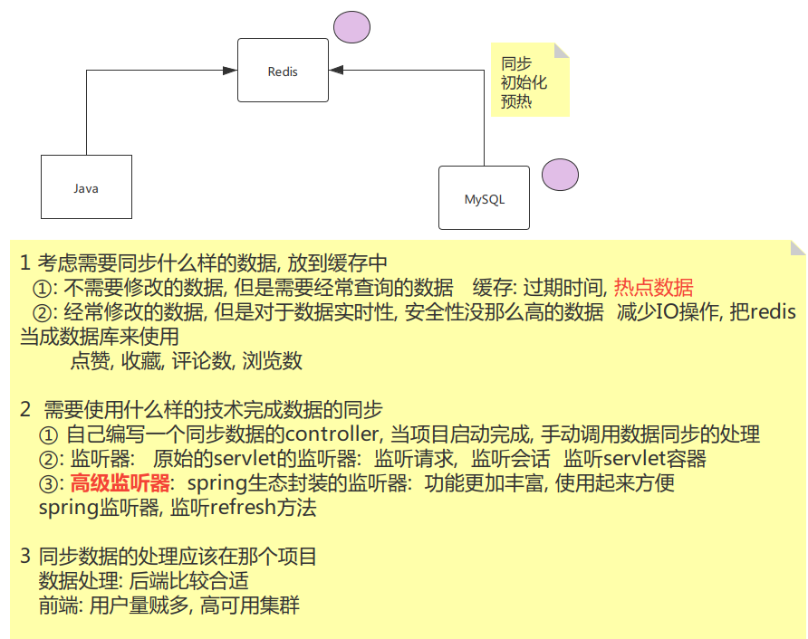

# 项目开发

### 使用的技术栈

**分析项目需要使用什么技术栈(框架,组件),用什么更符合需求**

### 定义项目结构

**本项目主要分为三大模块， 第一块是提供给用户浏览的前端页面(trip-website)**

**第二块是前端页面交互的接口及相应逻辑实现(trip-website-api)**

**第三块是后台提供给管理员的管理平台(trip-mgrsite)**

项目开发基本流程

### 根据需求设计表

**1.考虑要在页面需要展示什么数据**

**2.定义哪些列,还有各个表之间的关系,需不需要中间表**

**3.需不需要定义排序列**

**4.需要定义什么隐藏列**

**5.三范式** 

1. **表中的每一个列都必须是原子性，不可分割的，并且不能是数组，列表**
2. **一个表中的每一个必须要有一个唯一区分的字段主键**
3. **表和表之间的关联关系在维护关系的时候，需要依赖另外一个表的主键，不允许为其他的非主键的字段**
4. **根据需求也有违反三范式的情况如下图**

**解释: 读远远大于写的时候,例如市省名不可能一直改,几十年可能都不变的情况下,读操作远远大于写操作,所以上图违反是三范式**

### 用户注册实现

**根据手机号或者邮箱注册**

**业务逻辑:**

​		1.用户输入手机号或者邮箱点击注册,发送请求到服务器,先查询数据库看看有没有该条数据,如果有则响应已被注册之类的,

如果没有转跳到填写注册详细信息

​		2.获取注册验证码,点击获取验证码,后台可以根据UUID生成一个截取4位数作为验证码,存入Redis并设置存活时间(一般3~5分钟),存入的时候Redis的Key要求有意义(比如见名知意),并且返回给用户,并把验证码通过短信接口发送给用户

​       3.用户提交注册时候,控制器参数一般超过三个,就定义一个比如用User实体类举例,定义一个**UserDTO**类,封装接收的注册参数,并且做参数检验,不合理则相应错误信息给用户

​		4. 用户提交给前端数据,有时候会自定义类,放VO包下,**UserVo**实体类

### 用户登录实现

后端接收用户登录时候的用户名和密码,去查询数据库,查到则登录成功,用**UUID**生成一个用户的**Session ID**,存入Redis(Key命名要合理),并设置有效时间.再把这个ID响应回浏览器,把用户数据也一并响应回去,因为要显示用户名等

### 用户浏览访问页面

用户浏览访问页面,区分有没有登录,区分用户还是游客身份,区分浏览什么内容需要登录,简单来说,就是访问哪个前端控制器方法需要权限,用**注解**来解决,使用自定义注解,贴在对应的控制器方法上,并且配置拦截器,拦截器实现拦截请求,判断是否是访问控制器方法,不是直接放行,是的话再判断有没有贴注解,检测到贴了注解再判断是否有登录,登录了就把该用户在Redis中存入的Token(SessionID)登录有效期时间重置,没登录就转跳登录界面

### 响应给前端的数据

用Map或者自定义VO对象

### **分时统计表**

**互联网项目,对于表数据特别多,order by 特别损耗性能,解决办法有**

建立了分时统计表,同时使用了定时器+策略设计模式(解决繁琐的if-else)

### 阅读数点赞数评论数

首先评论的实现选用MongoDB

设计定义相应的实体类

为了减少MySQL的IO操作,影响性能以下采用Redis实现

- 攻略的评论数
- 点赞数
- 阅读数
- 转发数

#### 缓存方案的选择

#### 阅读数量的需求分析

##### 流程分析

#### 评论数的业务分析

#### 点赞的业务分析

#### 用户收藏业务分析

#### 数据初始化分析

#### 数据持久化分析

