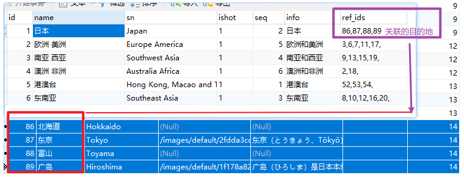
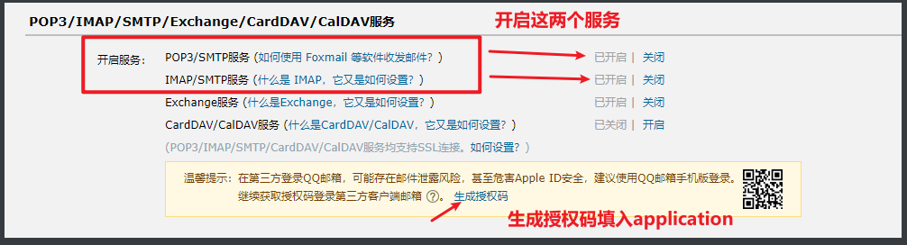

#  项目开发流程


## 技术栈选择

分析项目,需要做什么,用什么框架能实现,多个框架都能用的情况下,选什么框架更合适

| 通用技术   | `Maven`  `JDK11`                           |
| ---------- | ------------------------------------------ |
| 前端技术   | `vue` `jquery` `bootstrap` `themeleaf`     |
| 后端技术   | `SpringBoot` `MyBatisPlus` `SprigData JPA` |
| 数据库技术 | `MySQL`  `Redis` `MongoDB` `Elasticsearch` |


## 项目结构定义

**本项目主要分为三大模块， 第一块是提供给用户浏览的前端页面(trip-website)**

**第二块是前端页面交互的接口及相应逻辑实现(trip-website-api)**

**第三块是后台提供给管理员的管理平台(trip-mgrsite)**


```Java
1 trip-website: 前端项目:  由前端开发工程师完成, 主要包括静态页面, js,css,需要通过ajax获取到动态数据
    
2 trip: 管理项目, 是所有其他项目的父项目, pom类型的模块
        ①: 管理所有项目中的依赖的jar包 版本统一管理
        ②:  通用的项目依赖 lombok

3: trip-core: 前端接口项目和后台管理项目通用的数据的封装,制作为一个jar包给别的项目引入 
         ①: domain实体对象
         ②: mapper层, 数据持久层处理
         ③: service层, 业务处理层

4: trip-website-api: 前端接口项目,提供结构给前端静态项目访问 
          ①: controller
          ②: <dependency> 导入trip-core
         
5 trip-mgrsite: 后台管理系统  给平台运营或者管理人员使用
          ①: controller
          ②: <dependency> 导入trip-core
          ③: 页面: themeleaf
```

### 搭建好项目结构

```java
1: 理解需求: 
     ①: 需求文档
     ②: 查看演示项目的功能, 相同项目的功能
 
2: 先搭建好基础结构:
     ①: 表的设计
     ②: 实体对象
     ③: 定义mapper接口
     ④: 定义service接口和实现
     ⑤: 编写controller类

3: 从前端(发送ajax请求)--> 后端编写(controller的方法->service-->mapper)
```


## 根据需求设计表结构

**1.考虑要在页面需要展示什么数据**

**2.定义哪些列,还有各个表之间的关系,需不需要中间表**

**3.需不需要定义排序列**

**4.需要定义什么隐藏列**

**5.三范式** :

1. **表中的每一个列都必须是原子性，不可分割的，并且不能是数组，列表**
2. **一个表中的每一个必须要有一个唯一区分的字段主键**
3. **表和表之间的关联关系在维护关系的时候，需要依赖另外一个表的主键，不允许为其他的非主键的字段**

**根据需求也有违反三范式的情况如下图**

**原因:   读远远大于写的时候,例如市省名不可能一直改,几十年可能都不变的情况下,读操作远远大于写操作,所以设计违反了三范式**




## 用户注册功能实现

**根据手机号或者邮箱注册**

**业务逻辑:**

​		1.用户输入手机号或者邮箱点击注册,发送请求到服务器,先查询数据库看看有没有该条数据,如果有则响应已被注册之类的,

如果没有转跳到填写注册详细信息

​		2.获取注册验证码,点击获取验证码,后台可以根据UUID生成一个截取4位数作为验证码,存入Redis并设置存活时间(一般3~5分钟),存入的时候Redis的Key要求有意义(比如见名知意),并且返回给用户,并把验证码通过短信接口发送给用户

​       3.用户提交注册时候,控制器参数一般超过三个,就定义一个比如用User实体类举例,定义一个**UserDTO**类,封装接收的注册参数,并且做参数检验,不合理则响应错误信息给用户

​		4. 用户提交给前端数据,有时候会自定义类,放VO包下,**UserVO**实体类

### VO和DTO的解释

VO与DTO的区别
既然DTO是展示层与服务层之间传递数据的对象，为什么还需要一个VO呢？对！对于绝大部分的应用场景来说，DTO和VO的属性值基本是一致的，而且他们通常都是POJO，因此没必要多此一举，但不要忘记这是实现层面的思维，对于设计层面来说，概念上还是应该存在VO和DTO，因为两者有着本质的区别，DTO代表服务层需要接收的数据和返回的数据，而VO代表展示层需要显示的数据。

用一个例子来说明可能会比较容易理解：

例如Service层有一个getUser的方法返回一个系统用户，其中有一个属性是gender(性别)，对于Service层来说，它只从语义上定义：1-男性，2-女性，0-未指定，而对于展示层来说，它可能需要用“帅哥”代表男性，用“美女”代表女性，用“秘密”代表未指定。说到这里，可能你还会反驳，在服务层直接就返回“帅哥美女”不就行了吗？对于大部分应用来说，这不是问题，但设想一下，如果需求允许客户可以定制风格，而不同风格对于“性别”的表现方式不一样，又或者这个服务同时供多个客户端使用（不同门户），而不同的客户端对于表现层的要求有所不同，那么，问题就来了。再者，回到设计层面上分析，从职责单一原则来看，服务层只负责业务，与具体的表现形式无关，因此，它返回的DTO，不应该出现与表现形式的耦合。
理论归理论，这到底还是分析设计层面的思维，是否在实现层面必须这样做呢？一刀切的做法往往会得不偿失，下面我马上会分析应用中如何做出正确的选择。

VO与DTO的应用
上面只是用了一个简单的例子来说明VO与DTO在概念上的区别，本节将会告诉你如何在应用中做出正确的选择。

在以下才场景中，我们可以考虑把VO与DTO二合为一（注意：是实现层面）：

当需求非常清晰稳定，而且客户端很明确只有一个的时候，没有必要把VO和DTO区分开来，这时候VO可以退隐，用一个DTO即可，为什么是VO退隐而不是DTO？回到设计层面，Service层的职责依然不应该与View层耦合，所以，对于前面的例子，你很容易理解，DTO对于“性别”来说，依然不能用“帅哥美女”，这个转换应该依赖于页面的脚本（如JavaScript）或其他机制（JSTL、EL、CSS）
即使客户端可以进行定制，或者存在多个不同的客户端，如果客户端能够用某种技术（脚本或其他机制）实现转换，同样可以让VO退隐

以下场景需要优先考虑VO、DTO并存:

因为某种技术原因，比如某个框架（如Flex）提供自动把POJO转换为UI中某些Field时，可以考虑在实现层面定义出VO，这个权衡完全取决于使用框架的自动转换能力带来的开发和维护效率提升与设计多一个VO所多做的事情带来的开发和维护效率的下降之间的比对。

如果页面出现一个“大视图”，而组成这个大视图的所有数据需要调用多个服务，返回多个DTO来组装（当然，这同样可以通过服务层提供一次性返回一个大视图的DTO来取代，但在服务层提供一个这样的方法是否合适，需要在设计层面进行权衡）。

### 发送验证码

用户注册现需要发送验证码

#### 手机短信

需要对接别人的短信接口,使用SpringBoot 发送HTTP请求

```java
// 注入Bean
@Configuration
public class JavaConfig {
    
	// 注入Bean如果在编译器中提示factory不能自动注入，那应该时跟其他类有冲突，
    // 有多个 ClientHttpRequestFactory把这个factory的名字改一下
    @Bean   // 注入Bean
    public RestTemplate restTemplate(ClientHttpRequestFactory factory) {
        return new RestTemplate(factory);
    }

    @Bean   // 简单的客户端 Http 请求工厂
    public ClientHttpRequestFactory simpleClientHttpRequestFactory() {
        SimpleClientHttpRequestFactory factory = new SimpleClientHttpRequestFactory();
        factory.setReadTimeout(5000);//读取超时 单位为ms
        factory.setConnectTimeout(5000);// 连接超时 单位为ms
        return factory;
    }
}
```

测试类

```java
// Put 请求和 Delete 大同小异,也就那样
@SpringBootTest
public class TestHttp {

    @Autowired
    private RestTemplate template;

    @Test/* get请求 */
    public void getForObject() {
        HashMap<String, String> map = new HashMap<>();
        map.put("name", "张三");
        map.put("age", "18");
        String object = template.getForObject("http://localhost:8080/users/list", String.class, map);
        JSON.parseArray(object, UserInfo.class).forEach(System.err::println);
    }

    @Test /*  getForEntity和getForObject的用法是一样的，只是其返回结果是一个ResponseEntity */
    public void getForEntity() {
        
        ResponseEntity<String> response = template
            .getForEntity("http://localhost:8080/users/list", String.class, "name=age", "age=18");
        
        response.getHeaders();		//响应头
        String body = response.getBody(); //响应体，即前面的result
        HttpStatus statusCode = response.getStatusCode(); //响应码
        int statusCodeValue = response.getStatusCodeValue(); // 状态码的值 int 类型
    }

    @Test
    public void postForObject() {
        //设置请求头
        HttpHeaders headers = new HttpHeaders();
        headers.setContentType(MediaType.APPLICATION_JSON);
        headers.add("Accept", MediaType.APPLICATION_JSON.toString());
        //请求体,请求头
        HttpEntity<String> formEntity = new HttpEntity<String>("name=张三", headers);
        String object = template.postForObject("http://localhost:8080/users/list", formEntity, String.class);
        JSON.parseArray(object, UserInfo.class).forEach(System.err::println);
    }
}

```

本质上就是使用SpringBoot请求别人的接口,发送短信验证码给注册的用户,接口一般需要收费

- [京东万象](https://wx.jdcloud.com/api-66)
- [中国网建](http://sms.webchinese.com.cn/)
- [阿里短信](https://free.aliyun.com/product/cloudcommunication-free-trial?utm_content=se_1009977491)


#### 邮箱短信

不要钱,可以白嫖

需要添加依赖

```xml
<dependency><!-- 邮箱验证码自动配置 -->
    <groupId>org.springframework.boot</groupId>
    <artifactId>spring-boot-starter-mail</artifactId>
</dependency>
```

用QQ邮箱举例,需要开通某个服务,不过是免费的,而且一般邮箱默认就是开通的

**进入自己QQ网页的邮箱,选  设置>账户>开启上图两个服务**



Application,properties 配置

```properties
# 邮箱服务器地址 // 默认不动
spring.mail.host=smtp.qq.com
# 邮箱账号 作为服务给注册用户发送验证码的QQ邮箱
spring.mail.username=xxx@qq.com
# 授权码 开启POP3/SMTP 生成的授权码
spring.mail.password= 
# 邮箱默认编码 默认不该
spring.mail.default-encoding=UTF-8
# 端口 默认25 默认不该
spring.mail.port=25
# 邮箱发件人 和邮箱账号一样填QQ邮箱
my.mail.user=xxx@qq.com
```

接口及Service

```java
// 定义Service异步接口
public interface IAsyncService {
    /**
     * 异步发送邮件验证码
     * @param message 短信内容
     * @param email 收件人
     */
    void asyncSend(String message, String email);
}

/*异步类实现类*/
@Service
public class AsyncServiceImpl implements IAsyncService {

    /*发件人 自定义*/
    @Value("${my.mail.user}")
    private String emailNameUser;

    /*邮箱对象*/
    @Autowired
    private JavaMailSenderImpl mailSender;

    @Async("messageThread") // 从线程池获取对象,可以两边都不加
    public void asyncSend(String message, String email) {
        // 获取邮件对象
        MimeMessage mimeMessage = mailSender.createMimeMessage();
        try {
            // 获取消息助手对象
            MimeMessageHelper mimeMessageHelper = new MimeMessageHelper(mimeMessage, true);
            // 设置发件人
            mimeMessageHelper.setFrom(emailNameUser);
            // 设置收件人
            mimeMessageHelper.setTo(email);
            //设置邮件主题
            mimeMessageHelper.setSubject("邮件主题");
            //设置验证码的样式
            mimeMessageHelper.setText(message);
            // 发送验证码
            mailSender.send(mimeMessage);
        } catch (MessagingException e) {
            e.printStackTrace();
        }
    }
}
```

发送短信可以定义成异步的,验证码丢了大不了重新发一次,不然响应会前端会很慢


## 用户登录

后端接收用户登录时候的用户名和密码,去查询数据库,查到则登录成功,用**UUID**生成一个用户的**Session ID**,存入Redis(Key命名要有意义),并设置有效时间.再把这个ID作为Token,放在响应头响应回浏览器(为什么放响应头,考虑项目的用户可能不止浏览器用户,还有App用户,App对Cookie支持可能不是那么好,所有放响应头),把用户数据也一并响应回去,因为页面要显示用户名等用户信息


## 用户浏览页面

用户浏览访问页面,区分有没有登录,区分是用户还是游客身份,区分浏览什么内容需要登录,简单来说,就是访问哪个前端控制器方法需要权限,用**注解**来解决,使用自定义注解,贴在对应的控制器方法上,并且配置拦截器,拦截器实现拦截请求,判断是否是访问控制器方法,不是直接放行,是的话再判断有没有贴注解,检测到贴了注解再判断是否有登录,登录了就把该用户在Redis中存入的Token(SessionID)登录有效期时间重置,没登录就转跳登录界面

#### 1.注解

```java
/* 判断访问的控制器方法是否需要登录 */
@Target(ElementType.METHOD)
@Retention(RetentionPolicy.RUNTIME)
public @interface NeedLogin {
}
```

#### 2.配置类

```java
/* 接收跨域请求配置类 */
@Configuration
public class WebMvcCrossOrigin implements WebMvcConfigurer {

    @Bean/*LoginInterceptor 类上贴 @Component 就不用再配置类或者启动类上注入写@Bean的实体方法*/
    public LoginInterceptor handlerInterceptor() {
        return new LoginInterceptor();
    }

    @Override // 拦截规则,所有
    public void addInterceptors(InterceptorRegistry registry) {
        registry.addInterceptor(handlerInterceptor()).addPathPatterns("/**");
    }
}
```

#### 3.拦截器实现

```java
/* 拦截器配置 */
//@Component 贴了就不用自己写@Bean实体方法了
public class LoginInterceptor implements HandlerInterceptor {

    /*登录用户Token存活时间*/
    @Value("${my.usertoken.time}")
    private Long usertoken;

    @Autowired
    private IUserInfoRedisService userInfoRedisService;

    @Override
    public boolean preHandle(HttpServletRequest request, HttpServletResponse response, Object handler) throws Exception {

        String tokenId = request.getHeader("token");
        // 得到Key
        String tokenKey = RedisKeys.USER_LOGIN_TOKEN.join(tokenId);

        // 获取Value
        String token = userInfoRedisService.getVerifyValue(tokenKey);
		// 判断是否是访问控制器方法
        if (handler instanceof HandlerMethod) {
            HandlerMethod hm = (HandlerMethod) handler;
            // 不需要登录
            if (!hm.hasMethodAnnotation(NeedLogin.class)) {
                if (token != null) {
                    // 重置时间
                    userInfoRedisService.setVerifyKV(tokenKey, token, usertoken);
                }
                return true;
            } else { // 需要登录
                if (token != null) {
                    // 重置时间
                    userInfoRedisService.setVerifyKV(tokenKey, token, usertoken);
                    return true;
                }
                // 请登录
                response.sendRedirect("http://localhost/login.html");
                return false;
            }
        }
        return true;
    }
}
```


## 分时统计表


**互联网项目,对于表数据特别多,对于访问频繁的数据,有的需要做排序,而如果表数据多,每次 order by 特别损耗性能**

**分时统计表设计,**

**定义一个临时表,存放热点数据,数据少了,每次 order By 的速度就快了**

**但是设计临时表,数据肯定不是实时的,所以我们需要自定义手动同步的接口,和定时同步的定时器**

**这样就解决了 order By 查询数据量大的表,影响性能**


## 评论和阅读点赞数等


**选用MongoDB+Redis实现**

**MongoDB**是文档型存储的数据库,存储的数据格式是JSON,用来存储评论数据,比MySQL性能要好,且更易于开发

**Redis**定位是缓存,对于与阅读数,点赞数,浏览数,收藏数的统计使用MySQL对互联网项目,用户量大,会频繁读写数据,IO操作频繁,性能会不好,所以这里使用Redis来实现, 方法: 定义实体类, 定时同步回原数据库,然后数据初始化使用监听器实现


## 全局搜索


使用 Elasticsearch 实现

MYSQL无法实现模糊查询多列,且性能不高

Elasticsearch使用倒序索引存储拆分的关键字,且记录数据 ID 天生的查找小能手,存储数据格式JSON,也只支持JSON,查询不是实时的

分析:	Elastucsearch 存什么数据, 考虑用户需要查询什么数据需要,我应该放什么数据,然后设计表, 设置定时器,定时把MYSQL数据同步到Elasticsearch,和提供手动同步的接口


